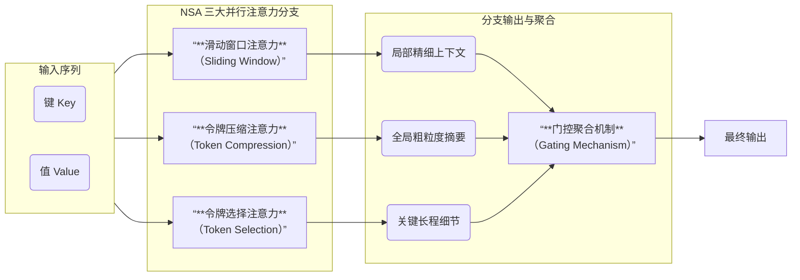

<!-- more -->

这两天网上疯传DeepSeek要发布新模型了。 

最初的来源是theinformation.com，他们引述知情人员报道，DeepSeek预计将会在二月中旬发布DeepSeek V4。 

好嘛，二月中旬，2月16日可是除夕夜啊。看来DeepSeek是想让我们过年也不得安生啊。：） 

报道说，根据DeepSeek员工的内部基准测试显示，该模型在编码任务上的表现，超越了当前行业领先的闭源模型，包括 OpenAI GPT 系列和 Anthropic Claude。

## 推测一下V4采用的关键技术与功能

### 1\. 稀疏注意力：从DSA向NSA进化

首先，DeepSeek V3.2 Exp发布时，提到了V3.2版本是在V3.1-Terminus版本的基础上引入了DSA( DeepSeek Sparse Attention）^[[DeepSeek Sparse Attention](https://github.com/deepseek-ai/DeepSeek-V3.2-Exp)]，DeepSeek声称DSA首次实现了细粒度稀疏注意力，在保持几乎相同的模型输出质量的同时，显著提升了长上下文训练和推理效率。

而在更早一点的2月份，DeepSeek和北大合作发布了一篇论文《Hardware‑Aligned and Natively Trainable Sparse Attention》^[[arix.org 2502.11089](https://arxiv.org/abs/2502.11089)]。这篇论文在25年8月得到第 63 届国际计算语言学协会年会（ACL 2025）的最佳论文奖。

合理的推测是：

**V4 的注意力核心 = NSA（作为底层稀疏框架） + DSA（更精细的 token 选择策略）**

#### 什么是稀疏注意力？

传统上，大模型在处理文件时，肯定需要兼顾上下文，比如大模型在和你交谈时，总不能说到后面就忘记前面了吧。所以模型总是要将前面谈到的内容重新再加到对话中。这也是为什么在早期的ChatGPT版本中，随着对话的持续，越到后面，哪怕是一个简单的回答，都会消耗大量的Token。

这种情况下，模型处理长文本时，会成本高昂。你想让它给你分析一本书，Toekn消耗会让你肉疼，而且处理过程也极其缓慢——让你肉疼的时间更长。

2019年OpenAI提出了稀疏注意力模式。核心思想是 **“只看重点，忽略冗余”**。 它不再让当前 token 与过去所有的 token 建立连接，而是通过特定算法只挑选出最相关的一小部分信息进行计算。

当然实现方法有很多，上面提到的DSA和NSA就是两种代表性的稀疏注意力技术。

DSA是DeepSeek的算法，就是在推理的同时，用一个命名为“Lightning Indexer”的组件对前面的Token打分，得分最高的若干个（比如可选择2048个）Token可以作为重点代入到上下文中处理，根据实验，这种方法在保证质量的情况下，将长文本的推理成本降低了6~7倍。

NSA又是一种新技术，简单说就是采用**动态分层稀疏策略**，和人类读书一样，先通过目录和前言看看大概内容，然后再关注重点，对这些重点内容反复精读。其核心是一个三路并行的注意力架构：

上面的滑动窗口注意力相当于精读当前文字，而令牌压缩注意力就是在快速通览全文，至于令牌选择注意力就是找到值得精读的部分。

尤为难得的是，这两个技术都强调 **“硬件对齐”**，即它的计算逻辑是专门根据GPU或国产芯片的内存访问模式设计的。

### 2\. 使用mHC架构提升模型训练的稳定性

mHC在上一篇文章中已经讨论过了。上篇文章中也已经谈过mHC是什么以及它是怎么增加训练过程的稳定性和表达力的。这里就不再重复。

结合 DeepSeek 最近在博客^[[mhc blog](https://deepseek.ai/blog/deepseek-mhc-manifold-constrained-hyper-connections)]中提到“这可能会成为下一代架构的地基”，以及 R1 论文更新版^[[DeepSeek R1 论文更新](https://arxiv.org/abs/2501.12948)]中对训练失败案例、稳定性探索的长篇补充。很有理由认为：

**V4 在 block 级结构上会采用 mHC 架构**，在 MoE + 稀疏注意力外，再通过 mHC 提升极深网络的稳定性和表达力。

### 3\. 多种技术使模型有更强的“自我学习”能力

这不得不提到DeepSeek最近一个骚操作，他们将原来在1月份发布的R1论文，做了一个补充。原来的论文是2025年1月份发表的，有22页。然后在2026年的1月，DeepSeek将论文扩充到了86页。近乎做了一次重写。不仅将其技术思路展示了，还提供了具体完整可复现的技术细节。我看他们简直成了“开源圣人”。

从这篇补充的R1论文中，我们看到他们证实了，纯强化学习（也就是说，不需要人工标注，不需要人类写思维链）也能内生出复杂的推理能力。同时也披露了纯强化学习的范式也可能扩展到视觉、代码等多领域。这就是说，使用合适的方法和技巧，大模型是可以自己进化的。

同时，在上面提到v3.2-Exp的开源 ^[[v3.2-Exp的开源](https://github.com/deepseek-ai/DeepSeek-V3.2-Exp)] 中也提到了GRPO技术。

GRPO（组相对策略优化）是DeepSeek v3.2推理模型的核心强化学习算法，它通过分组比较和简化奖励机制，让模型能够“自学”复杂的推理任务。

我们能看到上面多篇论文都提到了大模型的“自我学习”、“自我进化”的能力和可能性。

所以合理的猜测是

V4 会用 **R1 式 RL 框架 + 升级版 GRPO** 把“思考过程”自动化。

## V4会不会支持多模态

从技术上看，NSA和DSA都是支持多模态的，从公开的算法来看，它们对于Token到底是文字还是图片都没有什么影响。

而且mHC解决的是“多流信息的稳定混合”，似乎更适合多模态。

再加上前面也提到过DeepSeek在25年下半年发布的论文DeepSeek OCR，好像也与图像有关。

但是目前所有的公开的或者传言的消息都没有提到V4有多模态能力。

我的推测是V4版本不支持多模态，原因是近期并没有DeepSeek关于图像处理或者音频处理的论文传出，看起来他们技术重心不在于此。但是V4的技术底座是支持多模态的。也许以后会做这一块内容。

## V4会是在国产芯片上训练的吗？

个人觉得可能性很大。

首先， V3.2-Exp的版本就已经做到了“国产芯片适配”。官方明确提到它的代码直接支持华为Ascend。

其次，DeepSeek官方在 V3.1时就公开表示会以FP8（尤其是UE8M0）格式发布。而UE8M0格式就是针对国产芯片设计的。

FP8格式可以简单理解为用更少的内存记录一个数。比如说要保存数字1，你可以用16位保存，就是“0000000000000001”，前面有15个是0，也可以用8位保存，就是“00000001”，前面只有7个0。当然，这样的话，精度会减少，但是这可以用算法解决，但显存占用降低75%可是实打实的硬件节省啊。

再加上最近各种新闻都是说他们与华为的合作，DeepSeek的新模型肯定是原生适配国产芯片的，具体到是否全部在国产芯片上训练出来就不得而知了。真希望他们在发布时能公开宣称这一点啊。

但是有一点，V4的推理侧百分百支持国产芯片是可以肯定的。

最后，希望DeepSeek让我们过一个开心年。能用国产硬件加上天才般的创新，构建一个强大的模型。

