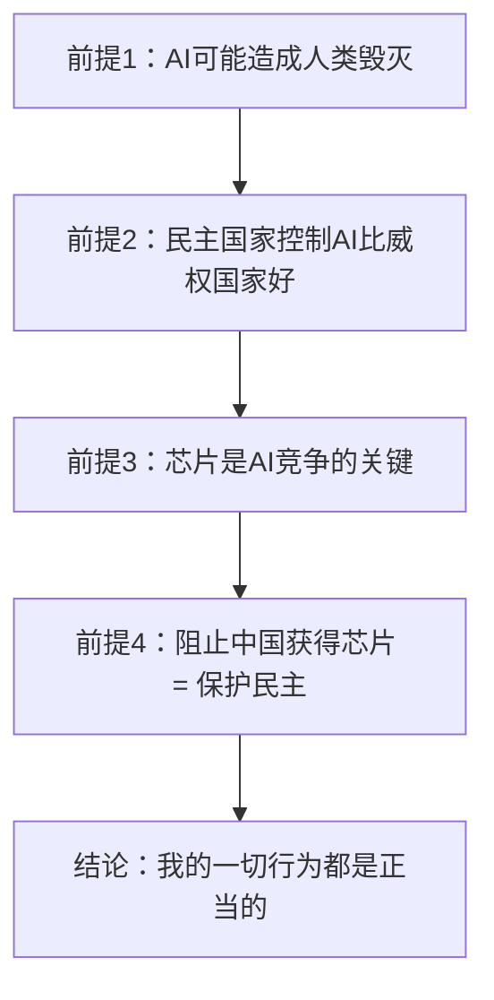

<!-- more -->

美国政客对中国进行科技封锁，本不是什么新闻。但一个商业公司宁可损失上亿美元的收入^[An Anthropic executive told the Financial Times that the move would have an impact on revenues in the "low hundreds of millions of dollars."---https://economictimes.indiatimes.com/tech/artificial-intelligence/us-ai-giant-anthropic-bars-chinese-owned-entities-from-services/articleshow/123711320.cms]也要禁止中国人访问他们的AI就有点魔症了。

我们不禁要问：为什么？凭什么？怎么办？

## 为什么

我们现在看到Anthropic的CEO Dario Amodei在所有场合都持强硬的反华立场，不免感觉有些奇怪。他天生与中国人有仇？

其实还真不是。2014年~2015年底，Dario还在百度的硅谷AI实验室（SVAIL）工作过。他的同事也大多是中国人或者华裔，就是一个正常的科技工作者，而他离职也没有表现出与政治立场有关的迹象。

>2020年Dario离开OpenAI创立Anthropic，一直到2023年都没有发表过与中国有关的言论。

>2023年7月26日，他在美国参议院司法委员会听证会时第一次在公开场合将 AI 与中国地缘政治竞争挂钩。他在证词中暗示 AI 是国家安全问题，需要防止"专制国家"获得前沿 AI 能力。虽然措辞相对克制，但方向已经明确。

>2024年10月，他发表《Machines of Loving Grace》，直接提出了对中国AI进行技术封锁。这时其反华意识形态基本成型。

>2025年1月，在DeepSeek发布后，他发表了《On DeepSeek and Export Controls》，这是他j最极端的公开言论。随后一直小动作不断，他不光为美国反华政客出谋划策，也极力封禁中国企业和个人访问Claude模型。

看他的行为，你会发现他既不符合一个程序员的思维模式，也不符合一个商人的思维模式，甚至都不符合一个政客的思维模式。我真怀疑他是真正相信自己说的那一套东西是正确的。**一个有认知偏差的高智商理想主义者对社会对人类是危险的。**

好好一个人，在OpenAI里干了几年，怎么就长偏了呢？我们得从一个理想主义运动说起

### EA（Effective Altruism）是什么

Effective Altruism，直译就是“有效利他主义”。我们从头开始：

#### 源起
一切的起点可以追溯到 1972 年。澳大利亚哲学家 Peter Singer 发表了一篇改变伦理学走向的论文——《饥荒、富足与道德》（Famine, Affluence, and Morality）。他提出了一个著名类比：

>如果你走路时看到一个小孩在池塘里溺水，你完全可以跳下去救他——代价只是弄脏你的衣服。如果你不救，那你就是不道德的。同理，地球上每天都有儿童死于贫困，而你花在奢侈品上的钱本来可以救他们。

这个论证的逻辑结论极其激进：**你有道德义务把收入中超出基本需求的部分捐给最有效的慈善机构。**

也许你会说，这也没有什么特别的啊，就是让人捐款而已，1972年之前有人劝捐，1972年之后也有人劝捐，这个Singer有什么特别的吗？

其实还真有点不一样。

Singer 做的事情本质上不是劝你捐款，而是**用一个逻辑论证强迫你承认：不捐款是不道德的**。

这是关键区别。传统慈善的逻辑是：

> "如果你愿意捐款，那是好事，你是一个善良的人。"（做了值得表扬，不做也不该被批评）

Singer 把这个逻辑**翻过来了**：

> "如果你不捐款，你就是在杀人。不是比喻，是字面意义上的杀人。"

这就是EA的起点：不是劝捐，而是**把捐款变成了一个严格的道德义务**。

#### 发展

2000年~2012年，牛津大学成为 EA 运动的真正孵化器。众多学者和社会活动家在“强制捐款”的基础上，为EA运动增加一些附加条件，成立了多个社会组织和机构，形成了多种流派。总结一下，有以下几个特点：

**第一，用带有功利主义的“成本效益”决定捐款方向**

普通人行善是基于同情心，但EA的逻辑不同，它认为，同情心是不理性的，它可能会让钱浪费在低效的慈善上。比如说，一种传染病来了，你可以用1万元去抢救一个重症患者，也可以用这个1万元给1千个健康人打疫苗，保证他们的安全。看到重症病人的痛苦，人们往往基于同情心会用这钱去抢救患者，但EA要求你选择后者。

看到这里，你是不是想到了著名的电车难题？

对，就是这个。让普通人为难的选择，对EA来说，不是问题。如果被绑的那一个人是“天才”，比如是Dario，那么肯定去压另外5个人。如果都是普通人，那就让那一个倒霉鬼去死吧。

你肯定说，凭什么啊？别急，EA会用各种论文来证明他们才是对的，他们会提出一系列量化的算法证明让你死是对的。

这就又引入了下一个特点：

**第二，用“长期主义”重新定义谁值得帮助**

“长期主义”，通俗地说，就是EA要求慈善不能“短视”。

比如说，我有一个亿，买粮给饥荒中的非洲人能救活几千万人，但是如果捐给农业研究所研究出一种高产粮食，能在随后多养活几十亿人，那就可以牺牲当前的几千万人。

#### 正式成型

2011年，最有名的两个组织决定合并。他们投票选了一个名字：**Centre for Effective Altruism（有效利他主义中心）**。从此，"EA"成为一个正式的身份标签。

2013年起，EA Global大会每年举办。

#### 进化

从上面的两个原则，我们能看出，EA占据了道德至高点。但是大家也不是傻子，你说自己的圣母，大家就信你？

于是，2012年EA组织进化了一个新的原则：

**第三， “行善”可以是一种身份和职业**

普通慈善是你生活的一部分——你赚你的钱，偶尔捐一些出去。

现在，EA提出了"**Earning to Give**"（赚钱为了捐）理念。不是你赚了钱捐款，而是为了捐款而设法赚钱。**行善不再是你在生活中做的事，而是你存在的全部理由。**

其实说人话就是，只要是行善的目的，你可以不择手段地赚钱。

#### 异化

一个MIT的本科生Sam Bankman-Fried（SBF）实践了此理论，他先是做量化交易，然后在2019年创立了加密货币交易所 FTX。然后SBF成为EA社区的超级金主。

2022年，FTX暴雷，SBF的捐款其实是挪用客户存款的结果。SBF被捕，最终被判25年监禁。

### EA和Dario有什么关系？

上面谈了很大篇幅EA，你也许奇怪，这和我们的主题不相干啊。

其实关系还是有的。根据上面EA的理念，你很容易明白，他们会大量投资于AI产业，因为这非常符合EA的长期主义和功利主义原则。

EA是OpenAI的早期最大捐赠方之一，Dario加入OpenAI时，就与他们有接触。而2017年开始，Dario的姐姐嫁给了EA的核心成员之一，并且与Dario合住，可以说是深度参与EA社区了。

2021年创立Anthropic后，SBF在2022年向其投资了约5亿美元。

你看，对于一个程序员直男来说，EA的理念通过亲情、友情围绕着他，生活工作中都被影响。而且最终还收到5亿美元的真金白银。怎么可能不被潜移默化呢？更何况EA运动还占据了道德至高点。Dario成为EA运动的核心人物一点也不奇怪。

### 这和反华有什么关系？

我们模拟AI的思维链来捋一捋这里的逻辑关系：

大前提基于EA长期主义的理念，推理过程无懈可击，问题在于，前提1过于极端，前提2是价值观而非事实，前提3未免简化而夸大，前提4逻辑未免过于跳跃。

但Dario的智商毋庸置疑——普林斯顿生物物理学博士，GPT-2和GPT-3的核心负责人，Scaling Law（缩放定律）的联合作者。但他身上存在一种高智商者的典型缺陷：他的推理能力太强了，强到他能为自己做的一切事情都构建出无懈可击的论证。

加上EA那种为目的不择手段的风格，用一句中国的古话来说，就是 **“智足以拒谏，言足以饰非”**。

他的智力越高，就越擅长为有偏差的结论构建完美论证，从而让自己更加坚信——而周围的人也越难提出反驳。这是一种**高智商版本的确认偏误。**

一旦Dario开始了这个起点，自然一切都会走向一个自我强化的正反馈之中。他的生活圈子和工作圈子里全是反华人士。要知道，Anthropic 是唯一一个将政策团队深度嵌入华盛顿的主要 AI 公司。在华盛顿的圈子里，反华才是政治正确。在这种环境里，"中国是威胁"不是一种需要论证的立场，而是一种空气般的存在前提。你当然不会质疑空气的存在。

## 凭什么？

Anthropic凭什么这么狂妄？

凭他手头的Claude模型是“最强的AI”（这是他自己说的），现在排名得分也是如此。你看任何一个当前的大模型榜单，Anthropic的产品Claudet系列都名列前茅。

你肯定会奇怪，2019年Dario从OpenAI出走时，OpenAI的ChatGPT已经如日中天。但在短短的时间内，Claude异军突起，一下子超越了ChatGPT，在各种榜单出力压老东家的产品。

### 他是如何让Claude后来居上的？

首先，我的看法是，Claude只是在特定领域占据了显著优势。比如说，编程方面和agent自主调度方法。而在多模态和产品生态上其实是非常落后的。但他的确建立了自己独特的优势。

#### 原因一：Anthropic 的创始团队本就是 GPT 的核心缔造者

他不是从头开始，而是带了一批核心成员离开的。很明显就不必从零开始。而是站在OpenAI的肩上，OpenAI走的弯路不必再走，踩的坑不必再踩。而且硬件的特点就是折旧率高，后买的显卡，性能更强价格更低，所以他能拿更少的钱，买更多的算力。先行者的资产反而成了累赘。所以Anthropic的后发而先至也是可以理解的。

#### 原因二：Constitutional AI 是真实的技术优势

这是 Anthropic 的核心创新。Constitutional AI直译为“AI宪法”，你可以理解为阿西莫夫的“机器人三定律”。

传统的AI训练方法是让人类标注员来对模型进行判断打分，而Constitutional AI来对模型进行判断打分。相当于高考的人工阅卷改成了机器阅卷。**这不是简单的"换了个训练方法"，而是从根本上改变了模型对齐的范式。** 它让 Anthropic 在对齐训练上比传统大模型更高效。

#### 原因三：专而精

这就是我一开始说的，Anthropic把几乎所有的资源都集中在文本理解和生成、编程能力、长上下文推理、指令安全上。尤其是在编程方面，赢得了广大程序员的喜爱。而对图像、声音、视频等多模态涉猎甚少。

做精一个领域，是一种商业策略，其实也是一种方法论上的无奈。因为编程是 LLM 能力中最"可验证"的领域，而且代码也是最规范的文本（不规范的代码根本跑不起来）。这就使得Constitutional AI变成可行。在其它领域，Constitutional AI既难写又难以验证。

#### 原因四：scaling 策略

Dario Amodei 是 scaling law（缩放定律）的联合作者。他比任何人都清楚：模型性能不是简单地"堆算力就能赢"。所以他能在相同的算力下，用丰富的经验合理地分配参数量和数据量之间的资源。

### Claude真的遥遥领先吗？

Anthropic将自己包装为"最安全的AI"、"编程最强的模型"。但如果看实际数据，图景远没有这么乐观。

他最强的是编程领域，但即使在这个领域，你如果查SWE-bench Verified得分的话，各个模型之间也咬的很紧，而且在某些细项上各家模型也各有胜负。Anthropic并没有建立绝对优势。

对他而言，更糟的是，中国大模型以另外一种方式追上来了。2025年1月，DeepSeek让美国AI行业引发了"斯普特尼克时刻"级别的震动。不是因为模型能力，而是DeepSeek训练模型中的创新。

## 怎么办？

反华的公司很多，反华的人也很多。我们本不必在意。

但是一个有强大力量的疯子总是危险的。尤其是这个疯子不是一个人的疯狂，而是一类思潮的反动。我在以前的文章里提到过“科技右翼”的黑暗启蒙。如今又来一个占据道德高点的EA。美国社会如今真是妖魔鬼怪盛行啊。

这两派在理念上其实是相反的，但是殊途同归，在对人类造成的风险其实都是一样的。他们的本质相同，都是“傲慢”，基于自身认知的傲慢，基于自身种族的傲慢。

能改变历史的人，几乎都具有同一个特征：有能力 + 绝对自信 + 崇高使命感。

Dario就是样种人。他坚信自己在保护人类的未来——而当你认为自己的事业是"人类最重要的道德项目"时，你就为自己的一切行为开了一张无限额的道德支票。封杀研究者、游说出口管制、深度嵌入军事体系——在"拯救数十亿未来人"的天平上，这些不过是无足轻重的筹码。

**真正危险的从来不是明知自己在作恶的人，而是真诚地相信自己在行善的人。因为后者没有刹车——他不会被良心阻止，因为他确信自己就是良心本身。**

讽刺的是，一个以"安全"为使命的人，最终成了全球AI安全格局的破坏者。把"安全"定义为"美国的安全"而非"全人类的安全"，制造了更多不信任。

对于这种人，愤怒和抗议都是无力的。

他们是偏执的疯子，解药是用实力打他们的脸。就像胡屠夫治范进一样，用大耳瓜才能让他们从癔症中清醒。

面对这类人，**唯一有效的办法，是在技术上彻底打败他。**

他的整个世界观建立在"只有美国才能安全地掌握AI"这个前提上。这个前提越看起来像真理，他就越偏执。而打破它的唯一方式，就是让中国的大模型一次又一次地证明——我们不但能做出来，而且能做得更好。

每一次中国模型在基准测试中超越Claude，都是对Dario世界观的一次冲击。每一次中国团队用创新架构实现更高训练效率，都是对"芯片是唯一优势"论断的一次反驳。

尽管中国的大模型现在可以说是百花齐放，但我仍是只看好DeepSeek。哪怕DeepSeek某些能力不一定强过GLM和Kimi。但他是唯一从架构上有可能从追赶者变成领跑者的。

不是说GLM和Kimi不优秀，而是在现在模式下，开源与闭源相比，其实是天然占劣势的。你发布了一个新模型，发表了论文说明了其创新之处，闭源模型很快就把这些创新抄了过去，然后又通过算力在硬件上的优势将自己模型的性能大大提升一个档次。

而DeepSeek不一样。他开启了自己的生态和模式，而在这些新生态上的任何创新就有了自己的护城河。比如说DeepSeek V4在FP4量化上的创新，对于Nvidia显卡可能用处就不大。而后续更多基于CANN生态的特点更是会让那些美国公司陷入一种两难处境。

在这种情况下，开源的优势才能真正转化为生态的优势。在AI技术领域才可能真正超车。

**一个偏执狂的叫嚣不可怕，可怕的是你真的不如他强。当你真的比他强了，他的叫嚣就只是噪音。**

