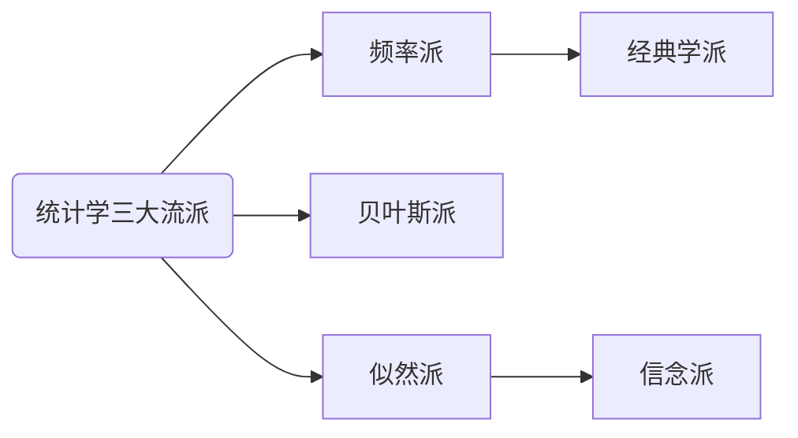

<!-- more -->

基于翟东升的[一篇微博](https://weibo.com/7452092375/LfoKfFlTb?from=page_1005057452092375_profile&wvr=6&mod=weibotime&type=comment)

>统计学有三大流派：频率派、贝叶斯派和似然派。这三个流派中，最边缘的是似然派，而我的导师Richard Royall算是这一派的主要倡导者之一。似然派的主要观点是，[似然函数](:/0713776370ea48cca9fa25b238cb5f25)充分表达了所有的统计证据，因此所有统计推断应该完全基于似然函数。相比之下，频率派则根据统计模型来估算观察到比实际数据更极端的概率，也就是p值；这个值越小越是模型参数值不满足零假设越强的证据，与此相关的还有置信区间的概念。而贝叶斯派则视参数本身为随机数，在观察到数据之前服从某种先验分布，该派将统计证据表达为根据观察数据修正后的参数后验分布。

频率学派认为世界是确定的，有一个本体，这个本体的真值是不变的，我们的目标就是要找到这个真值或真值所在的范围；

而贝叶斯学派认为世界是不确定的，人们对世界先有一个预判，而后通过观测数据对这个预判做调整，我们的目标是要找到这个世界的概率分布的最优表达。

数理统计学的任务是通过样本推断总体。
基于总体信息和样本信息进行统计推断的理论和方法称为经典（古典）统计学，它的基本观点是：把样本看成是来自于有一定概率分布的总体，所研究的对象是这个总体而不局限于数据本身。
基于总体信息、样本信息和先验信息进行统计推断的方法和理论则称为贝叶斯统计学，它与经典统计学的主要区别在于是否利用先验信息。

频率学派认为，一个事件的概率是要通过大量的重复试验得到，是确定的。而贝叶斯学派认为这个确定性是不存在的。

我的理解：以掷硬币为例
理论上正面概率是50%，但是因为我们不清楚这个硬币是否理论上完美，所以，当我们掷了1万次后，发现正面向上的概率是55%，掷了2万次后，发现正面向上的概率是54%。
因为总体概率对我们来说是没有什么意义，我们关心的是我现在马上要掷的这一次，正面向上的概率是多少。

对于频率学派来说，因为这个硬币的各要素决定了它的下面出现的概率，而这个概率是确定的，掷的次数越多，越接近正确的值，所以在每10001次掷时，我们可以判断它正面向上的概率是55%，而在20001次掷时，我们修改它的概率为54%.

对于贝叶斯学派来说，我先得到了1万次的数据，先验地预判其真实概率是55%，然后记录更多次的数据，包括次数和对应的频率，通过这些变化，动态地修正这个先验的值，最终估算最可能正确的值。这时2万次54%这个概率，只是运算中的一个参数而已，第20001次的概率并不确定是54%，而是掷了2万次时动态修改到的先验频率值。

似然学派也是一种根据结果数据拟合到真实值的过程，这一点和贝叶斯学派类似，但是它并不认为可以通过一个数学公式可以得到正确的概率，而是通过一系列的运算，比较在2万次正面向上的概率是54%的可能性，如果这个A参数算出的可能性大于B参数，因为54%是已经确定的了值，所以A参数更合理，那么我在运算20001次时，选择这个A参数。把A参数代入对应的公式再计算这次的概率。

>我那篇文章提出无偏性广义似然函数的概念，也就是说任何一个有关参数的函数，只要它满足我提出的无偏性等式，那么它就可以被认为是一个有效的广义似然函数。我进一步把这个等式扩展到近似形态来定义各阶无偏性。我发现，合理的统计推断最终都可以归结于是否满足无偏性或者近似无偏性。像全似然函数、条件似然函数以及之前难以归类的Cox模型中的部分似然函数都满足严格的无偏性，而广义估计方程等基于非参数模型的推断方法则满足近似无偏性。在非常宽泛的条件下，一阶无偏性蕴含统计量的一致性，即随着在数据增加，统计量收敛于真值，而二阶无偏性则蕴含统计量的渐进正态性，即统计量对参数刻画的偏差近似于正态分布。这些是确保统计推断具有合理性的关键条件。文章可以认为是以单一框架来看待统计学三个流派的一个尝试。

>从模型的角度来看，我把对数据的任何参数性刻画都看成广义似然函数。最粗糙的广义似然函数就是数据本身，即视每个数据记录本身为一个参数，将参数耦合起来则是对数据赋予结构的降维过程，而无偏性则确保参数耦合过程的有效性。在我看来，一个统计模型就是一个满足无偏性的广义似然函数，不同模型反映的只是刻画和呈现数据的不同视角，因此不存在模型的对错问题。我将这个态度归结于一句话，即所有模型都是正确的，在无偏性下做出的估算都是有效的。这听起来有点离经叛道，因为现代统计学最基本的态度是所有模型都是错误的。
>
>统计模型只是我们描述研究对象的框架，不同模型只是我们描述或者总结数据的不同视角，我们关心的是某个视角是否能帮助我们了解我们关注的问题并做出相应决策。我们可以说这个视角是否深入或全面，但不能说它是对正确还是错误。

黄文政认为，人把社会作为研究对象时，方法论很重要，把自己抽离出来作为观察者的研究方式，是不适应对社会科学的研究的，这其实也是一直以来对“理性人”理论的一种反动。

>总而言之，我认为所谓模型正确不正确并没有意义，有意义的是对信息的表达是否充分，以及这种表达具有的结构能否被用来向外拓展而涵盖更广的未知空间。我们可以把“真实”状态视为我们在思维中构造出来的一个极限状态，其最终目的是帮助我们来认识这个世界，并做出相应决策。但如果这个构造出来的极限状态，让我们对信息的表达更繁琐，让我们的理解框架变得支离破碎，那为何不完全放弃这个构造，而从纯粹的信息处理的角度来理解整个认知过程呢？
>
>如果我们把对数据的观测和根据观测数据所构造的模型（也就是信息的收集和根据信息来认知外部世界的思想体系）当成一个信息交流的过程，那么我们其实是在假设这个交流过程最终会收敛到一个“真实”世界上去。这意味着，在对外部表述的这样一个广大的可能空间上，我们假设它在无限远处是一个点而不是一个面。
>
>这显然是一个非常严厉的假设，可能是对信息交流和认知程加上了一个无形的枷锁。正是由于这个枷锁的存在，我们目前用来表述物理世界的模型，比如量子场论乃至金融市场机制等变得可能反直观，对相关现象的表述变得支离破碎了。

在有人参与的情况下，根本就不存在一个“真实的”世界模型。
但是，这个观点不能说不正确，也是说，对于我们大多数人的需求来说，没有意义。
这涉及到另一个问题，一门学科，是工具性的，还是哲学性的。
