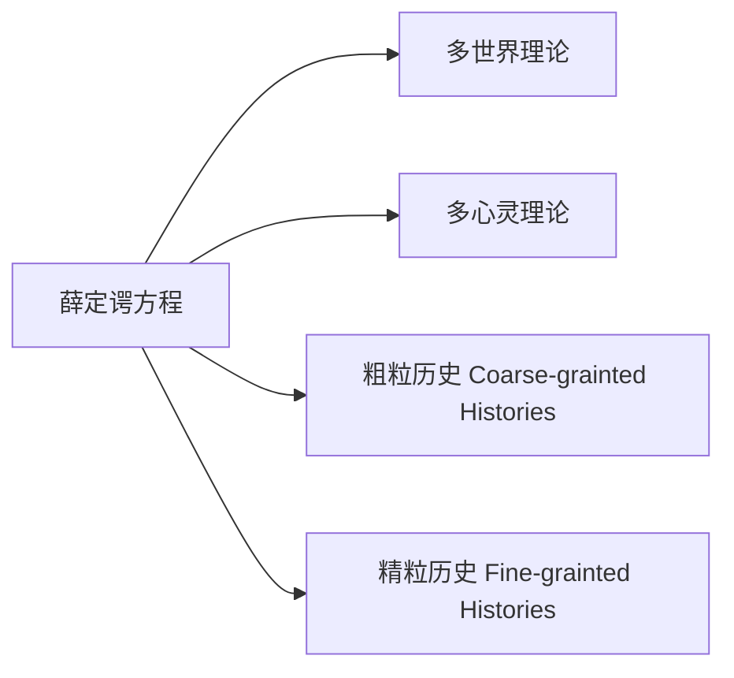
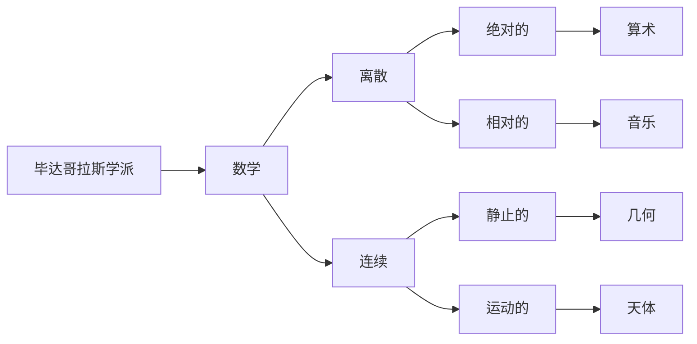
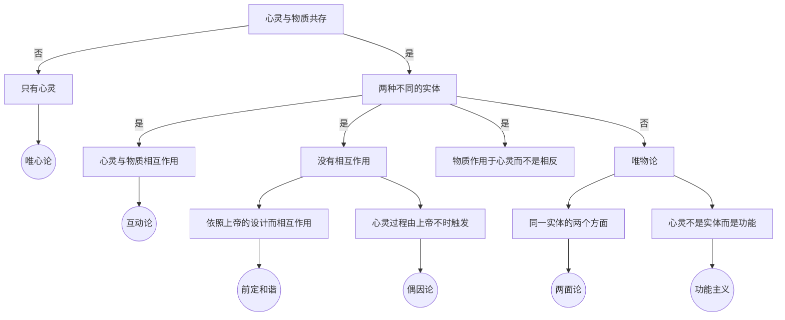

<!-- more -->

[豆瓣读书](https://book.douban.com/subject/2077047/)
作者：英·[布赖恩·里德雷](https://zh.wikimirror.xyz/wiki/%E5%B8%83%E8%8E%B1%E6%81%A9%C2%B7%E9%87%8C%E5%BE%B7%E5%88%A9) Brian Kidd Ridley
译者：李斌、张卜天
9787563365173
[在线阅读](http://my.52ds.net:32766/read/3901/pdf)

2021-08-22 21:01

p31

维也纳学派是在二次大战之间以卡尔纳普为主要人物的哲学学派，它所关注的核心是语言及其意义。其核心思想 把科学陈述的意义定义为证实其真理性的过程。如果一种说法不能通过实验来检验，那么这种说法就是无意义的。

这里是根据科学的定义来证明科学的局限性，科学的本质在于可证伪性，在于实践结果的可重复性。这需要在实验中摒弃一些干扰的因素，但现实中干扰因素是无处不在的，所以科学的结果只能是近似而不是真理。

维也纳学派认为经验是知识唯一可靠来源^[ [维也纳学派——百度百科](https://baike.baidu.com/item/%E7%BB%B4%E4%B9%9F%E7%BA%B3%E5%AD%A6%E6%B4%BE/2401438?fr=aladdin)]，但是休谟^[ David Hume]则认为通过经验获得的知识并不确定^[ [人性论，A Treatise of Human Nature](http://my.52ds.net:32766/read/782/epub#epubcfi(/6/16[id14]!/8/2[b003]/1:0))]，因此，他走向了怀疑论的极端，康德试图纠正这一点，但他做的并不好，但是康德^[ [Immanuel Keant](http://my.52ds.net:32766/read/1289/epub#epubcfi(/6/36[id312]!/8[7K4G0-f09823e2fd8549fe85c254f2e174d83c]/10/1:0))]在其《未来形而上学导论》中说，“说世界在时间和空间上有一个开始，或者世界在时间和空间上是无限的，这都是无意义的，因为无限的空间或时间都是关于超出任何可能的经验之外的事物的理念”

威尔逊(Edward O. Wilson)的《论契合》（Consilience）列出了科学的语录特征：可重复性、经济性、量化、激发和内在的一致性。

科学实践的两个方面：一是分析（还原论），二是不得不用物理世界的一部分去测量和研究另一部分（自指性）。这两个方面规定和科学的局限性。

量子理论改变了关于传统科学的一切。打破的传统科学主义的自信。但我们还没有找到一个令人信服的新的理论体系。我们用一个又一个匪夷所思的理论来解释我们发现的一切。

当我们不得不用概率论来描述我们所在的宇宙时，与我们原来定义的科学的定义又相互冲突了。尝试用一种随机性来证明一种确定性。如果我们相信这种随机性基于我们的无知还好，至少还能自圆其说，如果我们相信我们看到是宇宙的真理，那么我们不得不面临一种尴尬：我们发现这个真理的手段其实并不符合这个真理。

科学在人类社会中只解决很小范围内的事情。但现代社会对于科学的能力过于迷信了。我们高估了科学的能力和作用范围。但这很小的一部分却是目前人类唯一能有信心掌控的那部分。所以它对于人类的重要性是无论如何美誉都不为过的。

## 2021-08-23 22:22
p61
神秘主义对于科学来说，也许会起到很大的作用，但科学并不承认这一点。这是因为科学的基础在于“证实”或者“证伪”。
>通过经验来寻求通感知识的观念暗示了一个先验统一的世界。在这个世界中，事物可以被分割成各种事物，这种可分性连同其相互作用就构成了一个粗糙的图像。我们所身处的这个世界就有了一种统一性，于是通感也就是可能得了。事实上，物理学中渗透着对统一性的感知，这种感知植根于毕达哥拉斯主义，并从牛顿的成就中获取了经验力量：支配苹果下落的定律也支配着行星的运动。

这种神秘主义有时会推动科学的进步，因为他们相信他们所研究的对象是有意义的，上帝（或者神）通过这些研究对象向他们暗示了宇宙的真理，这样，研究过程就会带有方向性，有时，这反而会歪打正着。尤其是在一门学科的起步阶段，这时关键的不是方向，而是选择的决断。

但是事物又是螺旋发展的。当科学进步到如今地步时，对于统一场的寻求，本质上也是一种对于本体论（存在而非生成）的寻求。它本质上也是神学的。

>科学中的统一性思想似乎可以运用到存在上，但却不能运用到生成上。（P71）

斯宾诺莎认为实体之所以是实体，在于它有一种不依赖于其它任何事物的概念。因为现实中的事物都可以用其它事物来解释，所以如果有一个实体的话，这必然是“元实体”，这只能指向上帝或者自然。

而事物普遍联系这一事实还可以有另一个方向的思辨，就是，当我们把所有联系的事物当作一个整体时，这个整体就是最高的“一元”。但这里有一个隐藏的前提，就是这个整体，其实是在我们可认知范围内的整体。也就是说，这是我们有限的宇宙中的整体。我们知道我们的宇宙是有边界的，但我们无法想像我们宇宙之外的事物，正如虚拟环境中的程序无法逃逸到宿主机中一样。

## 2021-08-28 14:54
p75
如果我们认为世界是统一的，那么根据对微观粒子量子属性的认知，我们不得不推导出一个“多世界”观点。

阿兰·古斯（Alan Guth）的“暴涨理论”：我们的宇宙迅速膨胀，以至于涨落效应被稀释了。

>因此，我们的宇宙只是包含着无数个彼此孤立的暴涨气泡的元宇宙的一员。

事实就是，我们对于宇宙最大胆的猜想却来源于我们对微观料子最模糊的认知。

薛定谔方程：
$$ \hat H \Psi = i \hbar \frac{\partial }{\partial t} \Psi$$
$$ 
i \hbar \frac{\partial}{\partial t} \Psi(\boldsymbol{r}, t)=-\frac{\hbar^{2}}{2 m} \nabla^{2} \Psi(\boldsymbol{r}, t)+V(\boldsymbol{r}, t) \Psi(\boldsymbol{r}, t)
$$

物理学的发展已经分裂成两个方向，一个是传统物理学，也就是主流物理学，它使我们的生活发生各种改变，另一个则是宇宙-粒子物理学，它没什么用，只是给我们提供类似于宗教的精神上的抚慰。：）

科学想要了解这个世界，首先就得让这个世界失去生命，然后对其肢体进行剖析。

## 2021-08-29 22:29
p133
我们能感知，但不能理解的，都可看作是魔法。比如，我们能感知音乐给人的特殊感觉，感知诗歌的魅力，但我们并不能量化分析这些原因。所以定义它们为魔法。
当然，医学上也许能分析出，音乐能激发哪片脑区域，但目前也只能止步于此了。

作者是花较大的篇幅谈论毕达哥拉斯学派，是因为，他们认为数学是万物之母，他们把数字和宇宙的真理联系起来，把数学和所有的科学发现生硬地拉扯起来。现在看来，当然是漏洞百出，但是，不得不承认的是，现在科学，的确离不开数学，甚至可以说是建立在数学之上，数学现在成了解决一切问题的工具。甚至在目前定义的科学领域之外。或者说，数学成了科学攻城略地的工具。

科学发展使得我们越来越不容易理解这个世界，只能用数学来进行抽象描述。

第七章一如继往地看不太懂，但是，每次看到相同不懂的地方却总有点新的收获，比如，这里好像对引力的理解更明晰了一些：
>引力实际上是质量-能量作用于空时所产生的效应。

也就是说，并没有什么神秘的力量，在两个物体之间产生拉扯的力量。它们只是因为自身有一定的质量，这质量在当前的时空中产生了作用，表现出相互靠近的效果。

作者之所以花大力气说明当前科学的基础是数学，在这一章终于图穷匕见了，因为，数学本身的真理性就引人怀疑。

首先是罗素的集合论悖论^[[罗素的集合论悖论_百度百科](https://baike.baidu.com/item/%E7%BD%97%E7%B4%A0%E6%82%96%E8%AE%BA/633604?fr=aladdin)]。
其次是哥德尔不完备定律^[[哥德尔不完备定律_百度百科](https://baike.baidu.com/item/%E5%93%A5%E5%BE%B7%E5%B0%94%E4%B8%8D%E5%AE%8C%E5%85%A8%E6%80%A7%E5%AE%9A%E7%90%86/4116640?fromtitle=%E5%93%A5%E5%BE%B7%E5%B0%94%E4%B8%8D%E5%AE%8C%E5%A4%87%E5%AE%9A%E7%90%86&fromid=11039894&fr=aladdin)]。

我们承认数学可疑的根基，只是噩梦的第一步，即使我们乐观地相信数学的科学性，我们仍然会面临一些实际的困难，那就是，现的有技术和科学水平无法解决的一些复杂问题，这里的复杂，不是难，有时就仅仅是字面意义的复杂。比如混沌系统。

第八章里提到了爱丁顿爵士^[[爱丁顿爵士_百度百科](https://baike.baidu.com/item/%E4%BA%9A%E7%91%9F%C2%B7%E6%96%AF%E5%9D%A6%E5%88%A9%C2%B7%E7%88%B1%E4%B8%81%E9%A1%BF/5340831?fr=aladdin)]，他是一个有趣的人，感觉更像是一个毕达哥拉斯学派的信徒。他相信各种宇宙常量是有意义的。

这其实引入了另外一个思考，这些宇宙常数看起来没有规律，但可能爱丁顿爵士是对的，只是我们没有发现这其中蕴含的规律。

## 2021-09-05 23:31
p204
第9章 量子魔法
关于量子理论的说明，无论看多少遍，都是看不懂的。
但是量子纠缠的说明还是能看懂的，从简单的理论来看，这种距离在更高维度上看就是在一起，反而比较容易理解，但是谁知道呢。
而关于量子塌缩更是无法理喻了。当然，也有可能是我们没有掌握足够技术的测量手段。
本章中的各种理论，都是围绕着对波函数的处理和理解来提出的，问题是我一个也看不懂，只知道，科学家们也很纠结，因为他们甚至都可能找到“心灵”等不可言说的原因了。
>量子理论有一个大问题，那就是它无法解释事实的存在。

但是在不理解的前提下，量子理论仍然获得了越来越多的应用。
量子计算的基础是量子比特，一般来说，比特有两个状态0和1，而量子比特却有a,b,a+b,a-b四个状态。

第10章，科学与心灵

>彭罗斯列举了四种关于科学的心灵理论的现代观点:
>1. 一切思维都是计算；特别是，意识仅仅是通过完成恰当的计算而被唤起的。
>2. 意识是大脑物理活动的一个特征；虽然任何物理活动都可以进行计算模拟，但计算模拟本身却不能唤起意识。
>3. 大脑的恰当的物理活动唤起了意识，但这种物理活动却无法被恰当地模拟出来
>4. 意识无法通过物理术语、计算术语或其它任何科学术语所解释。^[[皇帝新脑](http://my.52ds.net:32766/read/4253/epub#epubcfi(/6/2[titlepage]!/8/1:0))：]

我个人是更喜欢或者说更相信第一种观点的，就是如果计算量足够大，就能产生意识。意识本身也是一种计算过程，只是是我们当前无法理解而已。

作者在这里不相信心理学会成为真正的“硬科学”，因为“心理现象是非常独特的，因为人就是一个独特的个体。”，“科学只能处理可重复的事件，就心理学研究的是独特的人格个性而言，它不可能是科学的。”

这到不一定啊，想象一下，如果人类能“逸出”我们当前的维度，操纵时间，我们也可以就人在某个时间的决策，反复地进行重复，从将研究符合作者要求的“科学性”。

其实，说来说去，我们都没有很好地定义意识到底是什么。本章中哈克理解的意识就是“人性的弱点”，机器不会犯错，如果一台机器开始出现不合逻辑的错误，那么它其实可能是有了意识了。

## 2021-09-07 00:26
第11章 科学与社会
也许社会担心科学走的太远了，这就是西洋版的“等一等你的人民”。
作者自然地推理到：科学主义者解决这个问题的方法肯定会走向乌托邦，而这正是一条“通往奴役之路”啊。当然，作者也承认“左派的道德比右派的道德更道德”，但是最终的目的地仍让他心存疑虑。
不过文中更好像是作者自已树靶子自已打。
好吧，我们也不知道科学能否构建一个乌托邦。但我个人觉得基于科学基于计算总比基于宗教基于道德要可靠的多。而且我相信，通往理想社会的唯一道路只能是科学。

第12章 科学与艺术
我不懂艺术，也不知道如何定义艺术。但是文中给我的感觉是，作者认为艺术家通过艺术表达自己的感觉，观众感觉到了，所以一定有一种叫艺术的玄妙而美好的东西在其中。这种东西是无法量化的。
我却有点怀疑，也许，我们欣赏艺术，只是基于我们自己的感觉，与作者并无关系。那么这种艺术感，只是源自于观众的个人体验。
如果人工智能，能做出一幅画，写出一首诗，编出一曲歌。那么我又何必关心这是不是人工智能自己先理解了，再试图将他的理解表达出来呢？我只看这东西能不能触发我的那部分艺术感。
如果能，那么它就创造出艺术品了。

## 2021-09-09 20:58
第13章 科学与感性

>1. 科学有其基本的限度。最重要的一点便是它无法对意识、伦理、艺术和宗教信仰说出什么有趣的东西。相信科学可以就这些话题说出什么有趣的东西，这种信念便是科学主义。它完全建立在范畴错误和误导的基础之上。
>2. 自然魔法，亦即那种从超自然事物和迷信中解脱出来的魔法，对于人类世界来说仍然是有意义的。它以一种独特的方式激发了想象并通过“感动”人们的真实力量贯穿于宗教、艺术乃至科学之中。
>3. 只有认识到科学与艺术之间基本的互补，两种文化即科学与文学之间的鸿沟才能够跨越。与艺术不同，科学只涉及公众知识；与科学不同，艺术只涉及自我知识。

作者的举例其实是混乱的。科学应该是一种研究问题的方法论，现在人们无法用这种方法精确地研究人类的情感，并不代表这种方法论是错误的，也许只是技术问题。

在我看来科学源自魔法，科学一点点侵蚀魔法的领域，并最终会占领所有魔法领域，没有什么不可描述的“感性”能站在科学的对立面或者并立其肩。

作者是一个科学家，他相信科学有局限，不是因为无知、更不是因为傲慢与偏见，是因为恐惧。

但是“真的猛士，敢于直面惨淡的人生,敢于正视淋漓的鲜血。”

