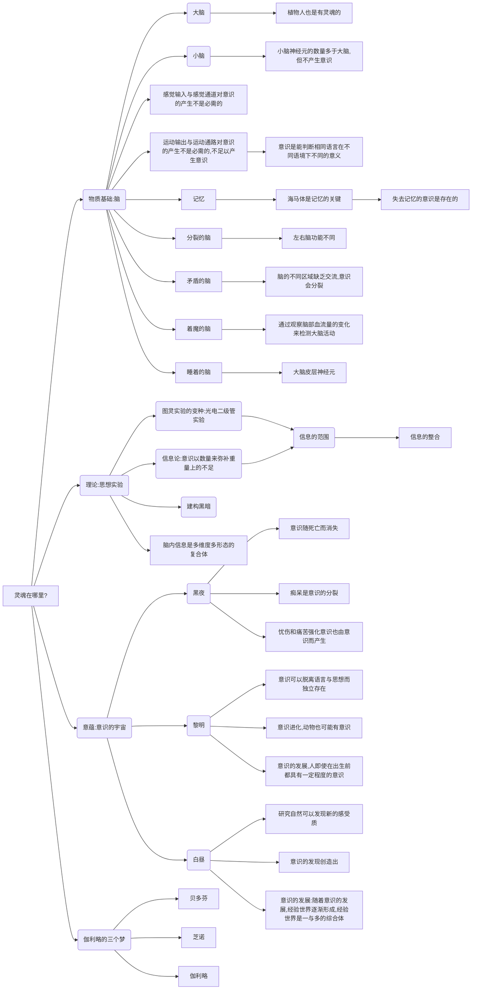

<!-- more -->

[豆瓣读书](https://book.douban.com/subject/26278801/)
PHI
PHI作者: [美] 朱利奥•托诺尼
出版社: 机械工业出版社
副标题: 从脑到灵魂的旅行
原作名: Phi: A Voyage from the Brain to the Soul
译者: 林旭文
出版年: 2015-1-1
页数: 316
定价: 69.00
装帧: 平装
丛书: 
ISBN: 9787111485728
[在线阅读](http://my.52ds.net:32766/book/2922)
相关书籍：
[意识的宇宙](:/2f680d74269b453db9f2bf7cc91e030b)

>我们以及我们的悲喜、记忆、抱负、认同感和自由意志，只不过是我们大脑内数以亿计的神经细胞运作的结果，是构成我们的分子运作的结果。弗里克说，我们不过是一堆神经细胞、一堆分子而已。

托马斯·亨利·赫胥黎（1825—1895），英国生物学家，因捍卫达尔文的进化论而被称为“达尔文的斗牛犬”，创造了术语“不可知论”。

>如果意识的图像是在脑中产生，不是在视网膜上产生，那么这位女士的眼睛可能没有问题，但她看不见东西，而这位盲人画家却能够看得见。

>这一章有两个目的。第一个目的是想说明：即使一个人一动不动躺着（像M那样由于脑部受到损伤引起，或正常人睡着了做梦的时候），他还是可能具有意识。第二个目的是将M与机器作对比：M不能说话，不能行动，但是他有灵魂（或者说曾经有过灵魂）；自动告解神父这台机器能够回答所有问题，却极可能是没有灵魂的。看来有时候我们不能轻易下这样的结论：几乎没有反应意味着几乎没有意识。反过来，我们也不能做出以下结论：具有很多聪明的反应必定意味着具有很多意识。

记忆的关键在于检索，海马体实现记忆细胞之间的关联，相当于附加在记忆上的各类标签及供检索用的线索。如果海马体受损，人们会失去记忆，失去的不是记忆内容，而是检索大脑的能力，这样，即使记忆存在也无法找到。但失去了记忆的人，并不能说是一个没有意识的人。

>睡眠可能是研究意识的一个理想的测试方式，多数人都可以用这种方式测试意识。晚上睡着时忽然醒过来，此时你可能会从一种虚无状态进入到充满各种体验的状态，就像这一章里的笛卡尔。这告诉我们：意识不是确定不变的——脑部活动仅仅发生一个变化，一切都可能会消失；而且，我们在清醒与熟睡（或麻醉状态）时，脑部活动的差异也许是解释意识产生的关键。

根据自己的经验，梦中最奇妙的事不是梦境有多离奇，而是在梦中，我们现有的逻辑判断标准与现实是不同的，比如在梦中，你认为非常合理的判断过程，醒来后如果你还记得的话，会显的非常荒谬。

>当我凝视天空，我看到扁平的苍穹，我看到太阳像一个耀眼的圆盘，我还看到很多其他东西。我是怎么看到这些东西的？来自太阳的一束光进入到我的眼睛，聚焦在视网膜上，在这里进行转化，然后再传送给脑顶部的神经细胞。这一连串的反应——从太阳光到脑顶部的神经细胞——是一个物理的过程。每一步都是一种电反应，但结果会产生一种变化，这种变化与之前每一步的反应完全不同，我们也无法解释这种变化。于是我们的意识中就会出现一幅景象：苍穹与太阳，还有很多其他东西。事实上，我看到的是周围世界的图像。

我们看到了这个世界，我们认为这个世界给我们的感觉是我们设计的机器无感觉到的，但正如机器无法同理我们对这个世界的感觉一样，我们也无法同理机器对这个世界的感觉。我们认为这些独特的感觉是意识的基础，但是我们并不能为这种意识进行定义，我们并不知道机器对这世界是不是也有独特的感觉，或者同类机器是不是对这世界有类似的感觉，也不知道，这些独特的感觉，是不是机器意识的基础。

>因此，伽利略产生一个简单的想法：也许正是因为他的脑子懂得区分无数的可选择项，才使得他具有意识，而光电二极管没有意识，或者只有极少量的意识。**意识以数量来弥补重量上的不足。** 想到这，他想起了桑克托留斯。这个想法并不新奇，以致伽利略奇怪自己之前怎么没想到。
香农的p对数方程式如下，其中S代表信息熵。
$$
\mathrm{S}(\mathrm{X}) = -\sum_{\mathrm{m} = 1}^{\mathrm{M}} \mathrm{p}_{\mathrm{m}} \log _{2} \mathrm{P}_{\mathrm{m}}
$$
>X可以代表任何一个系统，这个系统可以取m=1……M中的任何一个数值，数值表示的是可能状态。以光电二极管为例，它的状态是1和2。每一种状态有一个概率Pm（光电二极管状态的概率是1/2），所有概率之和是1。如果每一种状态的概率都一样，方程式就简化为状态总数的对数（也称作玻尔兹曼方程式）。如果某种状态出现的概率比其他状态要大，方程式会考虑到每个结果的概率分布，以减少不确定性。

我们常常想到用量变引起质变，足够数据的传感器也许能模拟人脑神经，从而产生意识。
但是这也涉及到另一个问题，就是怎么能让足够多的数量能认识到自己是相互是一个整体呢？
以书中相机为例，相机拍到一张照片，但不会理解照片，因为对于相机来说，只是一个像素点的集合，而伽利略能认出照片，是因为他的脑中有一个先验的感觉。
这所谓的先验，在于他能在适当的范围内剪切信息。

在适当的范围内，这些信息还需要能有机整合。
>一个盲人和一个聋子在一起是不能区分颜色和声音的。
>
>一个系统产生的信息与部分的集合产生的信息应该是不同的。
>
>“相机传感器除了各组成部分产生的信息，没有产生其他信息。因此，至少在涉及信息方面，相机并没有高于各部分总和。我们不妨将相机从有用实体的名单上删去，用奥卡姆剃刀将其剪切，只要有100万个光电二极管存在就行了。如无必要，勿增实体。”

所以意识不是信息是总和，而是输入信息以外产生的信息。

意识有一个最小的核心，有一个最大的外延。比如，切除一部分脑细胞，并不影响你的意识，而两个人拉在一起，也不会溶合成一个意识。

>即使我们很肯定一个系统是有意识的，我们还是不知道它具有的是什么样的意识。因为经验是有特征的，不能被简化成任何东西。

子非鱼，安知鱼之乐

>是否具有意识，意识在哪里产生，不是由神经细胞的属性决定的，而是由整合信息的数量决定的，而整合信息是由很多神经细胞产生的。也许意识特定的方式，即意识的特性，不是由复合体内细胞的属性决定的，而是由产生信息的特定方式决定的。

>黑暗不是存在于虚空中，看到黑暗需要条件

空与满只是两种状态，而不是说，空是默认的，加了东西后才是满。从信息的角度来看，两种状态的信息含量应该是相同的。

>莱布尼茨这样想象他的磨坊：“设想有这样一台机器，能思考、感受，有知觉。设想这台机器按原比例放大，大到我们可以走进去，就像走进一座磨坊。我们仔细检查它的内部结构，会发现机器各组成部分都在运作，但是没有一个部分能够解释知觉是如何形成的”（《单子论》，1714）。之后的哲学家内德·布洛克（Ned Block）与约翰·塞尔发展了莱布尼茨的磨坊理论，将中文作为论证的变量。

大脑中信息保存的方式一直是个谜，神经元是物质的可以观察的三维结构，但其中的信息，可能却是更高维度的。这一点很难理解，但是可以想象对一个信息打标签，每一个标签就是一个维度，而打标签的方式，就是每个独特的个体的智力等差异。

书中用亮光宫殿来比拟大脑，是因为现在的研究方式，在判断一个大脑的活动时，脑部神经元就如同点亮的星光，在脑中熠熠生辉。这也可以想象，我们在思考时，或者我们在对一件外在事物反应时，从来不是孤立的，而是多维并发的。

人脑不光对信息打上多维度的标签，而且会有这个信息的多种表现形式的备份。

>斯宾诺莎在这一章中备受尊敬，或许是因为他和伽利略都与透镜有密切关联，或许是因为他在《伦理学》一书中写道：“人身体的比例使其与其他物种相比，更擅长同时做很多事情，或同时以多种方式做一件事情。因此，与其他物种相比，人的心智也更擅长同时感知很多事情”（第二部分批注）。按照通常的理解，这个命题可以理解为区分很多可能状态的能力与意识相关，而这正是作者赞同的观点。
>
>斯宾诺莎是一个优秀的人才，是宿命论者、自由意志的否定者！
>
>这一信息的内容是：每一种经验都是由不可简化的概念组成的形状，概念指的是复合体过去和未来状态的概率分布，由感受质空间的机制规定，这些概念形成了复合体目前的状态。

>这就是死亡。死亡不是生命的消逝，不是不会动了，而是内心的亮光消逝了，而外在的火焰无法将亮光重新点燃。死亡就是永远地失去意识，死亡就是脑内的信息被撕成碎片。身体消逝了，灵魂也随之消逝。

死亡就是一个体的消失，但像伽利略这样的伟人，你能说他消失了吗？如果人类没有灭亡，就不能说他消失了吧？构成伽利略肉体的物质是消失了，但他的经历、经验，或者说思维方式，却仍在人间流传，所谓灵魂不灭，也许就是这样吧。如果意识是指这些脱离了肉体的单纯精神，也可以说伽利略的意识并没有消亡，至少是部分没有消亡。或者，这个部分的说法不准确，即使他还活着，大脑中的细胞也是生生灭灭，一刻不息的，作为意识的载体，也是时时刻刻部分消亡的。

也许人生的意义就在于此，努力构建一个在人类群体中不会被遗忘的信息流，这就是灵魂。而无数的灵魂构成了人类这一个大的生命体的本质。

剧烈的情感是意识强化的基础。所以古往今来，成大事者往往会经历更多的磨难，而且还不能被这些磨难打倒，淘汰。

反之，痛苦也是大脑产生的一种反应，理论上说，可以与身体无关。

文字可以承载情感，所以意识可以说是可能独立存在。

资本主义默认共产主义者抑制个人的个性，从而有损于人类意识的多样性。这个问题其实可以从另外一个角度来看，统一认识，只是从资产阶级手中夺权的一种手段，而之所以需要夺权，是因为需要让人类社会中的大多数人代替少部分特权阶级，即使这样做，会暂时让文明退步，从宏观角度来看，也是值得的。而共产主义的本质，却是更大地解放人类的思想。

再进一步，人类的特性决定了人类这个群众是无法万众一心地达成目标的。那么，即使通过各种手段，也只是临时起到作用的，最终，人类还是要启用托管模式，或者托管给人工智能，或者托管给更高级的文明，被圈养的人类才是最有创造力和最有灵魂的人类。

当然，这只是一个猜想，也许，不经历磨难或者时不时大幅度倒退的文明，是没有生命力的文明，而这些是灵魂产生的代价。只有和魔鬼做交易的人才能得到自由。

意识不可能是无本之源，只有不停地接受新的输入，才会有意识的存在，就是说，有不停的输入，人脑的建模过程才能持续不断。

艺术的想象能创造出新的形状吗？也许吧，但更可能只是现有形状的错误建构，因为正确答案只能有一个，而错误答案却五花八门。

>意识的世界辉煌壮丽，意识就像是钻石，由此产生了意义。但是不能被他人分享的意义，就像没人会戴的珠宝，冷冰冰的。

自我认知的困惑，自我的标准无法确定。

>伽利略说：我知道当我的脑分裂的时候，我的意识会消失，感受质会熄灭，但是其他人的意识和感受质会继续存活下去。我能够看到一条路，从一个人的过去或未来延伸至另一个人的自我中去；在这条路上，一种形状变成另外一种形状，但这种形状还是一个整体。
>
>她合上他的眼睛，让他休息，
然后拉着他的手，带他走进黑暗，
两颗星星从夜空坠落。

>伽利略最后三个烦躁不安的梦似乎要说明以下三点。一，我们并不孤独。意识有社会性的一面，这促使它发展、扩大，赋予它价值及满足感。二，我们都是人类，我们都有生命。我们可以也应该对其他生命形式产生一定程度的认同。从这点来说，我们的意识是不朽的。三，然而，我们每个人都是独特的，因此才珍贵。