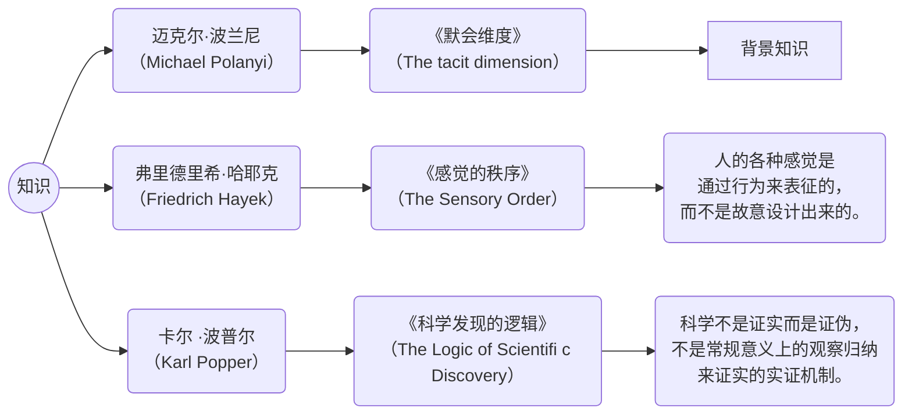
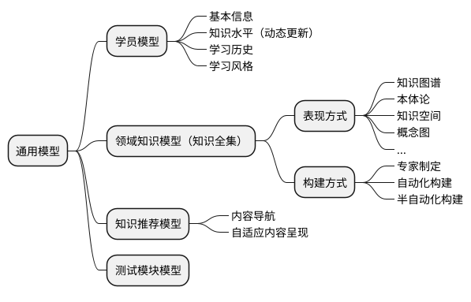

# 阅读：《追问人工智能 : 从剑桥到北京》

[在线阅读](http://my.52ds.net:32766/search?query=%E8%BF%BD%E9%97%AE%E4%BA%BA%E5%B7%A5%E6%99%BA%E8%83%BD)

[豆瓣读书](https://book.douban.com/subject/34850737/)

追问人工智能 : 从剑桥到北京

作者: 刘伟
出版社: 科学出版社
出版年: 2019-10
页数: 236
定价: 58.0元
ISBN: 9787030621955

## 2022-05-05

现在理解的人工智能大多基于机器学习，但是机器学习的本质就是从堆砌的数据推导出结果，而这个结果是不是基于智能的判断呢？休谟认为认为，从事实是推不出价值观的。比如说，“天行健，君子以自强不息”，人类也许可以观天像，而得出“君子当自强”，但机器学习无论从多少年的气象数据也得出不这个结果，从而催促人类努力学习。从这个意义上说，机器是没有智能的。

什么是智能，什么是知识，终究是一个哲学问题。

所以说，智能不是知识的堆砌而成，在数据变成决策之前，有一个神秘的转化过程。

深度态势感知

人的弱点
* 注意力的隧道效应
* 记忆瓶颈
* 生理及心理压力
* 数据过载
* 错位：容易引起错误理解的外部信息，类似读书时的错行，
* 复杂性蠕变：过多的信息引发的复杂性暴增
* 错误的心理模型：错误的习惯或者不再适合的习惯引起
* 环路异常：人们以为系统正处在正确的自动运行状态，其实不是。

所以正确的态势感知系统必须是人、机、环境的整合。

## 2022-05-07 00:01
> 深度态势感知的含义是“对态势感知的感知，是一种人机智慧，既包括了人的智慧，也融合了机器的智能”，是能指+ 所指，既涉及事物的属性（能指、感觉），又关联它们之间的关系（所指、知觉），既能够理解事物原本之意，也能够明白弦外之音。

如果说机器学习是基于数据进行概率分析，深度态势感知则引入了人的行为模式，从而形成一个经验。但这种完美的理论性必然会面临一个大的问题，就是如果无法量化无法标准化，机器就很难做到。

人工智能的三大门派
* 联结主义（connectionism）:深度学习，模仿大脑皮质神经网络及神经网络间的连接机制与学习算法，即用多隐层的处理结构处理各种大数据
* 行为主义（actionism）:强化学习，模仿人或生物个体、群体控制行为功能及感知—动作型控制系统，即通过行为增强或减弱的反馈来实现输出规划的表征
* 符号主义（symbolicism）：知识图谱，以物理符号系统（即符号操作系统）具有产生智能行为的充分必要条件假设和有限理性原理。即用模拟大脑的逻辑结构来加工处理各种信息和知识

人类与机器的智能区别还有一个重要的一点就是人会犯错误，一些毫无逻辑的错误也许正是灵感的来源，从这个角度，也许我们把机器所有判断的任何事实和基础都当作关联的，从量上解决这个问题。

## 2022-05-07 14:02
人机差异还有一个人、机对语境的理解不同，比如，书中举例，“你吃了吗？”，在中国常常是一句问候语，并不需要你回答吃什么，怎么吃等细节。这对于机器来说很难理解与区分。但是，我想，这只是一个伪命题，因为一个中国人在理解这个语境时，其实也是经过了许多次实践才形成的，那么机器完全可能通过强化学习，在反馈中理解这一特定的语境。

先信仰后理解是人的问题，不是机器的问题，机器不会有这个弱点。对于一个理性的人类来说，信仰并不是最重要的，你当然可以先相信某个事物并力争去证明它，但在证明的过程中，根据得到的信息，实时地修正或者改变信仰也并不是什么难事。

其实，作者做的哲学思考越多，在技术上能做的就越少。人工智能作为一个思辨性的学术问题和作为一门技术科学，是完全两回事。

当我们理解人工智能是人类更好的工具时，才需要考虑人机交互的问题。

自我其实就是一个坐标系的原点，每一个观点，都是基于“自我”这个原点来度量世界。

我们尝试理解这个世界，但这个世界只是你眼中的世界，我们不可能得到全部的事实，也存在所谓全部的事实，那么我们得到的结论，只是你以为的结论。那么有没有什么评判的标准呢？应该是没有的。但是在一些小范围内，是可能有的，比如财富，比如生命。

情感计算的可能性：通过对行为模式的变化、语言风格、面部表情变化等数据进行计算是可能的。如果有更多的传感器，比如血液中激素变化，大脑中激活区域、肌肉神经信号变化等等。

对于一个个体来说，情感计算可能是收集这个体的各项数据，而对于一件事物来说，可能会简单一点，因为它收集的是群体行为引发出的结果数据。起点庞杂，但终点往往很少。如果我们研究人工智能的目的是让它成为一个更好的工具，那么研究终点也一样能达到效果的。

游戏人工智能的实现技术
1. 有限状态机
2. 搜索
3. 有监督学习
4. 遗传算法
5. 强化学习
6. DRN（DRN 是 Google DeepMind 在 Playing Atari with Deep Reinforcement Learning 中结合深度学习和强化学习形成的神经网络算法）
7. 深度学习+强化学习+博弈树

自适应学习：Knewton平台
自适应学习系统通用模型：AEHS模型

元知识
试图以元知识来构建一个知识体系，其实是很困难的，因为对于元知识的概念、范围等，根本就没有一个确定的定义和描述方法。

人工智能在军事上的应用

智能传播，人工智能也许无法理解人性，但它肯定比大多数不思考的人类更能利用人性的弱点。所以，无论是在哪个方面的应用，人工智能肯定不是智能，但是达到的效果肯定比人的智能更好。

因为数理逻辑本身的局限性，所以当前的人工智能就有局限性，所以理想的人工智能就应该包含更多的东西来打破这个局限性，但是，这又是一个伪命题，在我看来，世界都不完美，为什么你要求人工智能是完美的？
在我看来，好的人工智能是能被人理解的人工智能，是好用的人工智能。所以从哲学高度去理解人工智能有点多余了，你觉得石斧好用，然后考虑石斧存在的意义，未免多事。
我们可以从人的学习方式得到启发，但是要让机器模拟出人脑来，是另一门科学，而不应该是人工智能的任务。

人机融合智能是一种新的智能，但与文化什么的应该没有什么关系。硬要把它向伦理、道德上靠只是自寻烦恼而已。
我们考虑“认知不是计算”时，其实我们更应该一开始就明白“计算不是认知”，你把计算当作认知来看待，然后又这不满意那不满意，不是自寻烦恼吗？

## 关于机器学习或者人工智能的一点思考
机器学习试图通过以前的数据找到这些数据中内含的规律，从而预测未来。

如果我们画一个坐标系，x轴是时间，y轴是位置，坐标系上的一系列点，其实我们找不到规律，于是引入了机器学习，如果我说，对于某一个时间点，坐标中有n个点，我算他的平均值，然后就可以画一条线，这条线尽可能拟合到一个函数，这个函数就是规律，我可以用它来预测下一个时间点的值，你肯定说我是疯子，很简单的逻辑，当前点拟合这个函数在实际中是由若干个点算出来的，而这些实际点，事实上与这个理论点毫无关系，你却让我相信你预测的点，是会实际出现的点。
但是如果我不告诉你计算方式，而在后台，一会用微分，一会用一些高大上的数学公式，最后得到一个结果，你就应该相信吗？这其实和上面的情况还是一样啊。所谓的机器学习，神经网络，其实就是这么一回事啊。

好吧，现在我不尝试找规律，我尝试分析人性，比如，面对这个场景时，人类的反应。拿股市为例，我不试图分析价格走势的规律，我只分析面对这个状态时，人们在历史上的反应是什么，我就可以假定，当前状态下，明天大家会怎么做。但是这有几个问题，使得以上的理论变的似是而非。
1）历史上面临这个态势时，是有许多的外面影响条件的，并不仅仅是面对这一项，我们能量化的态势是不够的，而且单一项越是精确，误差会越大。
2）产生的反应未必是正确的反应，因为实际上的反应结果是在反应动作以不可知的方式反应出来的，是说，这个系统不是一个稳定系统，而是类似蝴蝶效应，一个小的变化会引起大的系统崩塌。
3）假定这个判断是正确的，而预测结果是由多个实际结果通过概率的方式形成的，我并不能确定自己处于一个有利的概率状态。

那么机器学习有用吗？也许在一种情况下会变的有意义，那就是自我实现，如果所有的人都用这个工具来进行预测，那么机器学习就从玄学变成了自我实现的预言术了。

 以[AI测肿瘤](https://weibo.com/ttarticle/p/show?id=2309404766460256845935#_0)为例，coolwulf创建了[neuralred网站](http://neuralrad.com/)，通过机器学习来判断医学影像。但是，这是不是只是一个专家系统的复杂化应用呢？其实，也许一个或几个专家写几个规则就可以解决的问题，硬是用复杂化的数学理论进行了包装。否则的话，如果机器真的能发现专家都发现不了的规则，那么通过对它最终实用的建模的反编译，应该能发现新的知识才对，如果没有新知识，那么这就是一个人为复杂化的专家系统啊。

