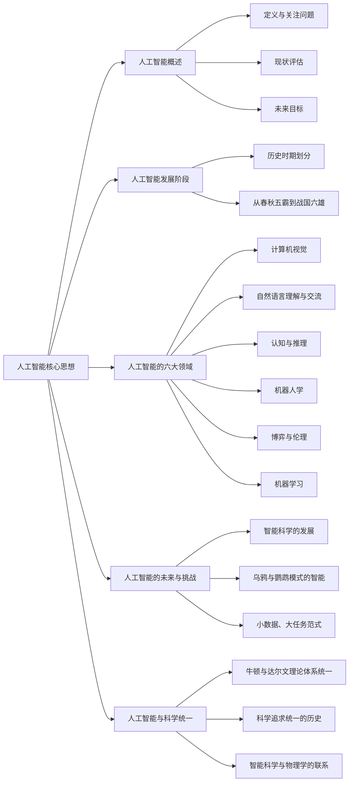

# 阅读《浅谈人工智能》

下面是基本的思维导图

本文根据乌鸦的学习示例提出智能的本质在于通过少量数据，以任务为导向，发展智能的模式。

当前的AI是从大量的数据中发现模式，而在数据中的的标注，其实相当于为大量的数据指定一个单一的任务。但是智能不应该是这样的。文中关于乌鸦的示例就是如此。

> 一只乌鸦，必须靠自己的观察、感知、认知、学习、推理、执行，完全自主生活。要在城里活下去，乌鸦首先面临一个任务，就是寻找食物。它找到了坚果，需要砸碎，可是这个任务超出它的物理动作的能力。它把坚果从天上往下抛，发现解决不了这个任务。在这个过程中，它就发现一个诀窍，把果子放到路上让车轧过去，可以砸碎坚果，但它到路中间去吃是一件很危险的事。因为在一个车水马龙的路面上，随时它就牺牲了。这个过程是没有大数据训练的，也没有所谓监督学习，乌鸦的生命没有第二次机会。这是与当前很多机器学习，特别是深度学习完全不同的机制。然后，它又开始观察了，它发现在靠近红绿路灯的路口，车子和人有时候停下了。这时，它必须进一步领悟出红绿灯、斑马线、行人指示灯、车子停、人流停这之间复杂的因果链。甚至，哪个灯在哪个方向管用、对什么对象管用。搞清楚之后，乌鸦就选择了一根正好在斑马线上方的一根电线，蹲下来了。也许它观察和学习的是别的地点，那个点没有这些蹲点的条件。它必须相信，同样的因果关系，可以搬到当前的地点来用。这一点，当前很多机器学习方法是做不到的。
> 
> 它把坚果抛到斑马线上，等车子轧过去，然后等到行人灯亮了。这个时候，车子都停在斑马线外面，它终于可以从容不迫地走过去，吃到了地上的果肉。你说这个乌鸦有多聪明，这是我期望的真正的智能。

在这个乌鸦模式中，在没有大数据学习、低功耗的情况下，一个完全自主的智能（感知、认知、推理、学习、执行）是可能的。

实现方法可能的路径是：
人工智能六大领域的合成。也就是说，通过小数据、任务为导向的前提下，整合六大领域的数据，试图发现智能的新方法。

就是说，为了完成一个任务，在现有的数据下，多试试，如果不行，再改造工具。

**隐藏的信息**
这样，首先，我们要认识到，数据可以提供的信息可能比我们想象的要多。
以计算机视觉为例，当前的卷积网络的深度学习，主要是对像素进行分析，以一张作者女儿在喝水的照片为例，当前的人工智能可以分析出照片的内容，可以认出照片中各种物体，但是照片中给出的信息应该远不止如此，比如，根据比例，能判断出图中物体的三维特征，比如高度宽度等，也能根据物理原理，判断一个挂在墙上的物体一定被某种东西固定在墙上。能判断一个物体的功能……。
比如现在有一个任务，让一个机器人进屋给室外的人倒一杯水，根据照片，能进行一个不精确的三维建模，能根据照片中的女孩喝水的状态，判断什么是水杯，盛水容器的特征等等。这样机器人应该能做一个基本的判断，判断在哪里拿到水杯，到哪里倒入饮用水。而这些动作的进行，其实和人一样是模糊的，在运行过程中不断地根据最新的数据逐步精确化。

但是作者认为的这些图像之外的“暗物质”，是通过人的想象和推理过程来完成的。但是这些过程其实是其它的数据引发的，作者认为的小数据，基础却是其它大量的数据，只是这些数据是没有直接关系的，对经历的数据的收集，形成了“经验”，而这些“经验”的来源是广泛的。可以是直接的，也可以是间接的。

以乌鸦为例，它是没有可能通过大数据判断安全的道路状态，但是它可能看到一只乌鸦在红灯时安全地吃到坚果，另一只乌鸦在绿灯时被车撞死。但是如果以这种方式产生智能，其实与我们的目标其实也是有些不同的，我们希望一个特定的机器能产生特定的智能，但乌鸦并不是每一只都是如此聪明，因为即使两只乌鸦同时看到以上的信息，也不能说，它们都可以把生死状态与红绿灯关联起来。可能一只笨蛋乌鸦会认为坚果的大小才是决定性因素。当我们开发一个人工智能时，我们是希望人工智能是一个可以预测的可靠工具。

当然，我们可以把一个人工智能的整体（世界上所有智能体的总和）当作产品，这样，它就是一个比人更聪明的AI。

以乌鸦模式为例，所谓的小功耗小数据的高智能，其实是以种群为基础的。那么我们可不可以不是从大数据精简出一套小模型，而是由大量的智能体，从分散的数据中学习“经验”，然后相互交流，达成共识，形成专家系统。

**认识推理**
文中的示例，通视频监控，机器人看到一个人站在厨房，根据人的位置，沿着他的目光，看到他可能关注的物体，比如一个微波炉，判断他的行为。比如，要加热食品，或者是从中取出食品，如果有更多的信息，比如这是一个损坏的微波炉……，根据信息作出判断（推理），信息的获取，可以是观察，但更有效的是交流

**语言沟通**
有效沟通的前提的双方会有一些共识（共同的认知体系），双方拥有的共识（思维方式、知识体系）越多，沟通越有效率。
在考虑到初始状态下，双方的共识很少，为了有效沟通，只能在最基础的共识上进行初始的交流，比如图形。
对于自主学习来说，没有人对数据进行标注，那么结果是正确还是错误呢？可以通过一种公众评审，类似于区块链中的共识算法，而得到这些评审内容则又需要通过沟通才能得到反馈。
以火车悖论来说，轧10个人还是1个人，是一个道德判断，假如一个智能第一次无法决定，它向10个智能体进行咨询，10个其它的智能体给出不同的判断，这个智能体可以根据简单多数进行决策。那么其它的智能体是如何做出判断的呢？这与它们的“经验”有关，而这些“经验”可能与它们的学习地点，学习内容有关，比如一个智能体只学到了“功利主义”，它可能会建议改道去轧那1个人。那么哪个决定是“合乎道德”的呢？这要看这个问题出现的时间和地点了。也就是说，所谓的道德是“时空伴随”的。

**博弈伦理**
使用损失函数
这其实和普通的机器学习原理相似，但是再类比人类的学习方式，比如归纳和演绎，就比较复杂了。

**机器人学：构建大任务平台**
其实就是机器人在任务执行过程中不停地刷新数据，同时作出响应，这样在每个时刻，数据量都不是很大，但是持续的数据都会是上下文的一部分。
但是在例子中，任务其实是不停地被分解被创造的，比如机器人听到有人敲门，它会去开门，并与人握手，打开门时，发现对方双手都提着东西，这时它的要会在当前任务执行时，增加新的中间过程，因为它发现别人双手都被占用，需要帮助，它应该去帮助别人拿东西并放置好，再继续任务。

**机器学习：学习的极限和“停机问题”**
真正的学习是一种交互过程

上面包括了常用的七种学习模式
1. 被动统计学习passive statistical learning：上面刚刚谈到的、当前最流行的学习模式，用大数据拟合模型；
2. 主动学习active learning：学生可以问老师主动要数据，这个在机器学习里面也流行过；
3. 算法教学 algorithmic teaching：老师主动跟踪学生的进展和能力，然后，设计例子来帮你学。这是成本比较高的、理想的优秀教师的教学方式；
4. 演示学习learning from demonstration：这是机器人学科里面常用的，就是手把手叫机器人做动作。一个变种是模仿学习immitation learning；
5. 感知因果学习perceptual causality：这是我发明的一种，就是通过观察别人行为的因果，而不需要去做实验验证，学习出来的因果模型，这在人类认知中十分普遍；
6. 因果学习causal learning：通过动手实验， 控制其它变量， 而得到更可靠的因果模型， 科学实验往往属于这一类；
7. 增强学习reinforcement learning：就是去学习决策函数与价值函数的一种方法。

停机问题，就是这个动态过程中所达成的各种平衡态。也就是说各种因素的综合决定了学习中止。

