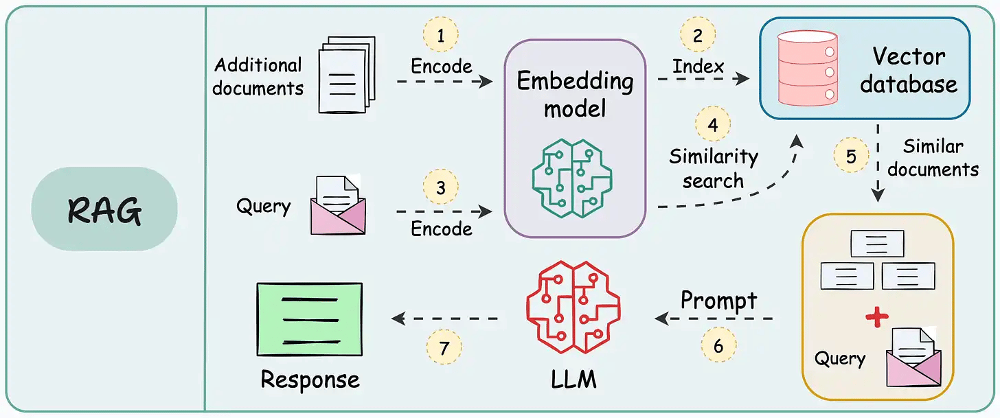
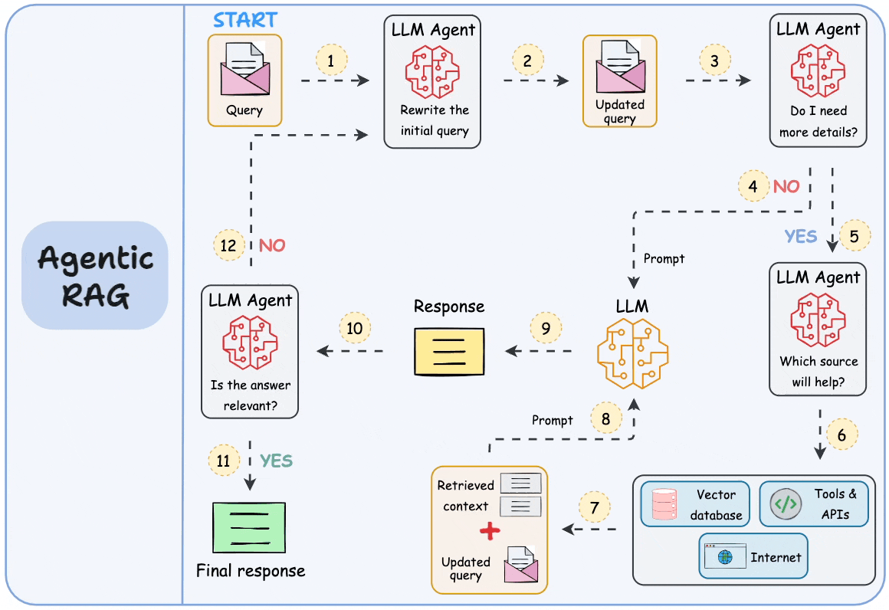

# 通过RAG实践理解RAG实现原理

在如火如荼的AI热潮中，RAG技术是企业使用LLM的主要落地方案之一。
选择适当的方案一向来是一个令人纠结的开始。

## 先动手实践
根据我手头的帮助文档，我试用了RAGFlow和maxKB两套方案。

### 使用RAGFLow实现
首先是RAGFlow。
[Github上的 RAGFlow](https://github.com/infiniflow/ragflow)

#### 部署
需要一台4核16G内存的服务器，因为我有阿里云账号，所以我直接使用阿里云自带的镜像服务器，就没有手动安装了。这样部署过程就变得相对简单了。
在阿里云控制台中，选择计算巢页面，然后在服务目录中找到RagFlow社区版，直接部署。

在登录后，你会发现它的使用非常简单和直观。

#### 配置模型
先点击右上角的头像，进入设置，选择适当的大模型。

因为在阿里云平台，我直接使用了阿里的千问大模型。根据上图的配置，你可以选择所有的主流模型。

#### 创建知识库
模型配置完成后，返回首页，点击上方知识库，就可以创建自己知识库了。

在创建的知识库中，上传工作文档，系统会自动进行解析和切分。

#### 创建聊天助理
再回到首页，点击导航条中的“聊天”，新建一个聊天机器人。

在3处自定义一个机器人名字，在4处选择刚才定义的知识库。
完成后，就可以点击助理名，和它聊天了。

### 使用maxKB
然后使用MaxKB。MaxKB需要的资源比RAGFlow略少一些，4核8G的服务器就能跑起来。
[MaxKB的官网](https://maxkb.cn/)
[Github上的MaxKB](https://github.com/1Panel-dev/MaxKB)

#### 部署
好在阿里云的计算巢里也有它的镜像。
直接通过服务目录进行部署。用系统提供的默认密码可以登录了。

#### 配置模型
登录进入主界面后，直接从导航栏进入进行大模型配置。

#### 创建知识库
再回到主界面，从导航栏进入知识库配置

然后将文档上传到知识库中即可。

#### 创建应用
回到主界面导航栏，创建应用，先创建一个简单应用

然后选择上面配置的大模型和知识库。点右上角的发布即可。

### 简单比较一下
用相同的问题简单比较一下，

很明显RAGFlow的效果好的多，而MaxKB则回答了许多与知识库内容无关的内容。作为一个帮助客服系统，这显然是不适当的。

为什么会有这种情况呢？

## 从RAG的技术原理分析RAG的特点、

### RAG到底是什么？
RAG，全称 Retrieval-Augmented Generation，中文一般翻译为“检索增强生成”。它的核心其实就是一种结合了大模型的查询方法。

假设你手里有一堆资料，而问题的答案一定藏在里面，怎样才能又快又准地找到呢？

RAG 的做法是：先用嵌入模型把所有资料转成“向量”，存入一个向量数据库。这个数据库就像一本智能索引，不仅能模糊匹配同义词，还能跨语言识别。比如你搜“人工智能”，它不仅会匹配到“人工智能”，还会找到“Artificial Intelligence”或“AI”。

当你提出问题时，RAG 先把问题转成向量，在数据库里找到最相关的资料片段，再交给大语言模型，由它根据这些片段生成完整的答案。

### 从RAG的技术原理优化方案
根据上面的原理，结合部署的实践，能看出部署一个方案相对简单，但是让这个系统有效运行，其实还是需要一些技术的。

根据具体的实践，我列了以下几点：
1. 嵌入模型的选择。模型中的维度越高，索引越大，但效果也是越好。
2. 资料的优化。对于手头的资料，最好能先做预处理。资料越规范，组织越结构化，效果越好。在实践中，我将docx格式的word文档，转成markdown格式，将截图格式统一成JPG格式并为每个截图加一个图标，文档的解析速度和成功率明显增加。
3. 大模型的选择。不同的大模型的生成风格和上下文的大小是不同的，当然，目前主流的大模型效果都不错，我选择阿里的千问和DeepSeek，效果都很好。
4. Chunking策略。RAG是将从资料中找到的片段提交给大模型，但这个片段的大小其实有讲究的。

但是有一些问题是无法解决的，比如，在实际使用中，如果资料多了，返回的信息总是不全。这是因为搜索到的Chunking片段是有限制的，因为它不可能把全部找到的内容上传给LLM。而且检索上传的信息只是一些零散的片段，无法让模型形成一个连贯有用的“理解”。

这一点其实网上已经有一些专家提出了，比如最近Cline团队的成员就在X上报怨RAG技术的不靠谱之处（https://x.com/arafatkatze/status/1957850152909119955)。

甚至还有一些更极端的观点，比如网上有一篇采访Chroma创始人Jeff Huber的博客，直接提到RAG已死。（https://www.latent.space/p/chroma）

不过如果仔细看看他们认为RAG不好用的理由，其实都是一个问题，就是如果要多海量资料中找到有用的信息，这些信息肯定是零散的，而这些零散的信息不足以让大模型理解问题的本质。

现在有一个解决方法，就是让大模型发挥更大的作用，而不仅仅是做组织语言这类简单工作。具体是用代理或者说智能体参与于RAG的每一步中。

比如说，现在我们根据向量化的索引，搜索到了1000条包含关键词的信息片段。因为参数限制，我们只能提交其中的30条给大模型。现在我们可以先让智能体介入，让它来判断这1000条片段的相关性，然后根据不同的相关权重，动态调整这些片段的上下文长度。然后有选择地提交大模型去处理。

而这些智能体可以串行或者并行地形成一个工作流。如下图所示。 这种代理式的RAG相当于用一系列的专业智能体处理传统RAG中的每一个步骤。

