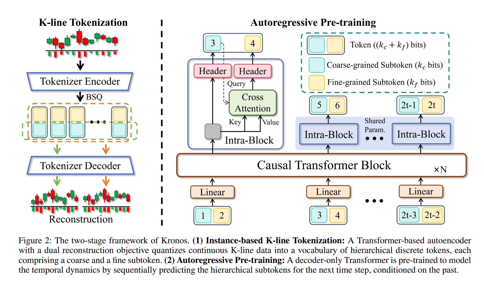

LLM（大语言模型）本只是NLP(自然语言处理）的一种具体技术实现，但它的成功已经让人们默认这就是是人工智能的发展方向了。
<!-- more -->
我们也习惯使用它来解决任何问题。炒股也不例外。

# 用Kronos算法实战
最近在github上看到一个有趣的K线图预测模型Kronos。
（github.com/shiyu-coder/Kronos）

在arXiv上有他们的论文《Kronos: A Foundation Model for the Language of Financial Markets》（arxiv.org/abs/2508.02739）。

它的核心思想是，一个连续的K线图可以理解成一篇文章，而每一个蜡烛图就是一个词，这些词是有上下文的语义的。

- 论文中把一个K线序列比作“市场语言”，顺序不同即意义不同。比如一个大阳线后接一根十字星，和一个十字星后接一个大阳线，市场含义完全相反。而用来处理NLP的Transformer的自注意力天生擅长捕捉这种“谁在前，谁在后”的依赖。
- 论文中从一个K线中提取开盘价、最高价、最低价、收盘价、交易量和交易额这6个参数，简称为OHLCA，然后将它编码成一个Token，类似于文章中的一个汉字。
- 论文中认为，预测价格和一篇文章中预测下个字并没有什么本质区别。

从直观上，我们能理解K线图是所谓的市场语言，但以前我们都是直接把OHLCA或者再加上一些自定义的参数直接喂给算法，让它通过深度学习来发现潜在的模式，只是通过反复验证来调整算法或者参数，毕竟深度学习就是做这个的啊。

这篇论文中有新意的地方在于：

## 为什么要将OHLCA先编码成Token
文中提到了一些必要性，比如在19页的Q2中提到

连续的OHLCVA直接喂Transformer的话，数值不稳定。比如价格闪崩、除权等会把模型搞崩溃。
同时也提到，高维连续空间导致样本效率低，而把无限的实数空间映射到有限字典，模型效果更好。
而OHLCVA的Token过程，其实也将信息离散化的过程，这种离散化从技术上更有利于生成预测。

## 为什么选择BSQ+两级Transformer Tokenizer
选择Binary Spherical Quantization(BSQ)，将向量先投影到单位超球面再二值化，让误差有严格的上界。相当于普通数据清洗中的归一化，只是选择算法特殊一些。
而两级因子化则是解决数据量大，显存放不下的问题。

然后论文中也讨论了不采用其它技术的一些理由，比如CNN卷积核难以捕捉跨维度长程依赖；直接连续回归对异常值敏感；BPE对序列数据意义不大；不分级会导致显存溢出等。

总的来说，**因为金融数据噪声大、维度高、任务多，所以必须把 OHLCVA 离散化成有限 token；而 BSQ+两级 Transformer Tokenizer 是唯一同时满足 误差有界+显存可控+跨维交互 的方案**，其余技术在论文里都被实验或理论一一否掉。



最终如上图，他们将一个K线图编码成一个Token。用这种方法，他们对45家交易所，7个频率、12亿根K线图（纯金融数据，没有混入天气、电力等无关序列）进行了编码和训练，从中得到了三种规格的模型，并将它们开源到了huggingface上。
（https://huggingface.co/NeoQuasar）

## 看看实际效果
先从github上将代码clone下来。
确定本地的Python版本在3.1以上，然后
```
pip install -r requirements.txt
```
然后直接运行/examples/prediction_example.py即可看到示例代码。

当然，我们更想试试手头持有的股票来试试效果。

让我们先看看上面的示例代码。需要注意以下几点：

### 1.模型开源在huggingface
```
# 1. Load Model and Tokenizer
tokenizer = KronosTokenizer.from_pretrained("NeoQuasar/Kronos-Tokenizer-base")
model = Kronos.from_pretrained("NeoQuasar/Kronos-base")
```
先是加载Tokenizer执行器和模型。这里需要注意的是，模型是开源在huggingface上的。另外，模型有不同的参数规模，默认model是Kronos-small，我把它修改成了Kronos-base。

### 2.注意是否有cuda环境
另外在初始化预测器时，使用了cuda环境。
```
# Initialize the predictor
predictor = KronosPredictor(model, tokenizer, device="cuda:0", max_context=512)
```
因为我笔记本上没有NV的独立显卡，没有安装cuda环境，所以修改了一下代码，让它用CPU来计算。
```
# 根据环境自动选择设备（优先 CUDA，否则 CPU）
device = "cuda:0" if torch.cuda.is_available() else "cpu"

# 2. Instantiate Predictor
predictor = KronosPredictor(model, tokenizer, device=device, max_context=512)
```

### 3.用自己的数据进行预测
首先能从代码中看到预测加载的数据是/examples/data目录下的csv格式文件。
然后需要注意的两个参数是
```
# Define context window and prediction length
lookback = 400
pred_len = 120
```
这是根据前面400个数据，预测随后的120个数据。
我把这两参数修改了一下，lookback=512，这是最大值了。pred_len=100，让它预测100天的数据。
我们再看看这个csv文件。

很明显，我这要按这个格式将数据修改成我需要预测的品种即可。

再看看下面
```
x_df = df.loc[:lookback-1, ['open', 'high', 'low', 'close', 'volume', 'amount']]
x_timestamp = df.loc[:lookback-1, 'timestamps']
y_timestamp = df.loc[lookback:lookback+pred_len-1, 'timestamps']
```
x_df意思是，从0到第511行的数据是历史需要，我们需要用这些数据来进行计算。而y_timestamp是随后100个预测数据的时间戳。

这里需要注意的是，我们想要预测往往是选择从今天开始倒数512天的数据，那么csv表中最后一行往往是今天的数据，这样y_timestamp定位时，从512到611行就读不到数据，程序会报错。我是简单粗暴地在excel中加上100行，时间戳是自动增加，然后其它所有的数据全填0。

获取股票的数据，我是用akshare库来拉取的，因为只是测试，我并没有对数据进行清洗，下面是主要获取代码
```
class StockDataFetcher:
    """A股数据获取类"""
    
    def __init__(self):
        """初始化"""
        self.today = datetime.date.today().strftime('%Y%m%d')
    
    def get_stock_info(self, symbol: str, period: str = "daily", 
                      start_date: Optional[str] = None, 
                      end_date: Optional[str] = None) -> pd.DataFrame:
        """
        获取单只股票的历史行情数据
        
        Args:
            symbol: 股票代码，如 '000001' 或 'sh000001'
            period: 数据周期，支持 'daily', 'weekly', 'monthly'
            start_date: 开始日期，格式 'YYYYMMDD'
            end_date: 结束日期，格式 'YYYYMMDD'
            
        Returns:
            包含股票行情数据的DataFrame
        """
        try:
            # 保存原始代码用于显示
            original_symbol = symbol
            
            # 处理股票代码格式 - 直接使用6位数字代码
            if len(symbol) > 6:
                # 如果已经包含前缀，去掉前缀
                symbol = symbol[-6:]
            
            # 设置默认日期
            if not end_date:
                end_date = self.today
            if not start_date:
                # 默认获取最近30天的数据
                start_date = (datetime.datetime.now() - datetime.timedelta(days=30)).strftime('%Y%m%d')
            
            # 获取股票历史数据 - 使用6位数字代码
            if period == "daily":
                df = ak.stock_zh_a_hist(symbol=symbol, period="daily", 
                                      start_date=start_date, end_date=end_date, adjust="")
            elif period == "weekly":
                df = ak.stock_zh_a_hist(symbol=symbol, period="weekly", 
                                      start_date=start_date, end_date=end_date, adjust="")
            elif period == "monthly":
                df = ak.stock_zh_a_hist(symbol=symbol, period="monthly", 
                                      start_date=start_date, end_date=end_date, adjust="")
            else:
                raise ValueError("period 参数只支持 'daily', 'weekly', 'monthly'")
            
            if df.empty:
                print(f"警告：股票代码 {symbol} 没有找到数据")
                return pd.DataFrame()
            
            # akshare返回的数据已经是中文列名，需要重命名为英文列名
            required_columns = ['日期', '开盘', '收盘', '最高', '最低', '成交量', '成交额']
            
            # 检查是否包含所需列
            missing_columns = [col for col in required_columns if col not in df.columns]
            if missing_columns:
                print(f"警告：缺少必要的列: {missing_columns}")
                return pd.DataFrame()
            
            # 选择需要的列并重命名为英文
            result_df = df[required_columns].copy()
            column_mapping = {
                '日期': 'timestamps',
                '开盘': 'open', 
                '收盘': 'close',
                '最高': 'high',
                '最低': 'low',
                '成交量': 'volume',
                '成交额': 'amount'
            }
            result_df = result_df.rename(columns=column_mapping)
            
            # 添加股票代码列
            result_df['stock_code'] = original_symbol
            
            return result_df
            
        except Exception as e:
            print(f"获取股票 {symbol} 数据时出错: {str(e)}")
            return pd.DataFrame()
    
    
	……   
```

再看看我拉下来的数据：

从上图能看出，第542行是截止8月20日的数据，第1行是标题，那么有效数据是541行，其中512行前的数据是用来计算的，从第512行开始到611行都是预测数据，其中8月20日前的数据刚好可以用来看看预测的效果。

红线是预测值，蓝线是实际值。这个效果看起来一般啊。
我试着又下载了另一个股票000156的数据，看是不是会好一点：

好像要好看一点。我这里用的是日线预测的。如果是短期预测，5分钟线可能会好点。
不管怎么说吧，至少预测的结果都比较乐观。

这里有一点需要提醒，上面拉取数据时，没有注意每一列的顺序，保存时默认是open、close、high、low，但是示例代码中正确的顺序应该是OHLC，我只好手动在excel时复制粘贴了一下。


## 更新一步的技术细节分析
### 用自己的数据进行微调
Kronos还提供了在自己数据集上进行微调的方法。具体的方法在github的项目中有完整的示例。因为我没有硬件条件进行复见，就没有继续研究了。


### K线图编码成离散Token的技术细节
开头的论文开源了全过程的技术细节。每一步都有对应的公式和关键代码。看起来太无聊了。简单总结一下。
- 一次只处理一个K线图
- 把K线OHLCVA的6个数变成236维隐向量
- 将这个向量用BSQ映射到单位超球面再切成20bit的二进制码。
- 将这个20bit的码切成2个10bit的表。（这个主要是因为20bit码要求显存过大）
- 训练时，分成两个粒度进行训练。
- 端到端自回归预训练。
- 将Token化后的数据还原成K线图
论文的附录中，提供了上面技术的代码仓库，理论上可以通过它自己训练模型。
（https://github.com/zhaoyue-zephyrus/bsq-vit）
因为没有硬件条件，也没有仔细看那个项目了。
不过在上面的仓库中，有一个小模块其实还是值得学习的，就是作者用来对K线数据进行清洗的脚本。

### OHLCVA的频率对推理的影响
Kronos 的预训练语料同时包含了 日线、5 分钟线、乃至 1 分钟线 等多频率数据，论文对“频率如何影响下游推理”做了系统性实验。
采样频率越高，短期任务表现越好，根据论文中的数据，1分钟线适合高频做市，5分钟线适合日内波段，15分钟线适合隔夜交易，日线则适合做按周按月的波段。

### 用K线组合代码单独K线是否效果更好
这个在论文中也有涉及。作者用实验证明了：
多根K线组合不会带来预测优势，反而增加量化噪声和显存占用。
作者说与其选择K线组合，不如增加上下文。
但是我看作者的实验是简单用3根K线拼接或者5根K线拼接来与单根K线比较的。我们在实践中考虑K线组合时，其实是指有特征的组合。不过这也增加了数据预处理的难度。

### 在当前框架中加入更多的参数是否能优化推理效果
比如增加CPI、地缘冲突等信息。
作者认为不会。
作者认为在现有“单根离散 token + 512 步短上下文”的框架中，宏观慢信息基本已经被K线内化，而且这类显式特征相当于噪声。
作者认为如果要利用这些信息，需要用新架构，而不能只是简单增加几列数据来解决。


