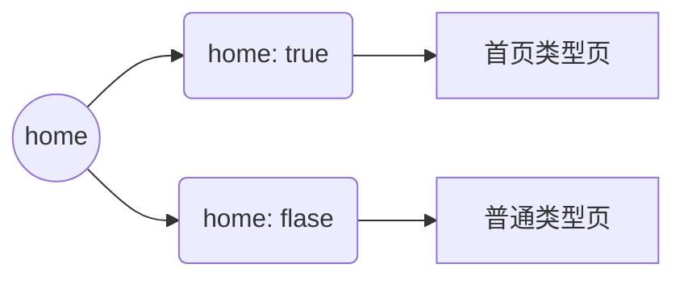

<!-- more -->

# 创建Vuepress网站

## 创建简单网站

根据[快速上手 | VuePress](https://vuepress.vuejs.org/zh/guide/getting-started.html#%E5%88%9B%E5%BB%BA%E9%A1%B9%E7%9B%AE)创建项目

 
```
# 新建一个目录，然后进入此目录
mkdir xgxgc-manual
cd xgxgc-manual
 
# 初始化git
git init

# 生成package.json
npm init -y

# 安装 vuepress
npm install -D vuepress@next
# 安装打包工具和主题
npm install -D @vuepress/bundler-vite@next @vuepress/theme-default@next

# 创建 docs 目录和 docs/.vuepress 目录
mkdir docs
mkdir docs/.vuepress
```

在docs/.vuepress下创建一个config.js文件，内容为
```
import { viteBundler } from '@vuepress/bundler-vite'
import { defaultTheme } from '@vuepress/theme-default'
import { defineUserConfig } from 'vuepress'

export default defineUserConfig({
  bundler: viteBundler(),
  theme: defaultTheme(),
})
```

创建一个首页
```
lijun@DESKTOP-FIEG1I3 MINGW64 /d/dev/xgxgc-manual (master)
$ echo '# 111 hi,Vuepress' > docs/README.md
```

创建.gitignore文件
```
# Dependencies
node_modules/

# VuePress 默认临时文件目录
.vuepress/.temp
# VuePress 默认缓存目录
.vuepress/.cache
# VuePress 默认构建生成的静态文件目录
.vuepress/dist
```

在package.json中增加
```
{
  "scripts": {
    "docs:dev": "vuepress dev docs",
    "docs:build": "vuepress build docs"
  }
}
```

然后运行
```
npm run docs:dev
```

很明显这个帮助文档有点过时，因为出错了


那就安装一下，先按Ctrl+C退出，然后安装
```
PS D:\dev\xgxgc-manual> npm install -D sass-embedded

added 20 packages in 11s

107 packages are looking for funding
  run `npm fund` for details
```

完成后再运行`npm run docs:dev`启动网站：


可以用了，但是外观非常简陋。

**理解网站配置文件**
网站都是通过.vuepress目录下config.js来控制的。我们增加功能一般都会在这个配置文件里修改。

## 通过逐步增加功能熟悉Vuepress

### 为网站加上logo和标题
修改config.js的配置即可，原来关于这个默认主题只有一行
```
theme:defaultTheme(),
```
现在需要将这一行修改成：
```
theme: defaultTheme({
    // 网站标题
    navbar: [
      {
        text: '首页',
        link: '/'
      },
	  	  {
		  		  text:'指南',
				  children:[
				  '/guide/getting-started.md','/guide/introduction.md',
				  ],				  
		  }
	  
    ],
    // 网站logo
    logo: '/logo.svg',
    // 仓库链接
    repo: '',
    // 导航栏标题
    siteTitle: '新干线观察操作'
  }),
  // 网站基本信息
  title: '新干线观察操作手册',
  description: 'XGXGC 项目使用手册',
```
这里需要注意的是，网站的静态资源都放在.vuepress的public目录下，所以得手工创建这个目录，然后在这个目录下加入一个logo.svg文件。和上面的title栏相配合。

上面的配置，除了增加标题和图标，还增加了一个导航条，


### 美化首页
Vuepress的页面都是markdown格式的md文件。

页面中都可以加上一个元数据区，叫Frontmatter。它必须在Markdown文件的顶部，并且被包裹在一对三短划线中间。
```
---
home: false
lang: zh-CN
title: 页面的标题
description: 页面的描述
---
```

所有页面分成两类，元数据区有一个项目home，可以用来区分这两类页面。



普通类型的页面，就是默认显示MD文件的内容，左侧是目录区，右侧是内容，最下一栏显示“上一页，下一页”。
首页类型的页面，不显示左侧的目录区，在内容之前，可以根据元数据区的设置，显示图片、标题、按钮等元素。

任一目录下的README.md是默认的页面，如果只指向目录，不写具体的文件名，就读README.md文件。


参阅：https://ecosystem.vuejs.press/zh/themes/default/frontmatter.html

对于首页：
|项目|值|说明|
|:--|:--:|:--|
|home|true/false|如果是false，则是普通页面来处理|
|navbar|true/false|是否显示导航条|
|heroImage|string|首页图片的URL,如/images/hero.png|
|heroImageDark|string|夜间模式下首页图片URL|
|heroHeight|number|首页图片高度，默认280|
|heroText|string/null|首页大标题，默认为站点title|
|tagline|string/null|首页标语，默认为站点description|
|action|Array<{text: string,link: string,type?: 'primary' \| 'secondary'}>|配置首页按钮|
|features|Array<{title: string details: string}>|配置首页特性列表|
|footer|string|首页的页脚|
|footerHtml|boolean|如果是true,上面的footer作为html代码处理|


对于普通页：
|项目|值|说明|
|:--|:--:|:--|
|contributors|boolean|是否显示本页创建者|
|lastUpdated|boolean|是否显示更新时间|
|sidebar|false\|SidebarOptions|配置侧边栏|
|sidebarDepth|number|侧边栏深度|
|prev|AutoLinkConfig\|string\|false|上一页|
|next|AutoLinkConfig\|string\|false|下一页|


上面的4个区中，除内容区外，都可以关闭不显示。

现在我要首页显示一个封面图片，加上两个按钮，默认选择第一个，可以这样配置
```
---
home: True
navbar: true
title: 首页
heroImage: /images/xgxgc111.png
heroHeight: 200px
#heroText: 
#tagline: 
actions:
  - text: 快速上手
    link: /guide/getting-started.html
    type: primary

  - text: 项目简介
    link: /guide/introduction.html
    type: secondary

features:
  - title: 强大的功能
    details: 强大的APP功能，可以令用户一机在手，万事无忧。

  - title: 微服务驱动，高性能应用
    details: 多端一致，一处登录，处处使用。享受分布式体验，强劲性能，快速响应。

  - title: 多角色，多平台，多语言
    details: 多角色权限管理，满足不同用户的需求。多平台卓越体验。


footer: MIT 协议 | 版权所有 © 2025-至今 春申汇
---
```

### 增加插件-以mermaid为例
通过官方的[VuePress 生态系统](https://ecosystem.vuejs.press/zh/)能找到mermaid的插件。

可以先配置插件，根据报错信息再安装插件
在config.js中
```
import { markdownChartPlugin } from '@vuepress/plugin-markdown-chart'

export default defineUserConfig({
  bundler: viteBundler(),
  theme: defaultTheme({ ...}),
  plugins: [
    markdownChartPlugin({
      //启用Mermaid
      mermaid: true,
    }),
  ],
```

但是一直报错无法运行。
查看当前的package.json内容能看到
```
"devDependencies": {
    "@vuepress/bundler-vite": "^2.0.0-rc.24",
    "@vuepress/theme-default": "^2.0.0-rc.112",
    "mermaid": "^11.10.1",
    "sass-embedded": "^1.91.0",
    "vuepress": "^2.0.0-rc.24"
  }
```
所以最终的原因是：
```
问题根源：

- 当前环境：Node.js v22.14.0，npm 10.9.2
- VuePress版本：2.0.0-rc.24
- @vuepress/theme-default版本：2.0.0-rc.112
- @vuepress/plugin-markdown-chart最低版本：2.0.0-rc.109
核心问题：

1. 1.
   版本不兼容 ：@vuepress/plugin-markdown-chart@2.0.0-rc.109要求vuepress@2.0.0-rc.23，但当前安装的是2.0.0-rc.24
2. 2.
   依赖冲突 ：theme-default是2.0.0-rc.112版本，与VuePress 2.0.0-rc.24存在peer dependency冲突
3. 3.
   包未安装 ：@vuepress/plugin-markdown-chart包根本没有安装在node_modules中
```
多次安装失败
重新删除package-lock.json和node_modules目录，
从头复位package.json文件
然后再安装
```
npm i -D mermaid
```
还是失败。安装成功，总是提示版本不兼容。

但是我**加上VPN后，重复上面的操作**，就成功了。
  ```
"devDependencies": {
    "@vuepress/bundler-vite": "^2.0.0-rc.24",
    "@vuepress/plugin-markdown-chart": "^2.0.0-rc.112",
    "@vuepress/theme-default": "^2.0.0-rc.112",
    "mermaid": "^11.10.1",
    "sass-embedded": "^1.91.0",
    "vuepress": "^2.0.0-rc.24"
  }
```
我看上面的版本，基本上都正常了。

**总结一下：先安装插件对应的功能包，再安装插件，然后在plugins区进行配置。注意版本兼容性问题，如果符合文档的要求，可以再考虑加上VPN再试一下。**
```
npm i -D mermaid
npm i -D @vuepress/plugin-markdown-chart --save-dev
```

### 增加主题
我们可以在vuepress网站的导航栏里找到参考-生态系统里找到主题指南。
这里我选择使用Hope主题。
主题就是把一系列的插件整合，自动安装而已。你不想用主题，自己安装各个单独的插件也是可以的。
```
npm install vuepress-theme-hope@latest --save-dev
``` 
然后在config.js中将默认主题替换成hopeTheme，修改import和theme两处即可。

#### 启用主题中插件

##### 启用mermaid
重新启动时，你能发现一个提示，说插件重复使用。这是因为我在上面已经安装过mermaid插件，而这个主题自带这个插件，所以会有这个提示。
我在config.js中，将
```
import { markdownChartPlugin } from '@vuepress/plugin-markdown-chart'
```
和plugins区段的
```
markdownChartPlugin({   mermaid: true,   }),
```
直接删除就可以了。
但是重启后你发现原来能看到的mermaid图不能正常显示了，这是因为原来是在plugins段打开mermaid功能，现在改成在主题里打开了。
所以还需要在config.js中增加
```
export default defineUserConfig({
	theme: hopeTheme({
		markdown:{
			mermaid: true,
		}
	})
```
原来放在插件区里，现在放在主题的markdown区。

我们可以在[Markdown 介绍 | vuepress-theme-hope](https://theme-hope.vuejs.press/zh/guide/markdown/intro.html)用看到hope主题中支持的markdown插件列表。

##### 增加一个本地搜索栏
```
npm i -D @vuepress/plugin-search@next
```
然后在主题选项中配置plugins.search
因为上面mermaid是markdown的一个功能，配置markdown区，搜索栏是一个独立的插件，所以需要配在plugins区
```
export default defineUserConfig({
	theme: hopeTheme({
		markdown:{
			mermaid: true,
		},
		    // 插件配置
    plugins: {
      // 启用内置搜索
      search: {
        // 搜索热键
        hotKeys: ['s', '/'],
        // 最大建议数
        maxSuggestions: 10,
        // 排除首页
        isSearchable: (page) => page.path !== '/'
      }
    }
	})
```

### 客户端配置
config.js 是 VuePress 站点的核心配置文件，主要用于配置构建阶段和全局站点的选项。
client.js用于编写会在浏览器中运行的客户端代码。

VuePress 在构建过程中会首先处理 config.js 中的配置。生成静态页面后，在浏览器中加载并执行 client.js 中的代码，从而激活为一个真正的 Vue SPA（单页应用）。


### 其它事宜
Vuepress根据配置文件生成导航，不会自动检测文件是否存在

