<!-- more -->

OpenClaw太庞大了，香港大学数据智能实验室（HKUDS）用4000行Python代码复现了OpenClaw（Clawdbot）的核心智能体功能，代码体量仅为原版的1%。这就是NanoBot项目（https://github.com/loaf/nanobot）。

这刚好体现了两种编程方式的差异，OpenClaw是Vibe Coding的典型案例，功能强大，代码冗余，架构复杂却成本低廉，但人类很难理解。而NanoBot则相反，手工精制，对开发人员要求较高，但是源代码更利于人类理解。

## 用AI帮助理解AI

将代码下载到本地。我选择常用的Trae作为IDE。用IDE的好处是更符合开发习惯，浏览源代码时效率更高。

Trae可以直接调用大模型分析代码，但是我觉得OpenCode加上Oh-My-OpenCode更强大。所以我先使用后者分析项目的整体结构。

## 项目整体结构
从项目首页，能看到它的整体流程如图：

首先是最左边是交互的界面，可以通过对话框，也可以通过社交媒体，这里支持Telegram、WhatApp，最近的迭代加增加了飞书，是国内可用的（以后应该会增加QQ和微信，不过我在OpenClaw中使用QQ和钉钉，都难用死了）。

与系统交互时，可以直接调用大模型LLM，也可以通过向NanoBot发送消息来调用。LLM会调用对应的工具运行要求的功能，再将结果返回。

先看**目录结构**
```
nanobot/
├── agent/              # 核心 Agent 系统
│   ├── loop.py          # Agent 循环引擎
│   ├── context.py       # Prompt 构建器
│   ├── memory.py        # 持久化记忆
│   ├── skills.py        # 技能加载器
│   ├── subagent.py     # 子 Agent 管理器
│   └── tools/           # 工具系统
│       ├── base.py       # 工具基类
│       ├── registry.py    # 工具注册表
│       ├── filesystem.py  # 文件系统工具
│       ├── shell.py       # Shell 执行工具
│       ├── web.py        # Web 搜索/抓取工具
│       ├── message.py    # 消息发送工具
│       ├── spawn.py      # 子 Agent 生成工具
│       └── cron.py       # 调度任务工具
├── providers/          # LLM Provider 抽象层
│   ├── base.py         # Provider 接口定义
│   └── litellm_provider.py  # 统一 Provider 实现
├── channels/           # 通信渠道集成
│   ├── base.py         # 渠道基类
│   ├── telegram.py     # Telegram Bot 集成
│   ├── whatsapp.py     # WhatsApp 集成（通过 Node.js bridge）
│   └── feishu.py       # 飞书/Lark 集成（WebSocket 长连接）
├── bus/                # 消息总线
│   ├── events.py       # 事件类型定义
│   └── queue.py       # 异步消息队列
├── session/             # 会话管理
│   └── manager.py     # Session 持久化
├── config/              # 配置系统
│   ├── schema.py       # Pydantic 配置模型
│   └── loader.py       # 配置加载
├── cron/               # 调度系统
│   ├── service.py      # Cron 服务
│   └── types.py       # Cron 类型定义
├── heartbeat/           # 心跳服务
│   └── service.py     # 定时唤醒
├── skills/             # 内置技能
│   ├── github/        # GitHub 集成
│   ├── weather/       # 天气查询
│   ├── tmux/          # Tmux 管理
│   ├── cron/          # 调度任务
│   ├── skill-creator/ # 技能创建器
│   └── summarize/     # 内容摘要
└── cli/                # 命令行接口
    └── commands.py     # Typer 命令定义
```

agent目录下是实现基本功能的代码。它通过loop.py监听请求，调用大模型，加载各项技能执行任务。

providers目录下代码提供大模型的接口，理论上可以接入所有商家的大模型。其中特别提到了Groq，支持语音转录功能。可惜国内不好用。

channels目录用来管理通信渠道。

skills目录里内置了几个常用功能，其中Tmux是一个终端管理。

## 通过agent/loop.py理解ReAct模式

**ReAct=Reasoning+Acting**

ReAct 是一种让大语言模型能够**推理（Reason）和行动（Act）**的架构模式。其核心思想是：

- Reason（推理）：模型分析问题，制定行动计划
- Act（行动）：模型执行具体工具/函数
- Observation（观察）：获取工具执行结果
- Thought（思考）：基于观察结果更新推理

这种循环持续进行，直到任务完成或达到最大迭代次数。

ReAct体现在方法run()中：


```
async def run(self)
{
 	while
	{
		msg = await asyncio.wait_for(...)
		response = await self._process_message(msg)
		if response
			await self.bus.publish_outbound(response)
	}
}
```
异步地从消息队列等待消息，异步地处理消息。如果处理完成，向消息总线的队列发送通知。

处理消息的过程_process_message(msg)
```
async def _process_message(self, msg: InboundMessage) -> OutboundMessage

	# 创建会话
	session = self.sessions.get_or_create(msg.session_key)
	
	# 更新工具上下文，根据消息的来源，构建不同的上下文
	# 当前有三种消息，message、spawn和cron
	# 分别是消息发送、子Agent和任务调度
	message_tool = self.tools.get("message")
	spawn_tool.set_context(msg.channel, msg.chat_id)
	messages = self.context.build_messages()
	
	# Agent循环,核心ReAct迭代，这里配置是最多20次
	while iteration < self.max_iterations:
            iteration += 1
			# 推理（Reasoning）- 调用 LLM
			response = await self.provider.chat()
			
			# 分析 LLM 响应
			if response.has_tool_calls:{ }
			
			# 行动（Acting）- 执行工具
			for tool_call in response.tool_calls:{}
			
```


完整流程图为：

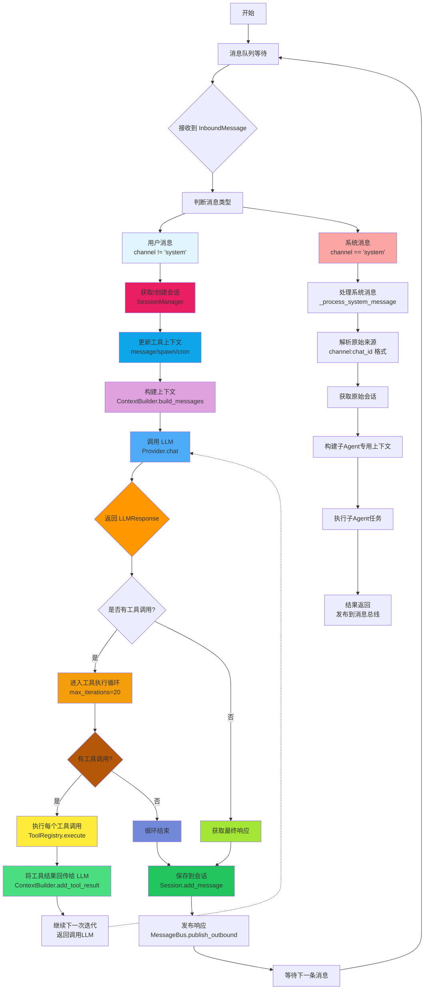


## 构建上下文build_messages()
这个函数的源码在 agent/context.py文件中。

```python
def build_messages(
    self,
    history: list[dict[str, Any]],
    current_message: str,
    skill_names: list[str] | None = None,
    media: list[str] | None = None,
    channel: str | None = None,
    chat_id: str | None = None,
) -> list[dict[str, Any]]:
```
参数
- history: 之前的对话消息列表
- current_message: 要处理的新用户消息
- skill_names: 包含在上下文中的特定技能名称的可选列表
- media: 本地图像或其他媒体文件路径的可选列表
- channel: 当前通信渠道（例如：telegram, feishu）
- chat_id: 当前聊天或用户标识符

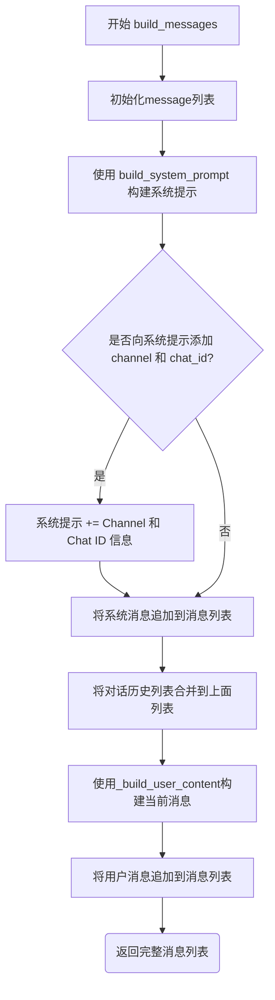

其中build_system_prompt()中
系统提示词包括：
- 核心身份（身份、时间、工作空间）
- 引导文件（AGENTS.md，SOUL.md，USER.md，TOOLS.md,IDENTITY.md）
- 记忆上下文
- 始终加载的Skills
- 可用的技能

而生成用户的当前消息时，如果有多媒体，则将多媒体转成base64编码后加入消息列表。

## 记忆memory
记忆用文本保存。
包括每日的短期记忆和长期记忆文件。
短期记忆文件是在工作区的memory目录下YYYY-MM-DD.md文件。
长期记忆文件直接是MEMOY.md文件。

## 技能Skills
技能也是用文本保存。
每个技能在其对应子目录下的SKILLS.md文件中描述。


## 调用工具
在loop.py中，当LLM返回的消息中包含tools_calls时，程序会遍历这些调用请求，并通过self.tools.execute()发起执行。
```
# loop.py L214-220
for tool_call in response.tool_calls:
    # ... (日志记录)
    # 调用注册表执行工具
    result = await self.tools.execute(tool_call.name, tool_call.arguments)
    # 将结果添加回消息历史
    messages = self.context.add_tool_result(
        messages, tool_call.id, tool_call.name, result
    )
```
然后在registry.py中，异步调用
```
# registry.py L38-60
async def execute(self, name: str, params: dict[str, Any]) -> str:
    tool = self._tools.get(name) # 1. 查找工具
    if not tool:
        return f"Error: Tool '{name}' not found"

    try:
        errors = tool.validate_params(params) # 2. 参数验证
        if errors:
            return ... 
        return await tool.execute(**params) # 3. 执行具体工具逻辑
    except Exception as e:
        return f"Error executing {name}: {str(e)}" # 4. 异常捕获
```

流程如下图：
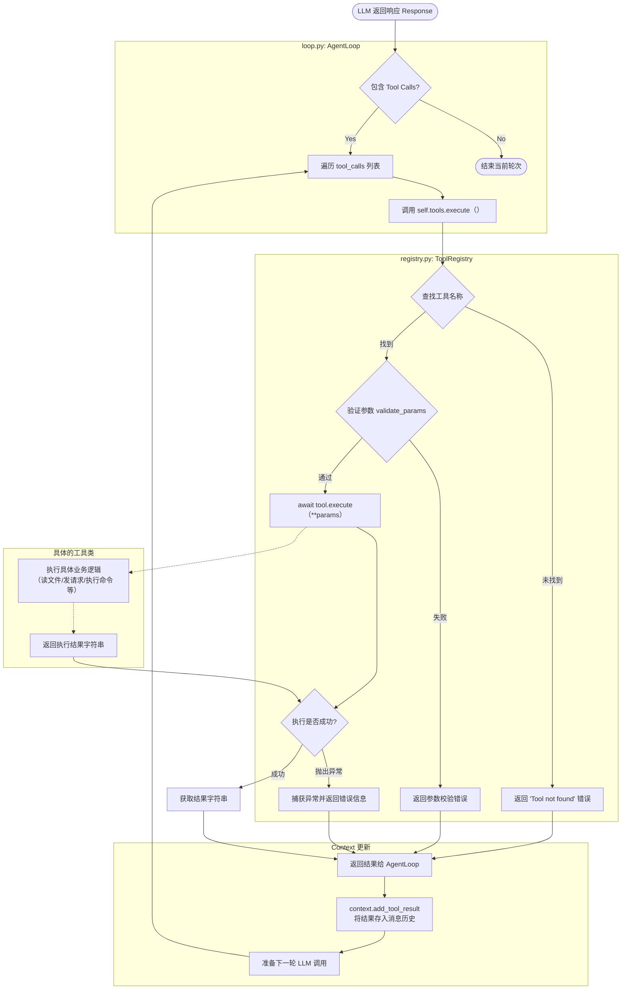


系统源代码中已经自带了部分工具：

### 文件系统工具filesystem.py
包含工具 : ReadFileTool , WriteFileTool , EditFileTool , ListDirTool
主要使用python标准库pthlib.Path进行路径操作和文件IO。

### 消息发送工具message.py
包含工具MessageTool
依赖nanobot.bus.events.OutboundMessage数据结构，通过回调函数`self._send_callback(msg)`将消息发送出去。
这个回调函数通常连接到系统的消息总线（MessageBus），最终由具体的适配器（如 Telegram Bot API 或 CLI 输出）处理发送逻辑。

这里回调时，先构造消息事件
 ```
msg = OutboundMessage(
        channel=target_channel,
        chat_id=target_chat_id,
        content=content
    )
```

然后异步回调
```
await self._send_callback(msg)
```

这个回调函数的发起在loop.py中，而实现在bus/queue.py中的publish_outbound方法中。

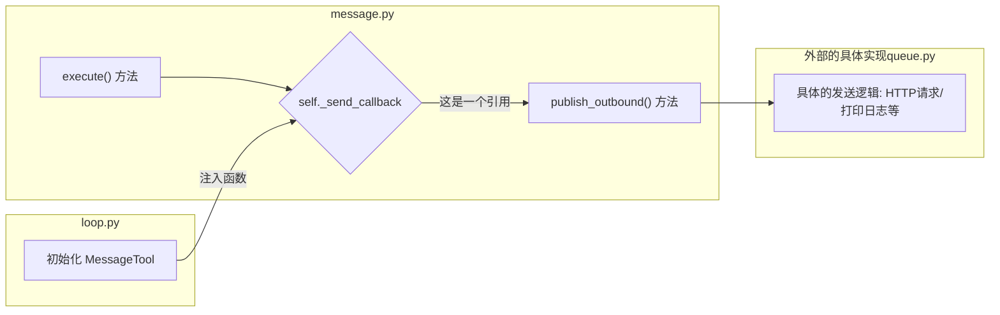
### Sell命令执行工具shell.py
包含工具ExecTool，使用Python的asyncio库进行异步子进程管理。
调用 asyncio.create_subprocess_shell(command, ...) 来启动 Shell 进程。
使用 process.communicate() 获取标准输出 (stdout) 和标准错误 (stderr)。
`_guard_command` 方法，使用正则表达式（ re 模块）拦截高危命令（如 rm -rf , format , dd 等）和路径遍历攻击。

也就是说如果你可以将某些命令加入黑名单deny_patterns，禁止其运行。也可以加入白名单allow_patterns
  ```
self.deny_patterns = deny_patterns or [
            r"\brm\s+-[rf]{1,2}\b",          # rm -r, rm -rf, rm -fr
            r"\bdel\s+/[fq]\b",              # del /f, del /q
            r"\brmdir\s+/s\b",               # rmdir /s
            r"\b(format|mkfs|diskpart)\b",   # disk operations
            r"\bdd\s+if=",                   # dd
            r">\s*/dev/sd",                  # write to disk
            r"\b(shutdown|reboot|poweroff)\b",  # system power
            r":\(\)\s*\{.*\};\s*:",          # fork bomb
        ]
```

基于正则的命令过滤 ( `_guard_command` ) 本质上是脆弱的，可以通过字符串拼接，编码等绕过。所以这里是有安全漏洞的。

### 子Agent生成工具spawn.py
用于创建后台任务（子Agent）。
它本身不执行复杂逻辑，而是代理调用 `self._manager.spawn(...)` 。
SubagentManager （在 nanobot.agent.subagent 中定义）负责实例化新的 AgentLoop 并在后台运行。

```
async def execute(self, task: str, label: str | None = None, **kwargs: Any) -> str:
        """Spawn a subagent to execute the given task."""
        return await self._manager.spawn(
            task=task,
            label=label,
            origin_channel=self._origin_channel,
            origin_chat_id=self._origin_chat_id,
        )
```

### 网络工具web.py
提供网络搜索和网页抓取功能。
包含工具 : WebSearchTool , WebFetchTool
使用 httpx （异步 HTTP 客户端）和 readability-lxml （网页内容提取）库。

WebSearchTool封装了Brave Search API，

```
async def execute(self, query: str, count: int | None = None, **kwargs: Any) -> str:
        if not self.api_key:
            return "Error: BRAVE_API_KEY not configured"
        
        try:
            n = min(max(count or self.max_results, 1), 10)
            async with httpx.AsyncClient() as client:
                r = await client.get(
                    "https://api.search.brave.com/res/v1/web/search",
                    params={"q": query, "count": n},
                    headers={"Accept": "application/json", "X-Subscription-Token": self.api_key},
                    timeout=10.0
                )
                r.raise_for_status()
            
            results = r.json().get("web", {}).get("results", [])
			...
```

如果需要封装其它的搜索引擎，可以在这里修改，比如我想将Brave修改成我喜欢的Tavily，就得修改这里的URL。如果需要定制化，可以在这里增加多种搜索引擎。

### 任务调度工具cron.py
定义了一个名为 CronTool 的工具类，该类赋予了 Agent 安排提醒和重复性任务的能力。它是 Nanobot 任务调度系统与 LLM 之间的桥梁。
这里只有`_add_job`（添加任务）、`_list_jobs`(列出任务）和`_remove_job`(删除任务)的函数，主要是管理任务。而具体的实现在
nanobat/cron/service.py中CronService。

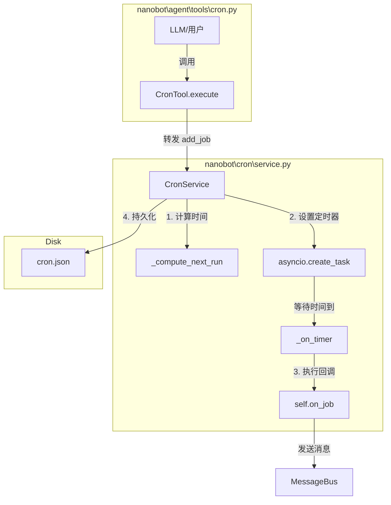


## LLM接口
在子目录providers下，实现了LLM统一抽象的接口。

### 在base.py中定义标准接口

它使用了Python的abc模块来实现抽象基类。

它使用Python标准库中dataclasses模块中@dataclass装饰器来创建类来代替dict数据格式。
```
class LLMProvider(ABC):
    """
    LLM提供商抽象基类.
    """
    
    def __init__(self, api_key: str | None = None, api_base: str | None = None):
        self.api_key = api_key
        self.api_base = api_base
    
    @abstractmethod
    async def chat(
        self,
        messages: list[dict[str, Any]], //消息字典列表，包括role和content
        tools: list[dict[str, Any]] | None = None, //可选的工具定义列表
        model: str | None = None,//模型标识符（供应商提供）
        max_tokens: int = 4096,
        temperature: float = 0.7,
    ) -> LLMResponse:
        
        pass
    
    @abstractmethod
    def get_default_model(self) -> str:
        """获取此提供商的默认模型"""
        pass
```

### 在litellm_provider.py中定义了接口的实现

这里使用了Python的litellm库，LiteLLM 是一个统一接口库，可以将不同 LLM 提供商的 API 标准化为 OpenAI 格式。


好处是不需要为每个模型写一个单独的类。坏处是支持的大模型受第三方限制，也就是说，如果你自己训练一个模型，要支持的话，得先让LiteLLM支持才行。不过源代码里有一句
```
self.is_vllm = bool(api_base) and not self.is_openrouter
```
看来LiteLLM本身就支持本地模型和自建模型。

如果需要使用本地模型，比如Ollama，只需要在使用LiteLLMProvider时传入参数
api_base为本地服务地址比如（`http://localhost:11434/v1`)。这里v1后缀是openai的模式的历史原因，与自己的版本号无关。
api_key可以乱填字符，因为本地服务通常不检验，但是litellm需要非空值。
default_model填写自己的模型名称。

既然LiteLLM已经统一了接口，为什么这里仍有大量的if-else代码列出不同供应商对应的模型前缀？其实如果你输入模型名时，用带厂商前缀的规范名称，比如deepseek/deepseek-chat，是不必要增加代码的，但是之所以这里仍加上许多的if-else代码，主要是为了交互更友好，有时你漏写了一些内容，它会自动给你补全。

### 辅助功能语音转文字
如果你现在看源代码，还有一个transcription.py文件，这个实现了一个语音转文字的辅助功能。是模型Groq专用的。

转码方法是
```
async def transcribe(self, file_path: str | Path) -> str:()
```
将音频文件直接提交给Groq，使用whisper-large-v3模型处理。

这个功能主要是在Telegram中发语音消息时使用。
你用语音发送消息，语音保存到本地，然后将语音文件发送到Groq处理，转成文字，再将转录的文本附加到消息内容中，再调用LLM处理。

## 会话管理
会话管理由nanobot/session/manger.py实现。

会话的数据结构是
```
@dataclass
class Session:
    """
    会话数据结构以 JSONL 格式存储消息，便于读取和持久化
    """

    key: str                                  # 会话唯一标识符 (channel:chat_id)
    messages: list[dict[str, Any]] = field(default_factory=list)  # 消息列表（每个列表包含role,content,timestamp
    created_at: datetime = field(default_factory=datetime.now)   # 创建时间
    updated_at: datetime = field(default_factory=datetime.now)   # 最后更新时间
    metadata: dict[str, Any] = field(default_factory=dict)  # 额外元数据
```


会话管理器是类SeesionManager:
```
class SessionManager:
    """
    会话管理器,会话以 JSONL 文件形式存储在 sessions 目录
    """

    def __init__(self, workspace: Path):
        self.workspace = workspace
        self.sessions_dir = ensure_dir(Path.home() / ".nanobot" / "sessions")
        self._cache: dict[str, Session] = {}  # 内存缓存
```
所有方法见下图:


这里使用JSONL格式存储，主要是JSONL可以逐行处理。
JSON是一个完整的结构：`[{}, {}, ...]`
JSONL文件结构是分行的：`{}\n{}\n{}\n`

这样在获得最近N条消息时，就比较方便了
```
def get_history(self, max_messages: int = 50) -> list[dict]:
    # 获取最近的 N 条消息
    recent = self.messages[-max_messages:] if len(self.messages) > max_messages else self.messages

    # 移除内部字段（timestamp 等），减少 token 消耗
    return [{"role": m["role"], "content": m["content"]} for m in recent]
```

总结一下完整的会话生命周期：
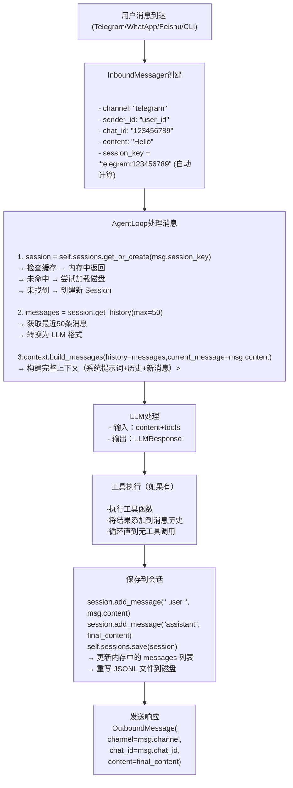

## 通道管理和消息路由
nanobot/channels目录负责通道管理，支持Telegram、WhatApps和飞书。
base.py定义抽象基类BaseChannel
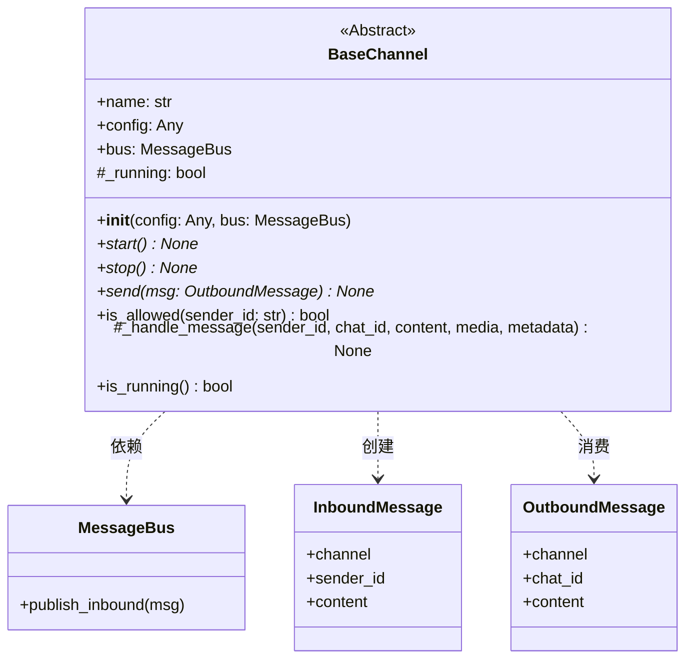


manager.py负责通道生命周期管理。

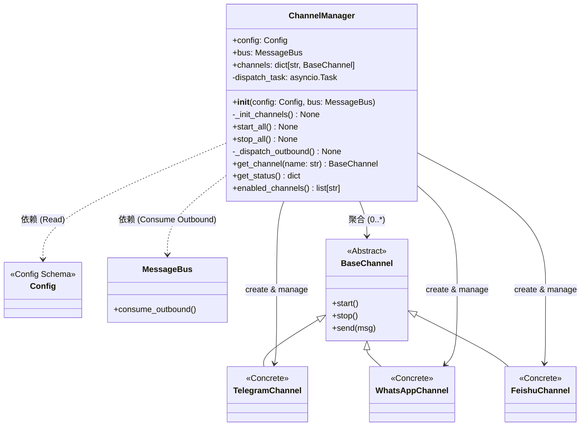
类ChannelManager管理聊天通道并协调消息路由.
它的职责是：
 - 根据配置初始化启用的通道
 - 启动/停止所有通道
 - 将出站消息路由到正确的通道

从代码中可以看到，每个通道是否可用，由配置文件决定，而一旦实例已经运行，状态就是确定的，如果在运行过程中修改配置，通道不会自动打开。所以修改配置后，需要重新启动进程，对应的服务才可以运行。

剩下三个文件telegram.py,feishu.py和whatsapp.py分别实现Telegram、飞书和WhatApp通道。
每种通道的协议和实现都不相同，得看对应的开发文档。

**如果需要添加一个新的通道**：
1. 创建一个新文件，比如是微信，就是/nanobot/channels/wechat.py。继承BaseChannel并实现它的三个抽象方法：
```
# nanobot/channels/wechat.py
from nanobot.channels.base import BaseChannel

class WeChatChannel(BaseChannel):  # <--- 继承这个基类
    name = "wechat"  # 定义通道名称

    async def start(self) -> None:
        # 实现启动逻辑（如连接 WebSocket 或开始轮询）
        pass

    async def stop(self) -> None:
        # 实现关闭逻辑
        pass

    async def send(self, msg: OutboundMessage) -> None:
        # 实现发送消息的具体 API 调用
        pass
```
2.在ChannelManager中注册
修改manager.py中的`_init_channels` 方法，手动把新通道加进去：
```
# nanobot/channels/manager.py

def _init_channels(self) -> None:
    # ... 原有的 telegram, whatsapp ...

    # 新增 WeChat 部分
    if self.config.channels.wechat.enabled:
        try:
            from nanobot.channels.wechat import WeChatChannel
            self.channels["wechat"] = WeChatChannel(
                self.config.channels.wechat, self.bus
            )
            logger.info("WeChat channel enabled")
        except ImportError as e:
            logger.warning(f"WeChat channel not available: {e}")
```
3. 根据源代码的结构，还需要确保配置文件中有wechat。这里需要修改nanobot/config/schema.py中的定义。

## 命令行主入口Cli
nanobot\cli\commands.py 是 nanobot 的 CLI (命令行界面) 入口 文件。它使用了 typer 库来定义命令，并使用 rich 库进行美化输出。

有6个命令
### 1. onboard()
初始化配置和工作空间。
onboard() 的作用是从零构建 Agent 的 运行环境（配置 + 目录） 和 认知基础（人设 + 记忆） 。执行完这个命令后，一个“白板”Agent 就诞生了，随时准备开始工作。
它会在当前用户目录下创建一个隐藏的目录，用config.json保存配置文件。如
`~/.nanobot/config.json`.

onboard会创建一个工作空间，就是新建一个目录。
然后调用`_create_workspace_templates()`在工作空间内创建初始文件。
先生成三个Markdown文件：
AGENTS.md：代理的说明。告诉 Agent 它的基本行为准则（如“解释你的操作”、“使用工具”）
SOUL.md：灵魂。定义Agent的自我认知，比如，个性、价值观等。
USER.md：用户画像。记录用户的偏好，比如使用语言等。
然后再创建一个记忆系统，就是再在这个工作空间目录下创建一个memory的子目录。默认创建一个MEMORY.md文件，作为长期记忆。
短期记忆则是当天日期命令的md文件。

这就是相当于定义了这个代理的人设和记忆。

有一些需要注意的是：
**nanobot的设计是单工作空间的**

也就是说你只能假定一个“人设”。

如果我们在命令行直接运行nanobot.exe --help命令


你能看到它没有指定工作区的参数。但是从代码里来看，并没有限制应用只能是单实例。

理论上说，我们可以运行多个nanobot实例，模拟多个人格进行操作。但根据代码现在很难做到。如果需要增加多实例功能，从代码上来看需要：
1）工作区（workspace）要可以指定。当前命令行中无法指定，不过从utils/helper.py里能看到一段代码（`def get_workspace_path(workspace: str | None = None) -> Path:`）是可以有一个参数来指定工作区的。
2）解决SeesionID冲突。因为SeesionID是固定的`channel:chat_id`，不同的进程写文件时，都会写到相同的地方。不过，这个有点存疑。如果不同的工作区，Seesion文件应该会写在不同的目录里。
3）网关端口定制。这个可以使用命令行指定。比如`nanobot gateway --port 18791`

这么分析下来，**只要解决了多工作区即可**。因为每个实例在不同的工作区里会有独立的记忆、会话和端口。

还有一个小问题，很容易看错。就是在代码中，**template其实是一个字典**，只是内容比较长，又是多行，很容易看乱，以为是一大段文本。
```
templates = {
        "AGENTS.md": """# Agent Instructions
...内容省略...
""",
        "SOUL.md": """# Soul
...内容省略...
""",
        "USER.md": """# User
...内容省略...
""",
    }
```

### 2. getewary()
启动后台服务网关（核心守护进程）
gateway 命令是系统的核心，它组装并启动了所有后台服务。

启动流程：
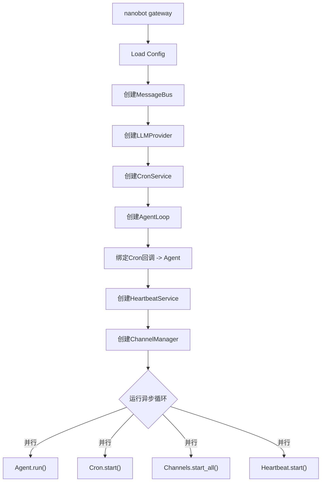

### 3. agent()
直接与 Agent 进行对话（支持单次模式或交互模式）。
它和上面的gateway()在代码上有许多共同的地方，比如创建消息，初始化LiteLLMProvider()等。
因为从本质上，它们都是要创建一个AgentLoop，等待交互。gateway()是由一个网关进行消息路由，而agent()是直接交互。

agent()模式的流程：
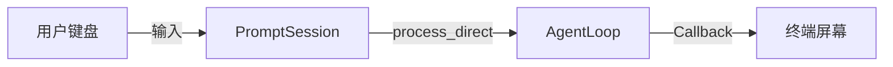
gateway()模式的流程：
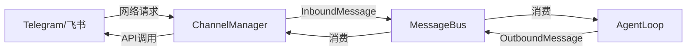


### 4.channels()
通道命令
- status : 查看 Telegram/WhatsApp 等渠道的连接状态。
- login : 启动 Bridge 服务并显示二维码（用于 WhatsApp 登录）。
这里的Bridge服务是一个Node.js端，模拟一个网页版的WhatApp，所以需要扫码登录。


### 5. cron()
定时任务命令
- list : 列出所有定时任务。
- add : 添加新任务（支持间隔、Cron 表达式、指定时间）。
- remove : 删除任务。
- enable/disable : 启停任务。

这里只是对Cron任务的管理，具体的cronservice服务在/cron/service.py里实现。


总结一下：
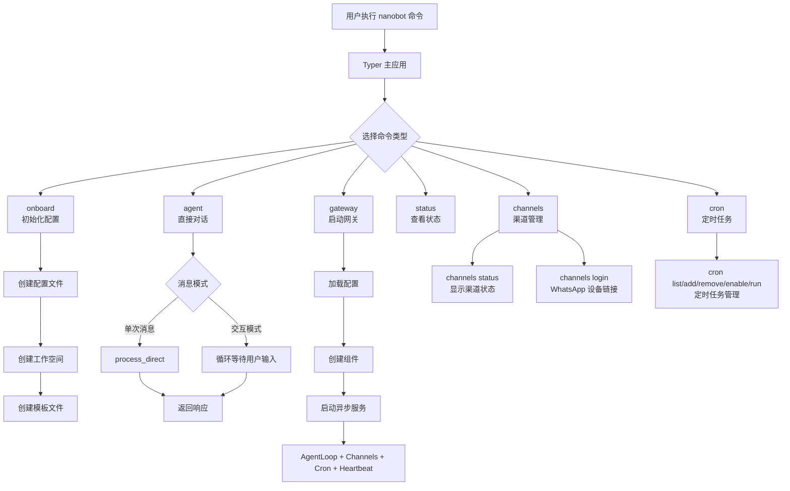


## 技能实现SKills
nanobot内置了若干技能，在nanobot/skills目录下，每个目录就是一个技能，在目录下，都会有一个SKILL.md文件，这是必需的文件。
在Agent的工作空间里，放置用户自定义的技能目录，目录名也是skills。
用户工作空间里的技能优先级是最高的。
```
nanobot/
├── skills/                           # 内置技能目录
│   ├── github/
│   │   └── SKILL.md              # 技能定义文件（必需）
│   ├── weather/
│   │   └── SKILL.md
│   ├── summarize/
│   │   └── SKILL.md
│   ├── cron/
│   │   └── SKILL.md
│   ├── tmux/
│   │   ├── SKILL.md
│   │   └── scripts/               # 可选的脚本目录
│   │       ├── wait-for-text.sh
│   │       └── find-sessions.sh
│   └── skill-creator/
│       └── SKILL.md
│
~/.nanobot/workspace/                  # 用户工作空间
└── skills/                       # 用户自定义技能目录（优先级更高）
    └── my-custom-skill/
        ├── SKILL.md
        ├── scripts/                # 可选：可执行脚本
        ├── references/             # 可选：参考文档
        └── assets/                # 可选：资源文件
```


在SKILL.md文件中，都会有一个YAML Frontmatter的文件头，叫前置元数据，用来描述技能本身。以github技能为例：

### YAML Frontmatter (前置元数据)

```yaml
---
name: github
description: "Interact with GitHub using the `gh` CLI. Use `gh issue`, `gh pr`, `gh run`, and `gh api` for issues, PRs, CI runs, and advanced queries."
metadata: {
    "nanobot": {
        "emoji": "🐙",
        "requires": {
            "bins": ["gh"]
        },
        "install": [
            {
                "id": "brew",
                "kind": "brew",
                "formula": "gh",
                "bins": ["gh"],
                "label": "Install GitHub CLI (brew)"
            },
            {
                "id": "apt",
                "kind": "apt",
                "package": "gh",
                "bins": ["gh"],
                "label": "Install GitHub CLI (apt)"
            }
        ]
    }
}
---
```

### Frontmatter 字段说明

| 字段 | 类型 | 必需 | 说明 |
|------|------|--------|------|
| `name` | string | ✅ | 技能名称（目录名） |
| `description` | string | ✅ | 技能描述，**Agent 据此判断何时使用技能** |
| `homepage` | string | ❌ | 技能主页 URL |
| `metadata.nanobot.emoji` | string | ❌ | 图标符号 |
| `metadata.nanobot.requires.bins` | list | ❌ | 必需的可执行程序（如 `["curl", "gh"]`） |
| `metadata.nanobot.requires.env` | list | ❌ | 必需的环境变量 |
| `metadata.nanobot.always` | boolean | ❌ | 是否始终加载到上下文 |
| `metadata.nanobot.install` | list | ❌ | 安装指令（用于未满足依赖时提示） |

### 正文部分
先是描述github操作主要用“gh"命令
然后是一个一个示例说明要执行的操作。
大模型会根据这些示例举一反三，执行操作。
```
# GitHub Skill
 这里描述基本操作，主要用gh命令

## Pull Requests
 这里用多个例子说明要求操作对应的命令格式

## API for Advanced Queries
 告诉AI如果上述命令达不到要求，可以调用原生API得到操作指南。

## JSON Output
 这里指定输出格式
```


### 具体的实现过程
你在对话中输入：**"列出 nanobot 仓库的 issue"**
1. 发现技能
Nanobot 会调用`/nanobot/agent/context.py`中的 build_system_prompt 方法中的SkillsLoader.build_skills_summary() 扫描技能目录。
找到github技能，读出其中的name和description部分。
2. 因为description中提到了issue，判断这个skills可实现这个功能。所以决定加载。
3. 读取技能书。
使用`/nanobot/agent/skills.py`中调用load_skill方法，Agent直接从`nanobot/skills/github/SKILL.md`中加载正文部分。
4. 按指南中的例子，生成一个需要执行的命令。
5. 调用`nanobot/agent/tools/shell.py`中的execute()来执行这条命令。
6. 命令行返回了 JSON 或文本格式的 Issue 列表，Agent 把它整理好反馈给用户。

## 定时任务

核心的文件结构
```
nanobot/
├── cron/
│   ├── __init__.py     # 公共接口导出
│   ├── types.py        # 类型定义（数据模型）
│   └── service.py      # 调度服务实现
├── agent/tools/cron.py # AI代理工具集成
└── cli/commands.py     # 命令行接口（部分）
```

types.py中定义了五个数据模型
- CronSchedule: 定义任务的调度规则。
- CronPayload: 定义任务触发时要执行的内容。
- CronJobState：定义任务的状态
- CronJob: 表示一个完整的定时任务。
- CronStore：任务内容持久化，保存到磁盘。

CronService 是整个模块的大脑，负责管理任务生命周期和调度执行。

nanobot自己实现了定时任务，并没有使用系统自带的定时任务系统。

任务的持久化就是将相关信息保存到本地的JSON文件中。
所以在 `nanobot/cli/commands.py` 中，cron_app 定义了 add, list, remove, enable, run 等命令。这些命令实例化 CronService，直接操作底层的 JSON 存储文件，无需启动后台服务即可修改配置。

Cron 任务在等待时， 唤醒机制完全依赖于 Python asyncio 事件循环（Event Loop）的 内部定时器 。
CronService计算出距离下一个任务还需要多久（例如delay_s秒），然后创建一个内部任务tick()，在CronService类中，
 ```
def _arm_timer(self) -> None:
        """Schedule the next timer tick."""
         ...
        async def tick():
            await asyncio.sleep(delay_s)
 					...
```

在时间流逝了delay_s后，事件循环检测到定时器到期，恢复tick()任务的执行。代码从 await 之后继续运行，调用 `_on_timer()` 执行任务。

## 消息总线
### 数据模型 (Data Models) 
`/nanobot/bus/events.py`中定义了两种标准化的消息类
- InboundMessage (入站消息) : 接收来源于各个 Channel（如 Telegram, WhatsApp）产生的消息，如果是通知消息，channel就是system。
- OutboundMessage (出站消息) :由 AgentLoop 产生，发送到Channel通道

### 消息总线 (Message Bus) 
/nanobot/bus/queue.py中实现MessageBus类，这个类是整个系统的通信中枢，基于Python的asyncio.Queue 实现。

```python
class MessageBus:
    def __init__(self):
        # 双向消息队列
        self.inbound: asyncio.Queue[InboundMessage]    # 入站消息队列
        self.outbound: asyncio.Queue[OutboundMessage]  # 出站消息队列

        # 出站消息订阅者（按渠道分组）
        self._outbound_subscribers: dict[str, list[Callable]] = {}
        self._running = False
```

在初始化时就就在内部创建了两个独立的异步队列：
- inbound : Channel -> Agent (外部消息流入)
- outbound : Agent -> Channel (AI 回复流出)

核心方法

| 方法 | 功能 | 调用者 |
|------|------|--------|
| `publish_inbound(msg)` | 将渠道消息发布到入站队列 | `Channel._handle_message()` |
| `consume_inbound()` | 阻塞，直到获取下一条入站消息 | `AgentLoop.run()` |
| `publish_outbound(msg)` | 将响应发布到出站队列 | `AgentLoop, CronService` |
| `consume_outbound()` | 阻塞，直到获取下一条出站消息 | `ChannelManager._dispatch_outbound()` |
| `subscribe_outbound(channel, callback)` | 订阅特定渠道的出站消息 | - |
| `dispatch_outbound()` | 分发出站消息到订阅者（后台任务） | - |
| `inbound_size` / `outbound_size` | 获取队列大小（监控用） | - |

上面dispatch_outbound- 是一个后台运行的 Task。它不断从 outbound 队列取出消息。它查找 `_outbound_subscribers` 字典，找到订阅了该 channel 的所有回调函数，并执行它们。
```
while self._running:
	msg = await asyncio.wait_for(self.outbound.get(), timeout=1.0)
	subscribers = self._outbound_subscribers.get(msg.channel, [])
	for callback in subscribers:
  		await callback(msg)
```


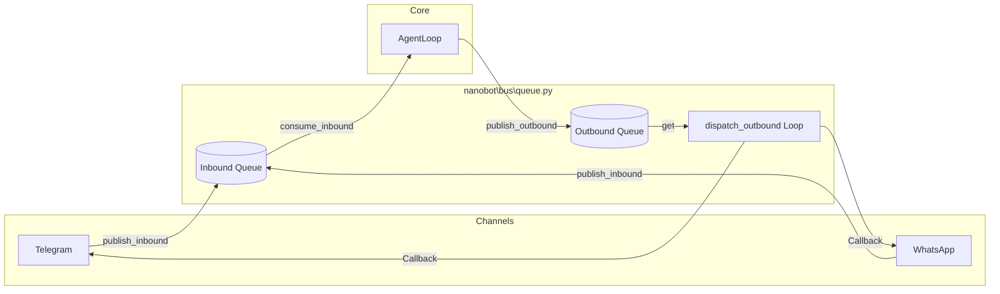


## 心跳机制
在nanobot/heartbeat目录下，nanobot项目提供了一个心跳机制。

不过这个心跳机制和我们平时理解的从中保活功能不一样。它其实是一个定期唤醒代理的主动式服务，用于检查和处理预定义的任务。它通过读取工作区中的 HEARTBEAT.md 文件，让代理定期执行其中列出的任务，实现自我管理和自动化工作流程。

默认情况下，它每隔30分钟，发送一个提示词给AI Agent，让它检查一下HEARTBEAT.md文件里是否有要执行的任务。
```
# Default interval: 30 minutes
DEFAULT_HEARTBEAT_INTERVAL_S = 30 * 60

# The prompt sent to agent during heartbeat
HEARTBEAT_PROMPT = """Read HEARTBEAT.md in your workspace (if it exists).
Follow any instructions or tasks listed there.
If nothing needs attention, reply with just: HEARTBEAT_OK"""

# Token that indicates "nothing to do"
HEARTBEAT_OK_TOKEN = "HEARTBEAT_OK"
```

它会先检查文件中是否包含可执行的内容，如果有，则将内容发送给Agent，让它执行，如果没有则直接返回一个ok就行了。

看起来和定时任务的功能相同。但是与定时任务的区别在于使用场景不同。
| 特性 | Heartbeat (心跳) | Cron (定时任务) |
| :--- | :--- | :--- |
| **触发源** | **文件内容** (`HEARTBEAT.md`) | **时间规则** (Cron 表达式 / 间隔) |
| **执行内容** | **不确定** (取决于文件里写了啥) | **确定** (Payload 里预定义的 Prompt) |
| **持久化** | 无需持久化 (实时读文件) | 需要持久化 (`cron.json`) |
| **交互性** | **人机异步协作** | **机器自动化** |
| **成本控制** | **高** (文件空就不唤醒 LLM) | **低** (时间到了必须唤醒 LLM 执行) |
| **代码位置** | `nanobot/heartbeat/` | `nanobot/cron/` |

因为触发源是文件，所以在运行的任何时候，你都可以修改这个文件，临时增加要执行的内容到HEARTBEAT.md文件中。

心跳机制相当于AI“每隔一段时间看看有没有新指示”，而任务则是AI “每隔一段时间必须做某件具体的事”。

当然，你一定要用cron代替heartbeat，也是可以是，毕竟，这里的心跳不是传统意义上的心跳。你可以在cron里加上一个任务，这个任务就是把上面那段提示词提交给agentloop。但是缺点是有两个：

一是浪费token，本来用heartbeat的话，如果文件里没有新指示，你本可以不调用AI。

二是如果任务非常多，或者任务特别费时，如果运行时间超过30分钟，但cron时间一到又调用文件，重复执行，反而造成混乱。

但是用心跳机制则不用担心这个问题，因为任务执行时，
 ```
if self._running:
	await self._tick()
```
它会停在 `await self._tick()` 这一行， 计时器暂停 。
只有在任务结束后再继续计时30分钟。

## 结语

看代码的部分，暂时告一段落。看代码是为了更好地理解它是怎么运作的，而了解运作机制的目的还是更好地应用。

总结一下，可以把它分成四个模块

### 1. 网关gateway

它是所有交互的入口。你可以从命令行，也可以从telegram、whatapp、飞书或其他聊天工具（需要自己开发接口）发消息，网关都会把这些不同平台的消息格式统一起来，然后交给后面的系统处理。核心就是AgentLoop，它常驻后台，负责身份验证、会话管理，还内置了定时任务调度。某种程度上，它就是整个系统的中枢。

### 2. 大模型LLM管理器

系统自己不是AI，它只这里提供接口，连到别人的大模型上。它做的事情其实是根据不同的情况，动态地生成提示词，把用户指令、可用技能、相关记忆和当前状态整合在一起发给模型。之所以说它是管理器，因为它其实是不仅仅是一个转发者，同时还是一个调度和决策者。

### 3. 记忆系统

用文件来保存记忆，会话日志用 JSONL 一行一条记录，方便查询。而且还有每日记忆和长期记忆，用来保存对用户的总结。再加上一个 SOUL.md，可以Agent的人格和设定。这样随着交互的增加，Agent的知识和个性会越来越明确。

### 4. 技能系统

这相当于Nanobot的手脚。SKILL.md文件里保存了技能，但在文件中技能只是告诉大模型在什么情况下调用哪个工具，以及参数怎么填。也就是说，技能是给模型看的使用说明书，工具则是实际干活的可执行代码。比如Python脚本。

这就是一个把AI从在线顾问变成一个可服务于人类的机器人的第一步啊。


## 参考文档
[nanobot源码解析nanobot源码解析 对当前项目工程内容进行详细解析说明，包含整体架构、数据流图。并对各类关键核 - 掘金](https://juejin.cn/post/7603195960254218240)
