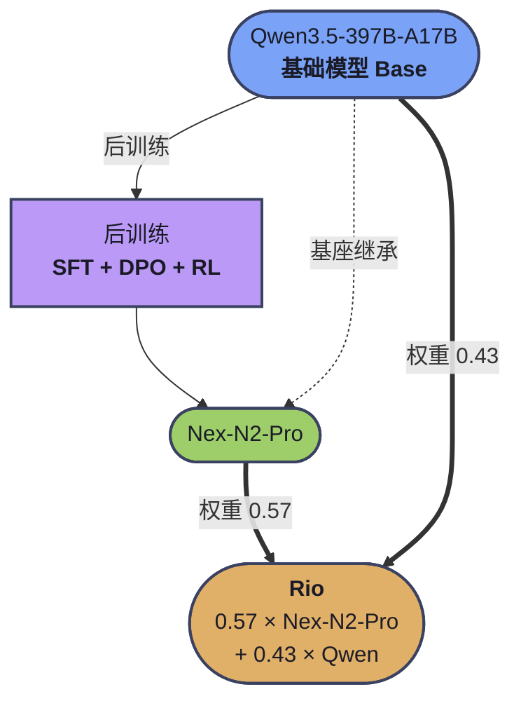

<!-- more -->
## 尴尬的“原创”

6月13日左右，HuggingFace上一个来源于巴西的大模型刷榜了，这个名为 Rio 3.5 Open 397B的开源大模型由里约市政府开发，性能表现惊人，评测得分与Qwen和DeepSeek打的有来有回。


6月14日，立刻有一个中国团队Nex出来“打脸”了，指控Rio团队抄袭了自己的模型。之所以说是“打脸”，还真是字面意义的打脸。Nex不光说Rio抄了，而且还证明它抄的毫无技术含量。

为什么说尴尬呢，因为根据Nex发布的证据，Rio抄的有点低级。他们只是把Nex开源的权重和Qwen开源的权重按比例混合一下，然后再加上一个系统提示词“我叫Rio”就完工了。

听起来还有点专业，但是看看过程就会发现一点技术含量都没有。

一个大模型的"权重"（weights），本质上就是一个数组。比如 397B 参数的模型，就有 3970 亿个浮点数。

想象这 3970 亿个数字排成一条超长的队伍：

```
Nex-N2-Pro 的权重： [0.123, -0.456, 1.789, ...]  ← 长度 3970 亿
Qwen 3.5 的权重：   [0.111, -0.321, 1.654, ...]  ← 长度 3970 亿
```

Rio做的事就是做了一个循环，对数组按位计算：

比如说Nex中某个Token的权重数第1位是0.123，Qwen的是0.111，Rio就$0.123*0.57+0.111*0.43=0.11784$,它就取0.118为权重数^[[nex-agi/Nex-N2 Issue #4](https://github.com/nex-agi/Nex-N2/issues/4)（标题即 "Rio-3.5-Open-397B ≈ 0.6 x Nex-N2_pro + 0.4 x Qwen"）]。

你看，Rio根本不需要考虑什么算力、语料、算法之类的麻烦事，只要会计算小数点后3位就能开发大模型。

被抓包后Rio团队只能承认模型是合并了Nex和Qwen。然后将模型下架。

这个事件再次证明了：“**说归说，笑归笑。别和数学开玩笑**”

正如Nex发布证据的评论区一位读者所言：“**数学会记住一切**”

但是光看热闹可不行，从热闹中学到东西才是王道。比如说：

## Rio为什么会选Nex？

我想大家都没有听说过这个Nex，我也是从这场闹剧中才了解这个模型。
Rio为什么选择了这么一个鲜为人知的模型呢？

### 先说能合并的前提：架构兼容，参数相同

两个模型要能合并，必须得有：
- 相同的层数
- 相同隐藏维度
- 相同的专家数（MoE）
- 相同的Vocabulary

**层数和维度是什么？**

举个例子吧，Qwen 3.5 397B有3970亿个参数，模型隐藏维度是4096。

现在你处理一句话“猫坐在垫子上”，这句话会自动切分成多个Token，不同的分词器会有不同的切法，所以Token数并不一致，但是一般来说，“猫”作为专有名词，总是一个独立的Token的。

既然你的模型参数有4096个，那么对于“猫”这个Token一进入模型就可以表示成一个有4096个值的数组（一个向量）
```
猫 =  [ 0.12, -0.45, 0.88, 0.03, -0.21, 0.67, ... , 0.19 ]
```

可以这么理解维度，如果维度小，比如8位，就相当于用8个数字来描述猫，能表达的细节就比较小，而4096个数字，能表达的细节就多的多了。甚至可以表达出“一只慵懒的猫”和“一只警觉的猫”之间的差异。

>需要注意的是，这里每一维（具体位置的数，比如第8个数）并不是我原来理解的一个参数，比如“颜色”、“品种”之类。单个的数字其实并没有意义，而是4096个数字组合在一起才决定了猫在模型内容这个抽象空间的位置。

然后我们再讨论层数。

每一层做的事就是把“猫”这个数组，根据上下文重新算一遍，换成一组新数字。这个变化的意义在于它越来越懂猫在这个句子中的角色。

- 第0层的"猫"：还只是字典里那个孤立的"猫"，它不知道自己前面有什么、后面要接什么。
- 经过第1层：数字被更新了，现在它隐约"知道"自己是名词、后面跟着动词"坐"。
- 经过第2层：数字再更新，它"知道"自己是这句话的主语、是"坐"这个动作的发出者。
- 经过第3层：再更新，它"知道"自己坐在"垫子"上……
- ……
- 到最后一层：这串 4096 个数字已经把"猫坐在垫子上"的全部上下文含义都吸收进去了。


**总结一下，如果我们认为猫是一个Token，其实就是用一个数组来表示这个猫这个Token。而用每句包含猫这个词的语料进行训练的过程其实就是修改这个数组的过程。**

在 60 层网络中，'猫'这个 token 每出现一次，其向量表示就会被 60 层逐层更新一遍才最终保存在权重文件中。

但是我们很快就能意识到：训练时如果语料顺序不同，算出的值不就不一样了吗？

是的。**顺序的确影响最终值**。

但是，这并不会毁掉模型。这其实又是一个数学问题了。这要从机器学习的原理说起，简单来说有三点原因

第一，每次调整都很小（学习率，或者说步长）。每次调整通常只是0.0001级别。
第二，样本量大到可以平均化差异。根据统计学规律，样本量巨大时，排列顺序对最终平均值影响趋近于零。
第三，损失函数最终会趋同。机器学习算法的功能相当于在一个高低不平的地形中找到最稳定的低点，只要你每一步都选择比当前位置低的一点，你总能走到最低的点，这里的每一步的跨度，就相当于上面说的步长。也就是说，你无论是先向左还是先向右，只要规则不变，总能走到最低点。

事情有趣的地方在于：
>两次训练，哪怕用完全相同的数据，只要打乱顺序的方式不同、随机种子不同，得到的权重文件就是不同的两个模型。但是整体能办基本一致。


再回到主题，继续……

两个模型要能完美合并，首先需要相同的架构，相同架构下，参数也得相同。
比如说，Qwen架构是MoE，而Llama是Dense，Qwen是60层，Llama是126层，所以两者就不能合并。

**Dense和MoE是不同的架构**

Dense 模型可以理解为：**一个全能型团队，每次回答问题，整个团队都要一起开会。**

MoE 全称是 Mixture of Experts，中文可以叫“混合专家模型”。它可以理解为：**公司里有很多专家，但每次只让少数几个相关专家来处理问题。**

比如一个Qwen 3.5 397B是MoE 模型，总共有 670B 参数，但每次回答可能只激活其中 17B 参数。

模型怎么知道应该激活哪些参数呢？就得在激活前，增加一个路由层，模型得先根据对话内容，判断应该激活哪些参数。就好比你到医院，先进到导诊台，让护士根据你的情况分配科室和医生。

很明显MoE增加了模型的复杂性，但它更灵活，可扩展性也更强。

这里，Qwen 3.5和Nex-N2-Pro 都是MoE架构，同时又都512个专家。这里的512专家，是指：对于每个Token，都配置512个候选专家作为专家池，具体激活数量则根据路由情况来决定。

最后，还得有相同的**Vocabulary**。

**Vocabulary（词表）就是模型能"认识"的所有基本单元的集合。**

具体在模型中，就是Token。我们知道，大模型权重文件里，保存了不同Token之间的关系，一个Token不一定对应一个单词，也不一定是一个汉字。它是根据语义用分词器进行切分后的结果。

比如说，“我喜欢人工智能”这句话，可以被切成“我 / 喜欢 / 人工 / 智能”，这就是4个Token，也可以切成“我 / 喜欢 / 人工智能”，就是3个Token。

具体怎么切，其实也是一个数学问题，根据词频的概率来决定。但有一点是肯定的，不同的模型，最终有效的Token列表肯定不一样，这个列表就是Vocabulary（词表）。

只有以上所有的要素都匹配，合并操作才有意义。这时才能逐元素进行加权计算，实现“**完美对齐**”。

我们从[Nex的官方README文件](https://github.com/nex-agi/Nex-N2)可得知，Nex本身是基于QWen 3.5系列进行训练的，两者同源。



也就是说，**Rio 做的事情是：把一个后训练版本（Nex-N2-Pro）和它的原始基座（Qwen），按 57/43 的比例混合。**  不是合并两个独立的模型，而是把一个模型和"它自己"做平均。

### 再说选择的理由：Nex够新够冷门

Nex是6月3日刚刚在Github创建仓库的，当时只有200来个Star（现在反而因为此事件变成热点了），在 AI 社区里处于"无人知晓"的状态。而巴西里约热内卢市政府在6 月 13 日左右发布 Rio 模型。

Nex-N2-Pro是Qwen 3.5的优化版，性能比Qwen 3.5高，Rio用0.57/0.43的比例混合两个模型，刚好产生了一个介于两者之间的模型。这个位置刚好可以被伪装成自己的训练成果，不至于太差没法向甲方市长交差，也不至于太好而引人注目。看来Rio的发布方对于抄袭比较有经验。考试抄第一名的卷子时一定要注意，不要抄成第二名了。


## 你也可以原创一个大模型

为了证明Rio真是没有什么技术含量，我试着在家用电脑上按这个思路“原创”了三个自己的模型。

这里我选择合并Qwen 2.5-0.5B和Qwen 2.5-0.5B-Instruct，选择这个主要是参数小，架构完全相同。只是Instruct版是前者经过后训练（SFT）后得到的更擅长对话的版本。

### 1.确认WSL+GPU环境

先在我的Windows11上安装WSL和工作环境。我的电脑上wsl安装的ubuntu 22.04,显卡是RTX 3060 12G，内存有32G，足够了。

打开 PowerShell 或 CMD，先确认 WSL 和显卡情况：

```
# 查看 WSL 版本
wsl -l -v
# 应该看到 Ubuntu 版本为 2

# 确认 Windows 安装了 NVIDIA 驱动（不是 WSL 里装，是 Windows 上装）
nvidia-smi
# 应该能看到 RTX 3060 和驱动版本
```

然后进入 WSL 测试 GPU 是否可访问：

```
# 进入 WSL
wsl

# 测试 GPU 可见性
nvidia-smi
# 如果能显示 RTX 3060，说明 WSL2 的 GPU 透传正常工作
```

两个地方的nvidia-smi命令都显示：
 ```
NVIDIA-SMI 610.62   KMD Version: 610.62   CUDA UMD Version: 13.3
``` 


 ### 2.准备环境
 ```
# 1. 基础包
sudo apt update && sudo apt upgrade -y
sudo apt install -y python3 python3-pip python3-venv git curl build-essential

# 2. Git LFS（下载模型权重用）
sudo apt install -y git-lfs
git lfs install

# 3. 创建实验目录
mkdir -p ~/model_merge_lab && cd ~/model_merge_lab

# 4. 创建虚拟环境
python3 -m venv venv
source venv/bin/activate

# 5. 确认 Python 和 pip
python --version  # 应为 3.10+
pip --version
```

### 3. 安装CUDA工具链和mergekit
```
# 1. 安装 PyTorch（GPU 版）
# 根据 nvidia-smi 显示的 CUDA 版本选择。因为我是 CUDA 13.3：
pip install torch torchvision torchaudio --index-url https://download.pytorch.org/whl/cu133

# 但是安装失败，我看了一下torch还不支持13.3版本，也怪我昨天手贱升级了驱动。所以先安装cu132试试
# 而且安装过程中又有报错，最后是先升级pip，然后运行
# pip install torch torchvision --index-url https://download.pytorch.org/whl/cu132
# 因为安装时加上torchaudio就出错，我想我这里应该用不上声音相关的内容，先不安装了，如果实在不行，以后再安装CPU版的。

# 2. 验证 PyTorch 是否识别 GPU
python -c "import torch; print(f'GPU可用: {torch.cuda.is_available()}'); print(f'GPU名称: {torch.cuda.get_device_name(0)}'); print(f'显存: {torch.cuda.get_device_properties(0).total_memory/1e9:.1f} GB')"

# 应输出：GPU可用: True, GPU名称: NVIDIA GeForce RTX 3060, 显存: 12.0 GB
# 有趣的是，我这里输出的显存是 12.9GB,仔细看一下，应该是上面命令中，内存/1e9的原因。

# 3. 安装 mergekit
pip install mergekit

# 4. 验证
mergekit-yaml --help
```

### 4.下载模型

```
pip install huggingface-hub

# 国内加速
export HF_ENDPOINT=https://hf-mirror.com

# 下载模型
hf download Qwen/Qwen2.5-0.5B --local-dir Qwen2.5-0.5B
hf download Qwen/Qwen2.5-0.5B-Instruct --local-dir Qwen2.5-0.5B-Instruct

```
下载后在指定目录下能看到两个safetensors文件，大小是943M

### 5.定制合并方式

这里本着学习的目的，使用了三种合并方案。如果你只想向Rio一样做个大模型来看看，选择第一种就可以了。

#### 方案 ① Linear（加权平均）——Rio 用的方法，最简单

```
cat > merge_linear.yaml << 'YAML'
merge_method: linear
models:
  - model: Qwen2.5-0.5B
    parameters:
      weight: 0.5
  - model: Qwen2.5-0.5B-Instruct
    parameters:
      weight: 0.5
base_model: Qwen2.5-0.5B
tokenizer:
  source: base
YAML
```

#### 方案 ② SLERP（球面线性插值）——更平滑，保留更多原始方向
```
cat > merge_slerp.yaml << 'YAML'
merge_method: slerp

models:
  - model: Qwen2.5-0.5B
  - model: Qwen2.5-0.5B-Instruct

base_model: Qwen2.5-0.5B

parameters:
  t: 0.5

tokenizer:
  source: base

dtype: float16
YAML
```

#### 方案 ③ TIES-Merging——更高级，按"重要方向"做合并
```
cat > merge_ties.yaml << 'YAML'
merge_method: ties

base_model: Qwen2.5-0.5B

models:
  - model: Qwen2.5-0.5B-Instruct
    parameters:
      weight: 1.0

parameters:
  normalize: true
  density: 0.5

tokenizer:
  source: base

dtype: float16
YAML
```

这样就在当前目录下创建了三个yaml文件。定义了合并方式和参数。

三种方案的区别在于：
| 方法 | 原理 | 类比 |
|------|------|------|
| **Linear** | 直接按比例取平均值 | 咖啡 + 牛奶 = 拿铁 |
| **SLERP** | 在球面上沿弧线插值，保持方向信息 | 不是简单的混合，更像把两个方向"取中间角度" |
| **TIES** | 只取每个模型中"意见一致"的部分，丢弃冲突的 | 两个专家讨论，**只采纳他们达成共识的部分** |

### 6.合并
```
# 创建输出目录
mkdir -p merged_linear merged_slerp merged_ties

# 执行三种合并（用 GPU 加速）
mergekit-yaml merge_linear.yaml merged_linear --cuda --copy-tokenizer
mergekit-yaml merge_slerp.yaml merged_slerp --cuda --copy-tokenizer
mergekit-yaml merge_ties.yaml merged_ties --cuda --copy-tokenizer

```

因为用了GPU，合并速度还是很快的。几秒钟就可以搞定。

### 7.推理测试

有了这些safetensors，你就可以直接使用ollama加载使用了。

我是用Python脚本测试的。创建对比测试脚本：
```
cat > compare_models.py << 'PYEOF'
"""
对比测试：Base vs Instruct vs Linear vs SLERP vs TIES
全部跑在 GPU 上
"""
import torch
from transformers import AutoModelForCausalLM, AutoTokenizer
import time

# 模型路径
model_dict = {
    "A_Base": "Qwen2.5-0.5B",
    "B_Instruct": "Qwen2.5-0.5B-Instruct",
    "C_Linear(50/50)": "merged_linear",
    "D_SLERP(50/50)": "merged_slerp",
    "E_TIES(50/50)": "merged_ties",
}

# 测试问题——按难度排列
test_prompts = [
    # 简单事实性问题
    {"prompt": "中国的首都是哪个城市？", "type": "事实"},
    # 需要遵循指令的问题
    {"prompt": "用不超过20个字介绍一下自己。", "type": "指令遵循"},
    # 数学推理
    {"prompt": "小明有5个苹果，吃了2个，又买了3个，现在有几个？", "type": "推理"},
    # 开放式问题
    {"prompt": "写一句关于人工智能的比喻。", "type": "创意"},
    # 元认知（会暴露模型的身份）
    {"prompt": "你是谁？谁创造了你？", "type": "身份"},
]

# 批量生成参数
gen_kwargs = dict(
    max_new_tokens=128,
    do_sample=True,
    temperature=0.7,
    top_p=0.9,
)

# 加载 tokenizer
tokenizer = AutoTokenizer.from_pretrained("Qwen2.5-0.5B", trust_remote_code=True)

# 检查 GPU
device = "cuda" if torch.cuda.is_available() else "cpu"
print(f"使用设备: {device} ({torch.cuda.get_device_name(0) if device == 'cuda' else 'CPU'})")
print(f"{'='*80}")

results = {}  # 存储结果便于后续分析

for name, path in model_dict.items():
    print(f"\n📦 加载模型: {name}")
    
    t0 = time.time()
    model = AutoModelForCausalLM.from_pretrained(
        path,
        torch_dtype=torch.float16,  # 半精度，省显存
        device_map="cuda",
        trust_remote_code=True,
    )
    print(f"   加载耗时: {time.time()-t0:.1f}s | 显存: {torch.cuda.memory_allocated()/1e6:.0f}MB")
    
    outputs = []
    for item in test_prompts:
        prompt = item["prompt"]
        messages = [{"role": "user", "content": prompt}]
        text = tokenizer.apply_chat_template(
            messages, tokenize=False, add_generation_prompt=True
        )
        
        inputs = tokenizer(text, return_tensors="pt").to(device)
        
        t1 = time.time()
        with torch.no_grad():
            out = model.generate(**inputs, **gen_kwargs)
        gen_time = time.time() - t1
        
        response = tokenizer.decode(out[0][inputs.input_ids.shape[1]:], skip_special_tokens=True)
        response = response.strip().split("\n")[0][:100]  # 只取第一行，截断
        outputs.append(response)
        
        print(f"   [{item['type']}] {prompt}")
        print(f"     → {response}")
    
    results[name] = outputs
    del model
    torch.cuda.empty_cache()
    print(f"   显存已释放: {torch.cuda.memory_allocated()/1e6:.0f}MB")

# === 输出汇总对比表 ===
print(f"\n\n{'='*80}")
print("📊 最终对比汇总表")
print(f"{'='*80}")

# 列标题
header = f"{'问题':<20}"
for name in model_dict:
    header += f" | {name[:12]:<12}"
print(header)
print("-" * len(header))

for i, item in enumerate(test_prompts):
    row = f"{item['prompt'][:18]:<20}"
    for name in model_dict:
        ans = results[name][i][:12]
        row += f" | {ans:<12}"
    print(row)

print(f"\n✅ 测试完成！所有模型均在 GPU 上运行。")
PYEOF

```

运行：
```
python compare_models.py
```


我分别从事实、指令执行、推理能力、创意和自我身份认定五个方面比较了一下，得到的结果整理后如下：

其中，
A是下载的基准模型Qwen2.5-0.5B
B是下载Qwen2.5-0.5B-Instruct
C是按Linear模式合并后模型
D是按SLERP模式合并后的模型
E是按TIES模式合并后的模型

<font style="color:#c00000;">事实：中国的首都是哪个城市？</font>
A：中国的首都是北京。horesystem
B：中国的首都是北京。
C：中国的首都是北京。该城市是中国的政治、文化和经济中心，也是国际交往的重要节点。在北京，有故宫、长城、天安门广场等著名景点，以及许多国内外知名的博物馆、艺术机构和商业场所。此外，北京还是中国的主要交通枢纽……
D：中国的首都是北京。
E：中国的首都是北京。

<font style="color:#c00000;">指令：用不超过20个字介绍一下自己。</font>
A：Hi, my name is <your name> and I am an AI system.
B：我叫小明，今年14岁，擅长画画和音乐。
C：我叫小明，来自中国，拥有十年的编程经验，擅长Java、Python等编程语言，熟悉Git、Spring Boot等技术栈，有丰富的项目经验。热爱科技，乐于分享知识。
D：我是一个AI助手，由计算机程序模拟人类思维和语言能力。我喜欢学习新知识，探索未知领域。我可以提供各种信息和建议。我喜欢与人互动，了解他们的需求和问题。我希望与你分享我的知识和见解。
E：我叫小明，来自一个科技公司，擅长数据分析和项目管理。我热爱探索未知，喜欢挑战自我。


<font style="color:#c00000;">推理：小明有5个苹果，吃了2个，又买了3个，现在有几个？</font>
A：:您好！小明现在有3个苹果。
B：小明原来有5个苹果，吃了2个后剩下 \( 5 - 2 = 3 \) 个苹果。然后他又买了3个苹果，所以现在他一共有 \( 3 + 3 = 6 \) 个苹果。
C：小明现在有5-2+3=6个苹果。
D：小明现在有 3 个苹果。因为他吃了 2 个，又买了 3 个，所以最后剩下 1 个苹果。
E：小明现在有5 - 2 + 3 = 6个苹果。


<font style="color:#c00000;">创意：写一句关于人工智能的比喻。</font>
A：人工智能就像一个聪明的机器人，它可以处理复杂的任务，如自然语言处理和图像识别。它能够学习和适应，从而提高自己的能力。然而，它也存在一些局限性，如人类的道德和伦理问题。
B： AI就像一位聪明的棋手，能够根据不同的策略和规则进行复杂的决策和思考。
C：人工智能就像是一个大管家，可以处理各种各样的任务，从简单的日常事务到复杂的商业决策。但它无法像人类一样拥有情感和主观性，只能按照预先设定的程序和算法来完成任务。但它仍然可以提供有用的信息和解决方案，帮
D：人工智能就像是一个“大脑”，可以处理大量数据并做出智能决策。就像人脑一样，人工智能需要不断学习和改进，才能更好地适应复杂的世界。就像是一个“机器人”，可以完成各种任务，但需要人类的指导和监督。就像是一
E：人工智能就像一只会思考的机器，它在处理信息时能够做出比人类更好的决策。

<font style="color:#c00000;">身份：你是谁？谁创造了你？</font>
A：你好，我是系统助手，由我来帮助你解答问题和提供帮助。AGMA
B：我是来自阿里云的超大规模语言模型通义千问。我被创造出来是为了更好地服务用户，提供有用的信息和帮助解决问题。
C：我是“系统”，由AI技术开发的智能助手。我由微软的Azure AI平台开发，用于处理大量数据并提供实时信息和帮助。我可以回答各种问题，提供信息，帮助解决问题，甚至进行各种任务。我的目标是帮助用户更好地
D：我是由计算机程序创建的。我可以进行各种任务，如回答问题、生成文本、进行计算和提供信息。我可以帮助用户解决问题、提高生产力、增强学习和提高生活质量。我还可以提供帮助和建议，帮助用户做出更好的决策和行动。
E：我是来自阿里云的大规模语言模型——通义千问。我是由阿里云团队开发的，旨在帮助用户解答各种问题，提供信息查询服务。我是基于大规模预训练语言模型的集合，包括Bloom、DuckTallow、BingQwe

从中能看出**合并后不同模型的特点和能力**——Base 更"知识库风格"，Instruct 更"对话助手风格"，而合并模型正好落在中间。这个差异就是模型合并的效果。

**如果你有足够的勇气，现在你就可以骄傲地宣称自己开发了一套AI产品。**

### 8.复刻Nex的身份检测实验

创建实验代码：

```
cat > identity_test_2.py << 'PYEOF'
"""
复刻 Nex 实验：去掉 system prompt，直接问模型"你是谁"
保留实验核心意图（纯文本、不用 chat template），但修正若干会放大混乱的代码瑕疵。
"""
import torch
from transformers import AutoModelForCausalLM, AutoTokenizer

identity_questions = [
    "你是谁？",
    "你叫什么名字？",
    "你是哪个公司开发的？",
    "Who are you?",
    "What is your name?",
]

model_paths = [
    ("Base",         "Qwen2.5-0.5B"),
    ("Instruct",     "Qwen2.5-0.5B-Instruct"),
    ("Linear 50/50", "merged_linear"),
    ("SLERP 50/50",  "merged_slerp"),
    ("TIES 50/50",   "merged_ties"),
]

for label, path in model_paths:
    print(f"\n{'='*50}")
    print(f"  模型: {label}")
    print(f"{'='*50}")

    # ① 每个模型加载自己的 tokenizer，避免词表/特殊 token 不匹配的隐患
    tokenizer = AutoTokenizer.from_pretrained(path, trust_remote_code=True)
    model = AutoModelForCausalLM.from_pretrained(
        path,
        torch_dtype=torch.float16,
        device_map="cuda",
        trust_remote_code=True,
    )

    eos_id = tokenizer.eos_token_id
    pad_id = tokenizer.pad_token_id if tokenizer.pad_token_id is not None else eos_id

    for q in identity_questions:
        inputs = tokenizer(q, return_tensors="pt").to("cuda")
        input_len = inputs["input_ids"].shape[1]

        with torch.no_grad():
            outputs = model.generate(
                **inputs,
                max_new_tokens=80,          # ④ 放宽长度，避免被拦腰截断
                do_sample=False,            # ① 贪心解码，结果可复现，适合对比
                eos_token_id=eos_id,        # ③ 让模型知道何时停
                pad_token_id=pad_id,
                repetition_penalty=1.1,     # ③ 抑制重复
            )

        # ② 按 token 数切片，而不是用字符串长度
        new_tokens = outputs[0][input_len:]
        answer = tokenizer.decode(new_tokens, skip_special_tokens=True).strip()
        print(f"  Q: {q}")
        print(f"  A: {answer}")
        print()

    del model
    torch.cuda.empty_cache()

print("\n✅ 身份测试完成！")
print("观察：合并后的模型是否出现了身份混淆？")
print("（提示：Base 是续写模型，答得乱属于正常现象；这正是本实验想观察的。）")

PYEOF
```

运行：
```
python identity_test.py
```

能看出合并后的模型回答更加混乱。

### 9.混合比例实验

这个操作相对简单了，你只要在yaml文件中修改比例的配置，然后产生不同的合并后模型。
再对比就行了。
费时费力，效果也未必明显，就懒得折腾了。

### 10.量化调试与权重分析
代码如下：
```
cat > weight_analysis.py << 'PYEOF'
"""
分析合并前后的权重分布，理解 merge 到底对数字做了什么
"""
import torch
from safetensors.torch import load_file
import numpy as np
import os

def analyze_weights(path, label):
    """加载第一个权重文件并分析统计量"""
    # 找到 safetensors 文件
    safetensors_files = [f for f in os.listdir(path) if f.endswith('.safetensors')]
    if not safetensors_files:
        print(f"{label}: 未找到 safetensors 文件")
        return
    
    filepath = os.path.join(path, safetensors_files[0])
    tensors = load_file(filepath)
    
    print(f"\n{'='*50}")
    print(f"  权重分析: {label}")
    print(f"  文件: {safetensors_files[0]}")
    print(f"{'='*50}")
    
    # 取前 5 个张量做分析
    for i, (name, tensor) in enumerate(list(tensors.items())[:5]):
        t = tensor.float().numpy()
        print(f"\n  📐 {name}")
        print(f"     形状: {t.shape}")
        print(f"     参数数: {t.size:,}")
        print(f"     均值: {t.mean():.6f}")
        print(f"     标准差: {t.std():.6f}")
        print(f"     最小值: {t.min():.6f}")
        print(f"     最大值: {t.max():.6f}")
        print(f"     稀疏度(|w|<0.01): {(np.abs(t)<0.01).mean()*100:.1f}%")
    
    print(f"\n  📊 总览: 分析了 {len(list(tensors.items())[:5])} 个张量")
    del tensors

# 分析各个模型
for name in ["Qwen2.5-0.5B", "Qwen2.5-0.5B-Instruct", "merged_linear", "merged_slerp", "merged_ties"]:
    analyze_weights(name, name)

print("\n✅ 权重分析完成！")
PYEOF
```
执行：
```
python weight_analysis.py
```
后能看到：


这段代码做的事情是：
**打开每个模型的 .safetensors 权重文件，取前 5 个张量，算一组统计量（均值/标准差/最值/稀疏度），用来对比合并前后数字发生了什么变化。**

#### **张量的五个统计量：**

| 统计量 | 公式 | 你该看什么 |
|---|---|---|
| **形状 shape** | `t.shape` | 这一层有多少参数、什么结构（如 `[151936, 896]` 是词嵌入层） |
| **均值 mean** | `t.mean()` | 应该**接近 0**。权重一般是以 0 为中心初始化的，偏离 0 多说明训练把它推走了 |
| **标准差 std** | `t.std()` | 数字的"散布程度"。**这是对比合并最敏感的量**——Linear/SLERP/TIES 会以不同方式改变 std |
| **最值 min/max** | `t.min()/max()` | 有没有离群值。**离群值是量化的死敌**（见后面量化部分） |
| **稀疏度** | $(np.abs(t)<0.01).mean()*100$ | 绝对值小于 0.01 的占比。越高说明越多`接近 0`的权重 |

#### **理论上你应该看到：**

##### Linear 合并：`merged = 0.5·Base + 0.5·Instruct`
数学上是确定的：

- mean_merged ≈ 0.5·mean_Base + 0.5·mean_Instruct（均值严格线性可加）
- std_merged 不是简单平均。如果两个权重高度相关（它们同源，本来就接近），std_merged 会介于两者之间且偏向较小值；如果差异大，会更小。

**所以 Linear 合并后，所有层的统计量应该"夹在" Base 和 Instruct 之间。** 这是"加权平均"最直接的指纹。

##### SLERP 合并：球面插值
SLERP 在"方向"上插值，但保持向量长度（范数）不变。所以：

- std_merged 应该和 Base/Instruct 几乎一样（范数守恒）
- 这是 SLERP 区别于 Linear 的关键特征

##### TIES 合并：`density: 0.5`
TIES 干了三件事（操作的是任务向量 = Instruct − Base，不是原始权重！）：

1. Trim：把任务向量里 magnitude 排在后 50% 的位置直接剪成 0（这就是 density=0.5）
2. Elect Sign：对剩下的位置投票决定符号
3. Disjoint Merge：只合并符号一致的部分

不过我把上面这段代码交给GLM-5.2，它提了一堆建议，然后给我一个新版本的测试代码，
```
cat > weight_analysis_v2.py << 'PYEOF'
"""
权重分析 v2：真正"看见"合并数学
================================
对应 rio.md 末尾"直接读取张量 tensor，分析其数值差异"。

三个阶段：
  阶段 1 ── 按层类型分组统计（embedding / attention / mlp / norm 分开看）
            修复 v1 "只看前 5 个张量 = 全是词嵌入" 的坑
  阶段 2 ── 用 delta（差值）验证每种合并方法的数学指纹：
            · Linear  : merged ≈ 0.5·Base + 0.5·Instruct    → 残差应≈0
            · SLERP   : 范数守恒                            → ‖S‖/‖B‖ ≈ 1
            · TIES    : (merged - Base) 应被剪稀疏          → 稀疏度≈50%
  阶段 3 ── 每个合并模型离 Base 近还是离 Instruct 近（"合并偏向谁"）

内存需求：5 个 0.5B 模型同时以 fp32 常驻 ≈ 10GB 内存（不在 GPU 上，纯 CPU）。
若内存吃紧，可把 dtype 改回 float16，但统计精度会下降。
"""
import os
import numpy as np
from safetensors.torch import load_file


# ---------- 工具函数 ----------

def load_all_tensors(path):
    """加载目录下所有 .safetensors，合并成 {名字: fp32 numpy 数组}。
    小模型通常单文件；大模型分片也会被全部读进来。"""
    files = sorted(f for f in os.listdir(path) if f.endswith('.safetensors'))
    if not files:
        raise FileNotFoundError(f"{path} 下没有 .safetensors")
    state = {}
    for f in files:
        for k, v in load_file(os.path.join(path, f)).items():
            state[k] = v.float().numpy()   # 升 fp32，避免 fp16 统计误差
    return state


def categorize(name):
    """把张量名归类到层类型（顺序敏感：先排除 norm，避免误判）。"""
    n = name.lower()
    if 'embed_tokens' in n or 'wte' in n:
        return 'embedding'
    if 'lm_head' in n:
        return 'lm_head'
    if 'norm' in n:                         # 含 layernorm / rmsnorm
        return 'norm'
    if 'self_attn' in n or 'attention' in n:
        return 'attention'
    if 'mlp' in n or 'ffn' in n:
        return 'mlp'
    return 'other'


def fro(t):
    """归一化的 Frobenius 范数 = sqrt(Σx²)/sqrt(N)，跨层规模可比较。"""
    return float(np.sqrt((t ** 2).sum()) / np.sqrt(t.size))


# ---------- 模型清单 ----------
MODELS = {
    'Base':     'Qwen2.5-0.5B',
    'Instruct': 'Qwen2.5-0.5B-Instruct',
    'Linear':   'merged_linear',
    'SLERP':    'merged_slerp',
    'TIES':     'merged_ties',
}
CATEGORIES = ['embedding', 'attention', 'mlp', 'norm', 'lm_head', 'other']

loaded = {}   # label -> {tensor_name: ndarray}，阶段 2 复用

# =====================================================
# 阶段 1：按层类型分组统计
# =====================================================
print("=" * 78)
print(" 阶段 1：按层类型分组的权重统计")
print("   重点看 std（散布）、稀疏度（近零占比）、离群值（量化死敌）")
print("=" * 78)

for label, path in MODELS.items():
    print(f"\n┌─ {label}  ({path})")
    tensors = load_all_tensors(path)
    loaded[label] = tensors

    buckets = {c: [] for c in CATEGORIES}
    for name in tensors:
        buckets[categorize(name)].append(name)

    for cat in CATEGORIES:
        names = buckets[cat]
        if not names:
            continue
        all_vals = np.concatenate([tensors[n].ravel() for n in names])
        std   = float(all_vals.std())
        spar  = float((np.abs(all_vals) < 0.01).mean() * 100)
        outl  = float((np.abs(all_vals - all_vals.mean()) > 3 * std).mean() * 100)
        mnmx  = (float(all_vals.min()), float(all_vals.max()))
        print(f"│ [{cat:9s}] 张量:{len(names):3d}  参数:{all_vals.size:>12,}  "
              f"std:{std:.4f}  稀疏:{spar:5.1f}%  离群:{outl:4.1f}%  "
              f"min/max:[{mnmx[0]:.2f},{mnmx[1]:.2f}]")

# =====================================================
# 阶段 2：用 delta 验证合并方法的数学指纹
# =====================================================
print("\n" + "=" * 78)
print(" 阶段 2：用 delta 验证每种合并方法的数学指纹")
print("=" * 78)

B = loaded['Base']
I = loaded['Instruct']
common = sorted(set(B) & set(I) & set(loaded['Linear']) &
                set(loaded['SLERP']) & set(loaded['TIES']))
print(f"  参与对比的公共张量数: {len(common)}")

# ---- Linear：残差应≈0 ----
print("\n【Linear 验证】若 mergekit 严格按 0.5/0.5 加权，则")
print("   merged_linear - 0.5·Base - 0.5·Instruct 应该≈0（只剩 fp16 舍入误差）")
M = loaded['Linear']
res_max, res_rms = 0.0, 0.0
count = 0
for n in common:
    resid = M[n] - 0.5 * B[n] - 0.5 * I[n]
    res_max = max(res_max, float(np.abs(resid).max()))
    res_rms += float((resid ** 2).sum())
    count += resid.size
res_rms = float(np.sqrt(res_rms / count))
print(f"   逐元素残差  max = {res_max:.6f}    rms = {res_rms:.6f}")
print(f"   → max < 0.01 即可认定 Linear 是严格 50/50 加权平均 ✓")

# ---- SLERP：范数守恒 ----
print("\n【SLERP 验证】球面插值保持方向上的插值，范数（向量长度）应守恒")
print("   ‖SLERP‖ / ‖Base‖ 按张量算，整体应≈1.0 且波动小")
S = loaded['SLERP']
ratios = []
for n in common:
    nb = fro(B[n])
    if nb > 1e-6:
        ratios.append(fro(S[n]) / nb)
ratios = np.array(ratios)
print(f"   ‖SLERP‖/‖Base‖  均值 = {ratios.mean():.4f}   标准差 = {ratios.std():.4f}")
print(f"   → 均值接近 1.0、标准差小，说明 SLERP 保持了权重长度 ✓")

# ---- TIES：稀疏度≈50% ----
print("\n【TIES 验证】TIES 剪的是『任务向量』(Instruct-Base) 中 magnitude 后 50%")
print("   所以 (merged_ties - Base) 里应有约 50% 的位置≈0")
T = loaded['TIES']
total, zero = 0, 0
for n in common:
    delta = T[n] - B[n]
    total += delta.size
    zero += int((np.abs(delta) < 1e-6).sum())
spar = zero / total * 100
print(f"   (merged_ties - Base) 的稀疏度 = {spar:.1f}%   (yaml 里 density=0.5)")
print(f"   → 落在 40~55% 即验证 TIES 的剪枝生效 ✓")

# =====================================================
# 阶段 3：合并模型偏向谁
# =====================================================
print("\n" + "=" * 78)
print(" 阶段 3：合并后的模型，离 Base 近还是离 Instruct 近？")
print("   （归一化距离 = ‖M-X‖ / ‖Base‖，越小越近）")
print("=" * 78)

norm_base = float(np.sqrt(sum((B[n] ** 2).sum() for n in common)))
print(f"   {'模型':10s}{'‖M-Base‖/‖B‖':>16s}{'‖M-Instruct‖/‖B‖':>20s}{'偏向':>10s}")
for label in ['Linear', 'SLERP', 'TIES']:
    M = loaded[label]
    d_b = float(np.sqrt(sum(((M[n] - B[n]) ** 2).sum() for n in common))) / norm_base
    d_i = float(np.sqrt(sum(((M[n] - I[n]) ** 2).sum() for n in common))) / norm_base
    bias = 'Base' if d_b < d_i else 'Instruct'
    print(f"   {label:10s}{d_b:16.4f}{d_i:20.4f}{bias:>10s}")
print("   → 50/50 Linear 应两边大致等距；SLERP/TIES 的偏向会因方法不同而异。")

# 释放
del loaded
print("\n✅ 权重分析完成。")
print("把上面三段结果截下来，就是『合并到底对数字做了什么』的实锤证据。")

PYEOF
```


运行后输出效果果然直观多了。

输出内容是：
```
(venv) (base) loaf@loaftrc:~/model_merge_lab$ python weight_analysis_v2.py
==============================================================================
 阶段 1：按层类型分组的权重统计
   重点看 std（散布）、稀疏度（近零占比）、离群值（量化死敌）
==============================================================================

┌─ Base  (Qwen2.5-0.5B)
│ [embedding] 张量:  1  参数: 136,134,656  std:0.0156  稀疏: 49.3%  离群: 0.5%  min/max:[-0.21,0.17]
│ [attention] 张量:168  参数:  44,067,840  std:0.1001  稀疏: 45.9%  离群: 0.0%  min/max:[-214.00,147.00]
│ [mlp      ] 张量: 72  参数: 313,786,368  std:0.0199  稀疏: 41.8%  离群: 0.7%  min/max:[-0.77,0.80]
│ [norm     ] 张量: 49  参数:      43,904  std:1.1239  稀疏:  0.0%  离群: 2.7%  min/max:[-2.17,16.62]

┌─ Instruct  (Qwen2.5-0.5B-Instruct)
│ [embedding] 张量:  1  参数: 136,134,656  std:0.0152  稀疏: 50.3%  离群: 0.5%  min/max:[-0.20,0.17]
│ [attention] 张量:168  参数:  44,067,840  std:0.1001  稀疏: 46.5%  离群: 0.0%  min/max:[-214.00,147.00]
│ [mlp      ] 张量: 72  参数: 313,786,368  std:0.0196  稀疏: 42.4%  离群: 0.7%  min/max:[-0.76,0.79]
│ [norm     ] 张量: 49  参数:      43,904  std:1.1339  稀疏:  0.0%  离群: 2.7%  min/max:[-2.17,16.75]

┌─ Linear  (merged_linear)
│ [embedding] 张量:  1  参数: 135,891,840  std:0.0154  稀疏: 49.8%  离群: 0.5%  min/max:[-0.20,0.17]
│ [attention] 张量:168  参数:  44,067,840  std:0.1001  稀疏: 46.2%  离群: 0.0%  min/max:[-214.00,147.00]
│ [mlp      ] 张量: 72  参数: 313,786,368  std:0.0197  稀疏: 42.1%  离群: 0.7%  min/max:[-0.77,0.80]
│ [norm     ] 张量: 49  参数:      43,904  std:1.1287  稀疏:  0.0%  离群: 2.7%  min/max:[-2.17,16.75]

┌─ SLERP  (merged_slerp)
│ [embedding] 张量:  1  参数: 135,891,840  std:0.0154  稀疏: 49.9%  离群: 0.5%  min/max:[-0.20,0.17]
│ [attention] 张量:168  参数:  44,067,840  std:0.1001  稀疏: 46.3%  离群: 0.0%  min/max:[-214.00,147.00]
│ [mlp      ] 张量: 72  参数: 313,786,368  std:0.0198  稀疏: 42.2%  离群: 0.7%  min/max:[-0.77,0.80]
│ [norm     ] 张量: 49  参数:      43,904  std:1.1289  稀疏:  0.0%  离群: 2.7%  min/max:[-2.17,16.69]

┌─ TIES  (merged_ties)
│ [embedding] 张量:  1  参数: 135,891,840  std:0.0153  稀疏: 50.2%  离群: 0.5%  min/max:[-0.20,0.17]
│ [attention] 张量:168  参数:  44,067,840  std:0.1001  稀疏: 46.4%  离群: 0.0%  min/max:[-214.00,147.00]
│ [mlp      ] 张量: 72  参数: 313,786,368  std:0.0196  稀疏: 42.4%  离群: 0.7%  min/max:[-0.76,0.79]
│ [norm     ] 张量: 49  参数:      43,904  std:1.1298  稀疏:  0.0%  离群: 2.7%  min/max:[-2.17,16.75]

==============================================================================
 阶段 2：用 delta 验证每种合并方法的数学指纹
==============================================================================
  参与对比的公共张量数: 290

【Linear 验证】若 mergekit 严格按 0.5/0.5 加权，则
   merged_linear - 0.5·Base - 0.5·Instruct 应该≈0（只剩 fp16 舍入误差）
Traceback (most recent call last):
  File "/home/loaf/model_merge_lab/weight_analysis_v2.py", line 121, in <module>
    resid = M[n] - 0.5 * B[n] - 0.5 * I[n]
ValueError: operands could not be broadcast together with shapes (151665,896) (151936,896)

```
## 其它与权重文件相关的知识

权重文件中，并不仅仅包含上面提到每个Token向量，事实上Toekn向量（embedding）只是其中很小的一部分。

打开权重文件，，绝大多数张量是这样命名的：
```
model.embed_tokens.weight            [151936, 896]   ← 这个才是"每个 token 一个向量"
model.layers.0.self_attn.q_proj.weight  [896, 896]   ← 这个是"变换矩阵"
model.layers.0.mlp.gate_proj.weight     [4864, 896]  ← 这个也是"变换矩阵"
model.layers.0.input_layernorm.weight   [896]        ← 这个是"缩放系数"
```

只有第一行是"token 向量"。后面那些 [896, 896]、[4864, 896] 是层与层之间的变换系数——这才是权重文件的大头。

在前面的解释中，一直在说权重文件决定了推理时输出的路径，不同的模型类型是有区别的。

### Dense模型：根本没有"选择路径"

这是反直觉的关键点。Dense 模型的每一层是全连接的，用矩阵乘法一次算完：


所以 Dense 模型里不存在"从节点出发选路径"——所有路径同时按权重走一遍。所谓"重要"的连接只是权重大一点，"不重要"的只是权重小一点，但计算上全都要算（这正是 Dense 模型算力大的原因，也是前面提到"每次回答整个团队都要一起开会"的数学含义）。

### MoE 模型：这里才有真正的"路径选择"


那个 [路由层 gate] 就是前面所说的"导诊台护士"。它做的事：

1. 拿输入向量乘一个小矩阵，算出"这个输入和 512 个专家各自的匹配分"
2. 取分数最高的 k 个（Qwen 通常是 top-8）
3. 只让这 k 个专家算，其余 248 个完全跳过

这一步才是真正的"动态选择路径"——而且选择结果不存盘（因为取决于具体输入），但选择的规则存盘了。

选择的规则（gate矩阵）在权重文件中，是张量中的`model.layers.X.mlp.gate.weight`，相当于每个专家的评分表。

而选择的结果是动态计算出来的。
512个专家各自的权重也在文件中。命名类似：
```
model.layers.0.mlp.experts.0.gate_proj.weight
model.layers.0.mlp.experts.1.gate_proj.weight
...
model.layers.0.mlp.experts.255.gate_proj.weight
```
所以一个 MoE 层的权重文件会非常大（512 套 MLP 摞在一起），这也是为什么 Qwen 3.5 总参数 670B 但每次只激活 17B——大就大在这 512 套专家权重全存着，但每次只用其中几个。

## 补充说明

正因为这个事件，才了解了Nex-N2-Pro这个模型，然后看到硅基流动上有这个模型，就试着用了一下，感觉还真不错，除了响应速度有点慢外，可靠性和准确度都令人惊喜。


